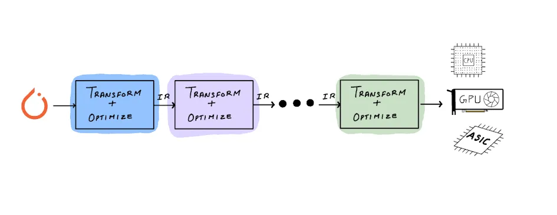
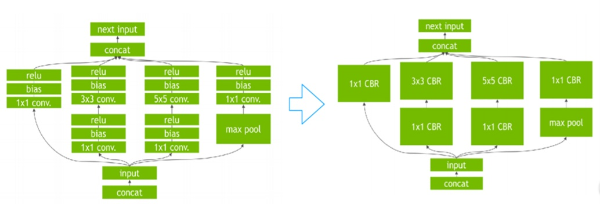

# AI Compilers in PyTorch and AI Frameworks

    
    
<em>PyTorch Deep Learning Compiler</em>

A **deep learning compiler** translates a high-level model (often a computation graph from a framework like PyTorch or TensorFlow) into optimized low-level code that runs efficiently on hardware accelerators. Unlike traditional compilers (e.g. LLVM) which take source code in languages like C/C++ and produce machine code via front-end parsing, IR optimization, and back-end codegen, an AI compiler starts from a trained neural network graph and applies tensor-specific optimizations. It identifies opportunities such as operator fusion and memory planning, then emits device-specific kernels (for GPUs, TPUs, NPUs, etc) to speed up training and inference. In other words, instead of compiling control-flow code, DL compilers focus on dataflow graphs: they build intermediate representations (IRs) of the model and optimize these IRs through passes that exploit the parallel, regular nature of tensor ops. For example, PyTorch’s TorchScript system produces a serializable computation graph of the model that can be optimized and run without the Python runtime.

AI compilers also differ from traditional compilers in their target and optimizations. They must handle **highly parallel** code on specialized hardware. This means taking advantage of features like mixed precision, tensor cores, and high-bandwidth memory, while minimizing CPU–accelerator communication. For instance, NVIDIA’s TVM or TensorRT and Intel’s OpenVINO perform hardware-specific kernel generation and fusing (e.g. combining convolution, batch-norm, and activation into one fused kernel) to greatly increase throughput. In summary, a compiler in an AI framework is an optimizer and code generator for neural-network graphs: it lowers a model into IRs, applies tensor/graph optimizations, and emits fast device code, rather than simply translating generic source code to CPU instructions as a conventional compiler does.

## Why AI Frameworks Need a Compiler

    
    
<em>Nividia has achieved a threefold increase in inference performance by fusing conv, bn, and relu into one operator fuse-CBR</em>

Modern frameworks like PyTorch use compilers to bridge the gap between easy-to-write Python code and efficient execution on diverse hardware. Without compilation, a PyTorch model runs operation-by-operation in Python, incurring interpreter overhead and missing cross-op optimizations. A compiler captures the _whole_ computational graph (or subgraphs) and can optimize across operator boundaries. This solves several problems: it **fuses operators** to reduce memory traffic (for example, fusing elementwise chains or conv+relu into one kernel), it **plans memory** to reuse buffers and minimize peak usage, and it **lowers** high-level tensor ops to lower-level primitives or hardware instructions that run efficiently on the target device. In doing so, it **generates device code** (CUDA, OpenMP C++, etc) tailored for GPUs, CPUs, or custom accelerators. For example, PyTorch’s `torch.compile` transforms Python functions into optimized GPU kernels via Triton, yielding the “same” functionally but much faster.

This is also how frameworks achieve **performance portability** across hardware. By targeting a common IR or employing multiple backends, a single model can run on NVIDIA GPUs, AMD GPUs, CPUs, or even NPUs with minimal changes. Tools like Intel’s nGraph or PlaidML are explicitly designed to give many frameworks performance portability across CPUs and GPUs. In short, compilers in AI frameworks automate the work of hand-tuning each operator on each chip: they automatically tune kernels and select implementations so that the model runs efficiently on whatever device it’s given. This accelerates both _training_ (by speeding up heavy compute loops) and _inference/deployment_ (by producing minimal, optimized modules for production).

## Design and Architecture of AI Compilers

AI compilers generally follow a multi-stage pipeline with a hierarchy of intermediate representations (IRs). Broadly, there are two layers: a **front-end** (framework-related) layer and a **back-end** (hardware-related) layer. The front-end IR captures the model’s computation graph in a framework-specific but hardware-agnostic form (e.g. PyTorch’s FX graph, TensorFlow’s GraphDef, or an ONNX graph). The back-end IR is lower-level and tuned to devices (e.g. MLIR, XLA HLO, or LLVM IR). Between these, the compiler applies passes that operate at different levels of abstraction. At the graph/IR level it might perform _fusion_, _dead code elimination_, _constant folding_, or _layout transforms_. Then it lowers tensor ops to a set of primitive operations or loops. Finally, code generation translates that IR into executable code for the target (CUDA kernels, vectorized CPU loops, etc).

A concise way to see this is in four stages (as in PyTorch’s compiler):

- **Graph Capture/IR Construction:** The high-level model is turned into an IR. In PyTorch 2.0 this is done by TorchDynamo (which hooks into Python bytecode) and Torch FX, yielding a static computation graph of the user code.

- **Automatic Differentiation (Backward Pass):** If training, the backward gradient graph is also captured and lowered. PyTorch uses AOT Autograd to trace the backward pass ahead-of-time so it can be optimized as well.
- **Graph-Level Optimizations:** The forward and backward graphs are optimized. This includes operator fusion (e.g. merging elementwise chains or fusing convolution+batchnorm+activation) and symbolic simplifications (removing redundant ops).
- **Code Generation:** The final IR is compiled into device-specific code. For example, PyTorch’s TorchInductor backend emits fused GPU kernels via Triton and parallel C++/OpenMP code for CPUs.

These stages may run in a JIT loop (specializing on input shapes and caching code) or in an AOT fashion (produce a static compiled module). In all cases, the key is a series of IR transformations gradually lowering the model to machine code.

## PyTorch Compiler Stack

PyTorch has evolved a multi-part compiler ecosystem. The original approach was **TorchScript**, which provides a static graph JIT. TorchScript lets you “script” or “trace” a PyTorch model into a `ScriptModule` that can be serialized and run without Python. This was useful for deployment but had limitations with Python dynamism.

The modern PyTorch compiler (since 2.0) centers on **`torch.compile`**, which uses:

- **TorchDynamo:** A Python-level JIT-like tracer that intercepts eager execution via CPython’s Frame Evaluation API. Dynamo rewrites Python bytecode on-the-fly to capture sequences of PyTorch ops into an FX graph. It supports dynamic control flow by automatically inserting guards and fallback, effectively mixing compiled subgraphs with normal Python execution.

    
    
<em>How PyTorch works with torch.compile and without it</em>

- **AOT Autograd:** Once the forward graph is captured, the backward graph is generated via PyTorch’s autograd engine ahead-of-time. This produces a fully functional backward IR that can also be compiled.
- **TorchInductor:** The default deep learning compiler backend for the FX graph. Inductor takes the fused FX graph and generates optimized kernels: on GPUs it generates Triton (CUDA) kernels, and on CPUs it emits parallel C++/OpenMP code. It also handles dynamic shapes and memory planning. TorchInductor is written in Python and mirrors PyTorch semantics to support all operators, applying broad optimizations (fusions, tiling) rather than focusing on one pattern.

Additionally, PyTorch still supports **torch.export** (an AOT graph-tracing tool) and the legacy **TorchScript**. `torch.compile()` (JIT) differs from `torch.export()` (AOT) in that the former will fall back to normal Python for untraceable code, whereas the latter aims to export a complete graph for use outside Python. In practice, developers use `torch.compile()` for ease (JIT) and can switch to `torch.export()` or TorchScript for fully static deployment if needed.

    
    
<em>_TorchDynamo splits a PyTorch function into compiled subgraphs and guards/fallback logic for dynamic parts_. In this example, the original Python function is broken into sub-functions (`__compiled_fn_0`, resume points, etc.) that a backend compiler can optimize, while a guard function routes execution depending on runtime conditions. This yields an optimized function that is functionally equivalent to the original but runs faster.</em>

## Example Optimizations

Deep learning compilers perform many domain-specific optimizations to speed up models. Typical examples include:

- **Operator Fusion:** Combining multiple operations into a single kernel to reduce memory traffic. For instance, fusing a convolution, batch-normalization, and ReLU into one “conv+BN+ReLU” kernel can yield 2–3× speedups. Elementwise chains (like `x*2 + 1 - x`) can be fused into one loop that does all the arithmetic per element, rather than multiple passes.
- **Memory and Layout Planning:** Rearranging data layouts or reusing buffers to improve cache locality. The compiler might transform data from NCHW to NHWC if the hardware prefers it, or pack data into tensors that match the GPU’s memory access pattern. It also inserts buffer aliasing or in-place ops when safe, to minimize allocation.
- **Constant Folding and Simplification:** Any parts of the graph that are static (e.g. fixed parameters or pure math) can be precomputed or simplified. A trivial example is simplifying `sin(x)**2 + cos(x)**2` to `1.0` during graph lowering.
- **Loop and Thread Tiling:** The compiler will often tile loops and distribute work across threads/warps appropriately. For example, it may break a large tensor operation into smaller blocks that fit on a GPU’s shared memory or vector registers, tuning block sizes for performance.
- **Precision and Algorithmic Selection:** It may insert mixed-precision (float16) casts where safe, or choose between different algorithms (FFT vs direct convolution) based on tensor sizes.

These and other optimizations are applied either as generic graph passes or in the backend (e.g. TorchInductor’s Triton kernels fuse and tile operations automatically). The goal is always to reduce runtime by maximizing hardware utilization and minimizing unnecessary work.

## Recent Trends in AI Compilers

AI compilers are rapidly evolving. One major trend is the adoption of **MLIR (Multi-Level Intermediate Representation)** as a common compiler infrastructure. MLIR provides a rich, extensible IR framework that can represent everything from high-level tensor operations down to LLVM IR. TensorFlow, PyTorch, and others are building MLIR-based toolchains so that different frontends (PyTorch, TensorFlow, ONNX, etc.) can share optimizations and backends. For example, PyTorch has the “Torch-MLIR” project and XLA backend support.

Another trend is the balance between **Ahead-of-Time (AOT)** and **Just-In-Time (JIT)** compilation modes. Some frameworks (like JAX) primarily use JIT to compile functions on-the-fly, while others emphasize AOT artifact generation for deployment. PyTorch 2.0 now supports both: `torch.compile()` works as a JIT during execution, whereas tools like `torch.export()` or TorchScript produce AOT graphs for static deployment. In general, JIT compilation offers flexibility (e.g. handling dynamic control flow and shapes) and ease of use, while AOT compilation offers predictability and portability (a fixed graph or library to deploy).

In summary, the field is moving towards more unified, modular compiler stacks. Efforts like MLIR aim to standardize IRs and passes across frameworks, and many systems are blending JIT/AOT techniques. Whatever the approach, the goal remains the same: use compiler technology to make ML code run as fast and portably as possible on emerging AI hardware.

## **References**

1. **PyTorch Documentation – TorchScript**

   - [https://pytorch.org/docs/stable/jit.html](https://pytorch.org/docs/stable/jit.html)
   - Official guide to TorchScript, scripting, tracing, and deployment workflows.

2. **PyTorch Documentation – torch.compile**

   - [https://pytorch.org/docs/stable/compile.html](https://pytorch.org/docs/stable/compile.html)
   - Overview of `torch.compile`, TorchDynamo, and TorchInductor in PyTorch 2.0.

3. **PyTorch Blog – Introducing TorchDynamo and TorchInductor**

   - [https://pytorch.org/blog/accelerating-pytorch-with-torchdynamo-and-inductor/](https://pytorch.org/blog/accelerating-pytorch-with-torchdynamo-and-inductor/)
   - High-level explanation of the new compiler stack in PyTorch 2.0.

4. **PyTorch Dev Discussions – TorchInductor Design**

   - [https://github.com/pytorch/pytorch/wiki/TorchInductor-Design](https://github.com/pytorch/pytorch/wiki/TorchInductor-Design)
   - Internal design notes for TorchInductor backend optimizations.

5. **PyTorch MLIR Project**

   - [https://github.com/pytorch/pytorch/blob/main/torch-mlir.md](https://github.com/pytorch/pytorch/blob/main/torch-mlir.md)
   - Integration of MLIR into PyTorch for IR unification and backend extensibility.

6. **MLIR: A Compiler Infrastructure for the End of Moore’s Law**

   - [https://mlir.llvm.org/](https://mlir.llvm.org/)
   - Official MLIR documentation describing its IR design for AI compilers and beyond.

7. **TensorFlow XLA Overview**

   - [https://www.tensorflow.org/xla](https://www.tensorflow.org/xla)
   - Context on how XLA uses AOT/JIT compilation for optimizing TensorFlow graphs.

8. **OpenAI Technical Blog – Triton: An Open Source GPU Programming Language**

   - [https://openai.com/blog/triton](https://openai.com/blog/triton)
   - Overview of Triton, used by TorchInductor for generating efficient GPU kernels.

9. **Deep Learning Compilers: A Comprehensive Survey (Wang et al., 2022)**

   - [https://arxiv.org/abs/2202.07327](https://arxiv.org/abs/2202.07327)
   - Academic survey covering TVM, XLA, TensorRT, MLIR, and other AI compiler frameworks.

10. **TVM: An Automated End-to-End Optimizing Compiler for Deep Learning (Chen et al., 2018)**

    - [https://arxiv.org/abs/1802.04799](https://arxiv.org/abs/1802.04799)
    - Seminal paper introducing TVM’s layered compiler design for tensor graphs.

11. **PlaidML – Intel’s Portable Deep Learning Engine**

    - [https://github.com/plaidml/plaidml](https://github.com/plaidml/plaidml)
    - Example of a framework aiming for performance portability across GPUs and CPUs.

12. **LLVM Compiler Infrastructure**

    - [https://llvm.org/](https://llvm.org/)
    - General background on traditional compiler infrastructure for comparison.
