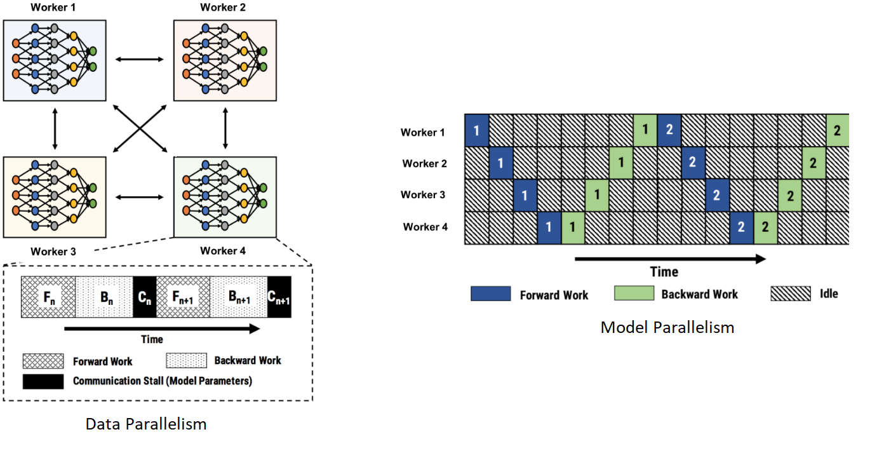
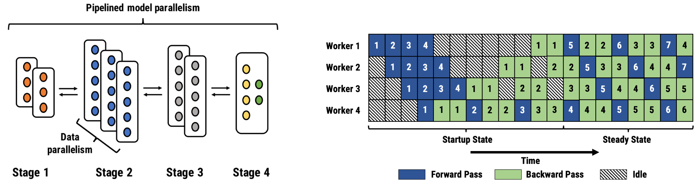
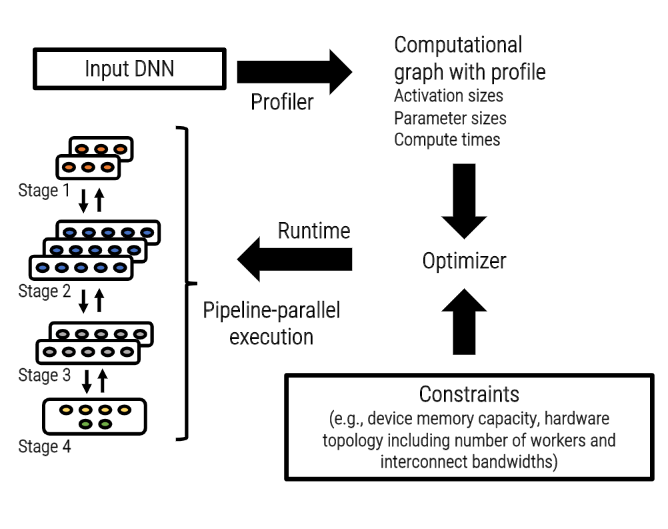

### PipeDream: Efficient Pipeline Parallelism for DNN Training

**PipeDream** is a system designed to optimize **pipeline parallelism** for training large deep neural networks (DNNs). It improves GPU utilization and reduces idle time ("pipeline bubbles") compared to traditional pipeline parallelism.

    
    
<em>Traditional intra-batch parallel training approaches, such as data parallelism and model parallelism, suffer from poor hardware efficiency. In the left image, data parallelism causes communication stalls as workers exchange gradients. In the right image, model parallelism processes only a single active minibatch across all workers, leading to severely limited hardware utilization.</em>

    
    
<em>The left image illustrates a pipeline-parallel assignment with eight GPUs divided into four stages. Only activations and gradients are communicated at stage boundaries. Stages 1, 2, and 3 are replicated to create a load-balanced pipeline. The right image shows another pipeline with four workers, depicting both the start-up and steady states. In this example, the backward pass takes twice as long as the forward pass.</em>

    
    
<em>PipeDream's Workflow</em>

### **Key Features of PipeDream**

1. **Model Partitioning**

   - Splits the model into multiple pipeline stages.
   - Each stage is assigned to a GPU (or a set of GPUs).
   - Partitioning is **optimized to balance computation and communication cost**.

2. **Efficient Scheduling (1F1B)**

   - PipeDream uses a **1-Forward-1-Backward (1F1B)** scheduling approach.
   - After the pipeline is filled, each GPU alternates between one forward pass and one backward pass, reducing bubbles significantly.

3. **Weight Versioning**

   - During pipeline training, different micro-batches may see slightly different model weights.
   - PipeDream handles this by maintaining **multiple weight versions** to ensure correctness in backward computations.

4. **Asynchronous Execution**

   - Forward and backward computations overlap across stages, improving hardware utilization.

### **How It Reduces Bubbles**

- Traditional pipeline parallelism suffers from idle times during startup and teardown.
- PipeDream reduces bubbles by **keeping GPUs busy** with forward/backward computations even when other stages are not yet ready.

### **Advantages**

- Significantly better GPU utilization than naïve pipeline parallelism.
- Enables training of very large models that cannot fit into a single GPU.
- Can be combined with **data parallelism** and **tensor parallelism** for further scaling.

### **Trade-offs**

- Requires **extra memory** to store multiple versions of weights.
- Introduces **staleness** in weight updates (different micro-batches may see slightly different parameters).
- Optimal partitioning and scheduling **depend on the model architecture and system configuration**.

### **Applications**

- Training **transformer-based models (BERT, GPT, etc.)** at scale.
- Used in large-scale distributed training systems where model size exceeds single GPU memory.
