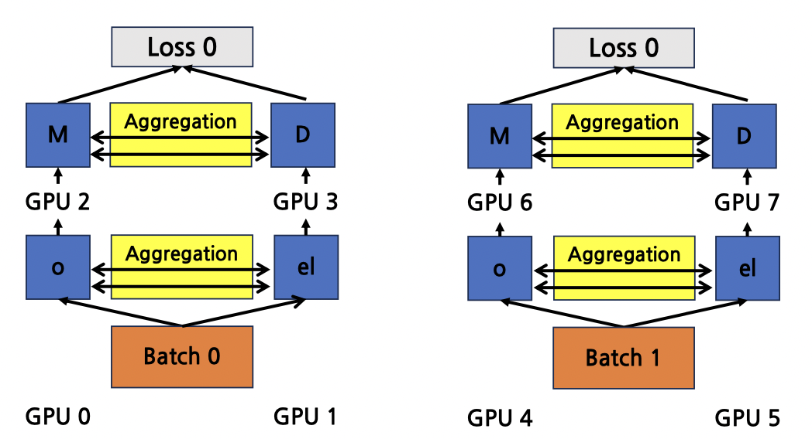
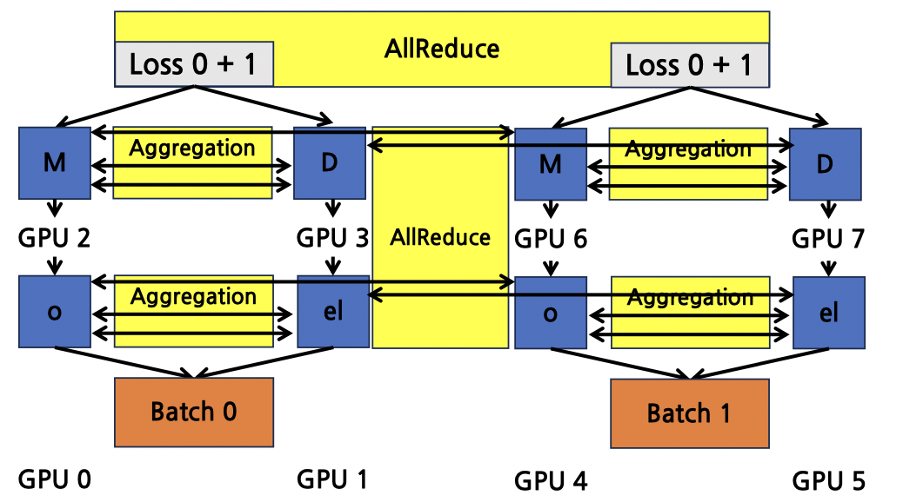

### Combined Data, Tensor, and Pipeline Parallelism

Large-scale deep learning training often uses a combination of **data parallelism (DP)**, **tensor parallelism (TP)**, and **pipeline parallelism (PP)** to maximize GPU utilization and enable training of massive models.

### **Parallelism Definitions**

- **Data Parallelism (DP)**

  - The model is **replicated** across multiple GPUs.
  - Each GPU processes a different shard of the training data.
  - Gradients are synchronized (e.g., via **AllReduce**) after each step.

- **Tensor Parallelism (TP)**

  - Computation **within each layer** is split across multiple GPUs.
  - Especially useful for large layers such as transformer feedforward blocks or attention heads.

- **Pipeline Parallelism (PP)**

  - The model is **partitioned into stages**, with each stage assigned to one or more GPUs.
  - Micro-batches are passed through the pipeline to keep all GPUs busy.

- **Total Number of Processes**

  - **Total Processes = DP × TP × PP**

### **Examples**

#### 1️⃣ **Example 1: DP=1, TP=1, PP=1 → 1 GPU**

- Entire model and training data are handled by a single GPU.

#### 2️⃣ **Example 2: DP=2, TP=1, PP=1 → 2 GPUs (Data Parallelism)**

- Two GPUs hold identical copies of the model.
- Each processes a different batch (Batch 0, Batch 1).
- Gradients are synchronized with **AllReduce** after the backward pass.

#### 3️⃣ **Example 3: DP=2, TP=2, PP=1 → 4 GPUs (Data + Tensor Parallelism)**

- Each data-parallel group contains two GPUs that share computations within each layer (tensor parallelism).
- Gradient synchronization occurs both within tensor-parallel groups and across data-parallel replicas.

#### 4️⃣ **Example 4: DP=2, TP=2, PP=2 → 8 GPUs (Data + Tensor + Pipeline Parallelism)**

- The model is divided into **two pipeline stages**, each using **two GPUs** for tensor parallelism.
- Two data-parallel groups replicate the entire pipeline.
- Training leverages **batch splitting (DP)**, **intra-layer splitting (TP)**, and **stage-wise pipelining (PP)**.

    
    
<em>Forward</em>

    
    
<em>Backward</em>

### **Benefits of Combining DP, TP, and PP**

- **Scalability:** Enables training models that exceed the memory and compute limits of a single GPU.
- **Resource Utilization:** Balances memory consumption and computation across devices.
- **Efficiency:** Overlaps computation and communication to reduce idle time.

This approach is widely adopted in frameworks such as **Megatron-LM**, **DeepSpeed**, and **PyTorch Distributed (FSDP with PP support)** to train **large language models (LLMs)** with trillions of parameters.
