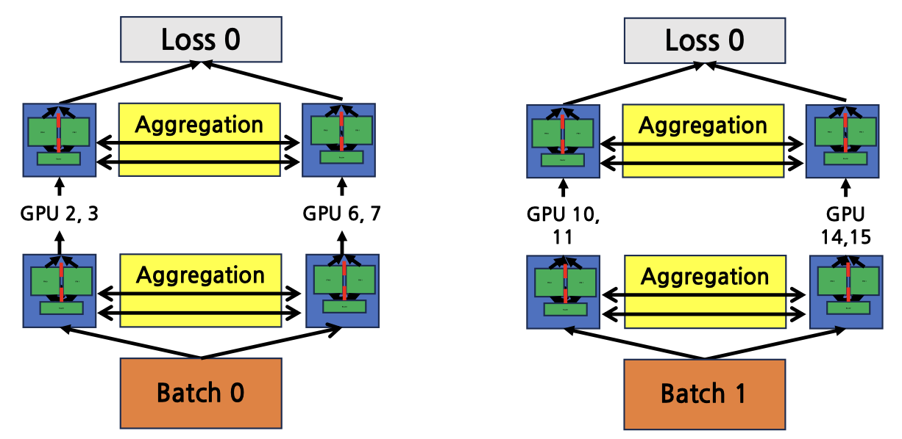

# Expert Parallelism

Expert parallelism is a technique used in **Mixture-of-Experts (MoE)** models to efficiently scale up large neural networks by distributing multiple "experts" across different devices. Each expert is a sub-network (typically a feed-forward network or FFN) that specializes in processing a subset of the input space. Instead of activating all experts for every input, only a subset of experts are selected dynamically during training and inference, leading to **sparse computation**.

## Key Concepts

### 1. **Mixture of Experts (MoE)**

- Uses multiple experts, each responsible for a **subspace of the overall problem space**.
- In neural networks, an expert corresponds to a **feed-forward network (FFN)**.
- Allows using **extremely large parameter counts** without activating all parameters for every input.
- MoE is a **sparse model**: for each forward-backward pass, **only a subset of experts** (and their parameters) are used.

### 2. **Switch Transformer**

- A **large language model architecture** proposed by Google that integrates MoE into the Transformer architecture.
- The **self-attention layers remain unchanged**, but the **FFN layers are replaced by switching FFN layers**.
- A **router module** decides which expert should process each input token, leading to more efficient parameter usage.

### 3. **Switch Routing**

- Each input token is routed to **a single expert** (unlike Top-k routing where multiple experts may be chosen).

- Routing algorithm for $E$ experts:

  $$P = \text{Softmax}(X W_r)$$

  - **Input**: $X \in \mathbb{R}^{S \times H}$
    $S$ = sequence length, $H$ = hidden dimension
  - **Parameter**: $W_r \in \mathbb{R}^{H \times E}$ (router weights)
  - **Output**: $P \in \mathbb{R}^{S \times E}$ (gate values for each token)
  - The token is routed to the expert with the **largest gate value** $\text{argmax}_j P_j$.

- The router is **differentiable**, meaning $W_r$ is trained via backpropagation like other parameters.

### 4. **Example Forward Pass**

For a setup with:

- $E = 4$ experts
- $S = 2$ tokens
- $H = 8$ hidden size

If the gate value matrix $P$ is:

|         | Expert 0 | Expert 1 | Expert 2 | Expert 3 |
| ------- | -------- | -------- | -------- | -------- |
| Token 1 | **0.4**  | 0.3      | 0.1      | 0.2      |
| Token 2 | 0.3      | 0.1      | **0.5**  | 0.1      |

- **Token 1** → Expert 0 (highest value 0.4)
- **Token 2** → Expert 2 (highest value 0.5)

## How Expert Parallelism Works

- **Each GPU handles the computation for a subset of experts.**
- The input token embeddings are sent to the GPU hosting the assigned expert(s).
- After the computation, the results are aggregated and returned to form the output sequence.

## Examples

### Example 1: One Token per Expert

Each token is routed to a different GPU that hosts the corresponding expert.

- **Token 1 → Expert 1 (GPU 0)**
- **Token 2 → Expert 2 (GPU 1)**
- **Token 3 → Expert 3 (GPU 2)**
- **Token 4 → Expert 4 (GPU 3)**

This setup distributes computation evenly if tokens are mapped uniformly across experts.

### Example 2: Multiple Tokens per Expert

All tokens are routed to the same expert on a single GPU.

- All tokens → Expert 1 (GPU 0)

This scenario can lead to **load imbalance**, where one GPU performs significantly more computation than others.

## Challenges in Expert Parallelism

### 1. **Load Imbalance**

- The mapping between tokens and experts can lead to uneven distribution.
- **Ideal case:** Equal token distribution across GPUs.
- **Worst case:** All tokens routed to one GPU.

### 2. **Computation Imbalance**

- The GPU handling the most tokens becomes the bottleneck, increasing overall execution time.

### 3. **Memory Imbalance**

- The GPU with the most tokens consumes the most memory, potentially exceeding capacity in extreme cases.

## Solutions to Load Imbalance

### 1. **Serializing Token Computation**

- If a GPU has more tokens than a threshold, computations are **partitioned and executed sequentially**.
- **Downside:** Reduced parallelism and slower performance.

### 2. **Skipping Excess Tokens**

- Exceeding tokens are ignored to prevent overload.
- **Downside:** Leads to correctness issues (model accuracy degradation).

## Capacity Factor

To systematically handle token distribution and imbalance, a **capacity factor** is used:

$$\text{Max tokens per expert} = \left(\frac{\text{total tokens in batch}}{\text{num experts}}\right) \times \text{capacity factor}$$

- **Capacity factor = 1.0** → Ideal case only.
- **Capacity factor ≫ 1.0** → Allows processing of overflow cases.

This parameter balances between **model performance** and **load distribution**.

## Key Takeaways

- Expert Parallelism allows **scaling to many experts** without requiring all experts to fit in a single GPU.
- It works by **distributing experts across GPUs** and routing tokens to the GPU that holds the required expert.
- The main challenges are **load imbalance, computation imbalance, and memory imbalance**.
- Solutions include **token computation serialization, token skipping (not ideal), and using capacity factors** to control the maximum number of tokens per expert.

    
    
<em>Forward</em>

- Each batch (Batch 0 and Batch 1) is processed in parallel by two data-parallel groups.
- Within each group, pipeline stages process micro-batches sequentially.
- Tensor-parallel GPUs perform partial computations per layer.
- Expert-parallel GPUs handle the MoE experts for their assigned tokens.

    
    
<em>Backward</em>

- Gradients are aggregated at each stage using **Aggregation** and **AllReduce** operations.
- After computing local gradients, **AllReduce** synchronizes weights across data-parallel groups.
- Expert-parallel gradients are also aggregated across GPUs hosting the same expert.
