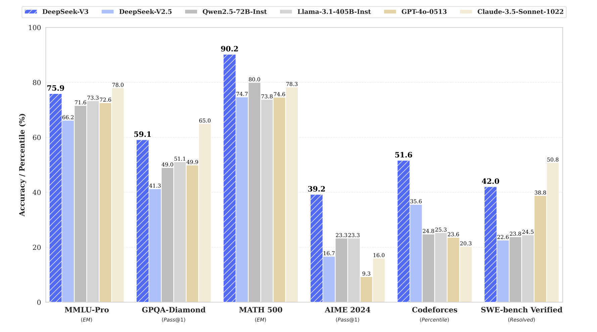

# DeepSeek-V3 Technical Report

- https://arxiv.org/pdf/2412.19437

# DeepSeek-V3: Abstract Notes

## Overview

- **Model**: DeepSeek-V3
- **Type**: Mixture-of-Experts (MoE) language model
- **Total Parameters**: 671B
- **Activated Parameters per Token**: 37B

## Key Architectures and Strategies

- **Multi-head Latent Attention (MLA)**: Adopted from DeepSeek-V2 for efficient inference and cost-effective training.
- **DeepSeekMoE**: Core MoE architecture validated in DeepSeek-V2.
- **Auxiliary-Loss-Free Load Balancing**: Pioneering strategy to balance expert loads without auxiliary loss.
- **Multi-Token Prediction Objective**: Enhances performance by predicting multiple tokens per training step.

## Training Details

- **Pre-training Dataset**: 14.8 trillion diverse, high-quality tokens.
- **Training Stages**:
  - Pre-training
  - Supervised Fine-Tuning (SFT)
  - Reinforcement Learning (RL)
- **Training Stability**: No irrecoverable loss spikes or rollbacks observed.
- **Compute Efficiency**:
  - Total GPU Hours: 2.788 million H800 GPU hours for full training.

## Performance

    
    
<em>Benchmark performance of DeepSeek-V3 and its counterparts</em>

- **Comparison**:
  - Outperforms other open-source models.
  - Comparable to leading closed-source models.

## Availability

- **Model Checkpoints**: [GitHub - DeepSeek-V3](https://github.com/deepseek-ai/DeepSeek-V3)

> **Note**: MLA and auxiliary-loss-free load balancing are notable innovations enhancing inference efficiency and training stability.
