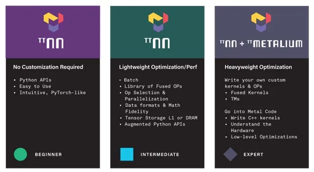
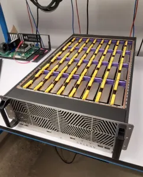
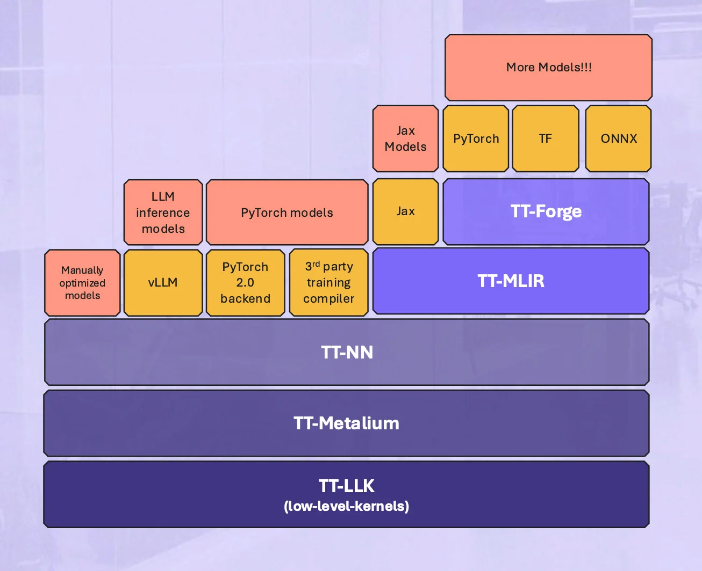

# Tenstorrent LLM Inference – Technical Deep Dive

Tenstorrent is an AI hardware startup building next-generation neural processors, with a strong focus on large language model (LLM) inference. The company’s strategy combines **innovative custom AI chips** (“Wormhole” first-generation PCIe cards) and a **fully open-source software stack** to deliver high-performance, scalable LLM inference. Tenstorrent’s hardware (based on proprietary _Tensix_ cores) has been demonstrated running state-of-the-art models like Meta’s LLaMA-70B and Alibaba’s Qwen-72B, both in single-node workstations and multi-board clusters. By 2025, Tenstorrent has open-sourced major components of its inference stack – from low-level kernel libraries to model serving frameworks – aiming to cultivate an ecosystem that can compete with Nvidia’s CUDA in flexibility and performance. This report provides a comprehensive technical deep dive into Tenstorrent’s LLM inference efforts, covering the hardware architecture, core software repositories, kernel and compiler optimizations, supported models, performance benchmarks, and future roadmap.

    
    
<em>ttnn + tt-metal</em>

## Inference Strategy and Goals

**Open Hardware Access and Performance:** Tenstorrent’s inference strategy centers on exposing the full capabilities of its AI chips to developers. To that end, the company provides a **bare-metal programming model (“Metalium”)** that allows expert users to write custom kernels and orchestrate data movement at the lowest level. This is akin to a “CUDA for Tenstorrent,” enabling fine-grained performance tuning by directly controlling the _Tensix_ cores and on-chip memory. While only a small subset of users will write custom kernels, Tenstorrent views this openness as vital for squeezing out efficiency in production deployments. In parallel, Tenstorrent offers higher-level APIs and automation (via its TT-NN library and compiler stack) so that most users can run models out-of-the-box without dealing with hardware details.

**Scalable Multi-Chip Inference:** A key goal is to run **very large models and many concurrent queries** by scaling across multiple chips. Tenstorrent’s first-gen Wormhole cards were designed for scale-out: each chip includes **16× 100 Gbps interconnect lanes** that allow building multi-card meshes (the 32-chip _Galaxy_ system) without external switches. The inference software supports _tensor parallelism_ to shard giant models across devices and _data parallelism_ to serve many requests in parallel. For example, LLaMA-70B has been run with **tensor-parallel 8-way splitting on 8 cards**, and Falcon-40B was demonstrated on a **32-chip Galaxy** server. This scale-out approach lets Tenstorrent treat a cluster of chips as one large memory and compute resource for LLMs – the Galaxy appliance is essentially pitched as an **LLM inference server** in a box.

    
    
<em>Tenstorrent’s Galaxy system comprises 32 Wormhole chips connected in a mesh</em>

**High-Throughput, Acceptable Latency:** Tenstorrent optimizes for high throughput (tokens/sec) under multi-user server loads while keeping latency per user reasonable. Internally, they use the metric _tokens per second per user_ (t/s/u), i.e. how fast each user receives tokens given a certain batch of concurrent users. The company considers **≥10 tokens/sec/user** sufficient for responsive chat applications. Their **Loud Box** workstation (8 Wormhole cards) currently achieves \~15 tokens/s per user with 32 users on LLaMA-70B, which is already in the interactive range. This performance is approaching the ballpark of Nvidia H100 systems (cloud APIs on 8×H100 report \~20–50 tokens/s/user). Tenstorrent’s near-term goal is to **double single-user speed via software optimizations** (e.g. improved kernels, speculative decoding) on the same hardware, and to further close the gap with second-gen chips. At the system level, Tenstorrent positions itself as a cost-efficient alternative – their 8-card workstation (\~\$12k) targets developers who need on-premise LLM serving, compared to the expensive DGX boxes used by hyperscalers.

**Framework Integration and Ease of Use:** Acknowledging that most AI engineers work with established frameworks, Tenstorrent’s stack is designed to integrate with front-ends like PyTorch, TensorFlow, ONNX, and even LLM-specific serving frameworks. The strategy involves a **top-down compiler** (to import models from various frameworks and optimize them for Tenstorrent chips) and a **runtime that can plug into inference servers** (so that using a Tenstorrent back-end is as seamless as swapping a device type). For instance, Tenstorrent built a custom fork of the popular high-throughput serving engine **vLLM** to interface with their hardware, enabling features like continuous batching and efficient memory management for LLM workloads on Tenstorrent devices. They also provide an [**Inference Server repository**](https://github.com/tenstorrent/tt-inference-server) with ready-made model API implementations and Docker images, aiming to let users deploy common models on Tenstorrent cards with minimal setup. Overall, Tenstorrent’s inference strategy is to combine **open, low-level control for maximum performance** with **easy adoption paths via high-level tools**, thereby appealing both to performance-tuning experts and to AI teams wanting a plug-and-play solution.

## Key Repositories and Software Stack

Tenstorrent’s LLM inference software stack spans several actively maintained open-source repositories, each addressing different layers of the stack:

    
    
<em>Tenstorrent’s software stack</em>

- **TT-Metal (TT-NN and TT-Metalium)** – _Operator Library and Kernel Runtime:_ This is the core Python/C++ library for executing neural network operations on Tenstorrent hardware. **TT-NN** provides a tensor class (`ttnn.Tensor`) and dozens of operators (akin to PyTorch’s ATen or CUDA’s cuDNN) implemented for the Tenstorrent architecture. It allows creating and running computation graphs on the device using familiar tensor semantics. Under the hood, TT-NN builds on **TT-Metalium**, Tenstorrent’s low-level programming model for the hardware. TT-Metalium exposes the _Tensix_ core architecture in a C++ API, letting developers write custom device kernels by orchestrating the five RISC-V sub-cores, DMA engines, and matrix units (more details in the next section). In practice, most developers use the high-level TT-NN ops, while a few expert users or Tenstorrent engineers implement new optimized kernels in Metalium when needed. The TT-Metal repository includes extensive documentation and even _tech reports_ on topics like the Matrix Engine and data formats. It also contains _model demo scripts_ for various networks and a performance table (updated as of May 5, 2025) showcasing throughput and latency across models and hardware configurations. TT-Metal is under active development with thousands of commits and a robust issues/pull-requests workflow, reflecting its central role in Tenstorrent’s software. (Notably, Tenstorrent uses the term “TT-Metal” sometimes to refer broadly to this whole stack, but technically TT-Metalium is the metal-level API and TT-NN is the neural network library.)

- **TT-Forge (MLIR-Based Compiler)** – _Graph Compiler and Runtime Planner:_ TT-Forge is Tenstorrent’s newer compiler framework (successor to an earlier stack called _Buda_). It is built on LLVM’s MLIR and serves as a **high-level compiler that ingests models from popular frameworks and lowers them to Tenstorrent executable code**. The idea is to enable a model trained in PyTorch or TensorFlow to be deployed on Tenstorrent silicon with automated graph optimization, placement, and scheduling. TT-Forge’s front-end (tt-forge-fe) can take in PyTorch JIT IR, ONNX graphs, etc., and perform transformations like operator fusion, layout conversion, and graph rewriting for performance. The compiler then leverages **TT-MLIR** passes to target the Tensix core architecture. The output is a low-level “netlist” or program that maps each neural net operation to specific Tensix cores and schedules data movement – a human-readable form of this mapping is available for inspection before it’s assembled into a binary for execution. TT-Forge is intended to be general and open, supporting all configurations of Tenstorrent hardware via a single, performance-oriented compiler. In essence, TT-Forge and its components automate what a skilled developer might otherwise do by hand with TT-Metalium: partitioning the model across cores/devices, choosing tiling strategies, and inserting data transfers. It’s actively updated (as of May 2025) and is a key piece for scaling to new models and future chips.

- **PyTorch Integration (torch.compile backend)** – Tenstorrent maintains an integration with PyTorch 2.x through a project often referred to as **pytorch2.0_ttnn**. This provides a backend for PyTorch’s `torch.compile()` (AOT compilation) so that users can take a PyTorch model and just compile it for Tenstorrent, similar to how one would for XLA or other accelerators. It uses the TT-NN compiler under the hood (TT-Forge/MLIR) to translate PyTorch ops into TT-Metal ops and kernels. By supporting PyTorch’s compiler API, Tenstorrent enables researchers to test models on their hardware with minimal code changes – essentially treat the Tenstorrent card like another device in the PyTorch ecosystem. Alongside this, Tenstorrent also has a **PJRT device for XLA/JAX** (the `tt-xla` repo) and a **TVM integration** (`tt-tvm` repo), underscoring their approach of meeting developers where they are. These compiler integrations are crucial for leveraging Tenstorrent hardware in existing ML workflows for both training and inference, although in practice by 2025 the emphasis is on inference deployment.

- **TT-Inference-Server** – _Model Serving APIs and vLLM Integration:_ This repository provides ready-to-use server implementations for popular LLMs on Tenstorrent hardware. It essentially packages **a modified vLLM** (open-source LLM serving engine) with Tenstorrent-specific backend hooks, along with model-specific configurations and API endpoints. The included **“Model Readiness” table** lists each supported model, a link to its Hugging Face weights, the recommended Tenstorrent hardware for it, and the software version (TT-Metal and vLLM commit) it’s compatible with. For example, entries include _Llama-3.3-70B-Instruct_ on a LoudBox (8 cards) marked “ready,” or _Qwen2.5-7B_ on a single n150 card, etc.. Each model name in the table links to an implementation – typically a small Python module defining how to load the model weights into TT-NN, any model-specific pre/post-processing, and integration with vLLM’s engine. The server leverages **vLLM’s high-throughput scheduler** (which uses a “paged attention” mechanism to efficiently handle concurrent requests) but replaces GPU-specific operations with calls into TT-NN (TT-Metal ops). In effect, TT-Inference-Server + vLLM gives users a **HTTP/GRPC serving interface** for LLM inference on Tenstorrent, with features like dynamic batching, streaming token output, etc., similar to a HuggingFace TextGenerationInference server but optimized for Tenstorrent. The repository also provides **Docker containers** for quick deployment of these inference servers. This component underscores Tenstorrent’s focus on _actively maintained, ready-to-run inference solutions_ – one can spin up a container and serve a model on a Tenstorrent box without having to write any kernel code or graph optimization by hand.

- **Support Utilities:** In addition to the main stack above, Tenstorrent provides tools like **TT-SMI** (a CLI tool similar to `nvidia-smi` for monitoring cards), **TT-Topology** for multi-card ethernet topology configuration, firmware flashing tools (TT-Flash), and visualization/debug tools (e.g. **ttnn-visualizer** for graph and memory visualization). These support inference deployment by giving insight into performance and helping manage hardware. For debugging or development, a **TTNN “graph trace” and profiling** feature exists to inspect how ops are executed on Tensix cores. Tenstorrent also maintains example **model zoo repos** (like `tt-buda-demos` and in TT-Metal’s docs) that show how to run various models (CNNs, Transformers, Whisper, Stable Diffusion, etc.) with their stack – many of these double as integration tests and performance benchmarks for inference.

In summary, Tenstorrent’s inference stack ranges from _low-level (Metalium ISA, custom kernels)_ to _high-level (model servers and PyTorch integration)_, with each layer open-sourced. The actively maintained repos ensure that new models and techniques can be rapidly incorporated. For instance, when Meta released Llama 3.2/3.3 models in late 2024, Tenstorrent’s team updated the model table and added support for Vision and Instruct variants, illustrating the agility of an open-source approach. Table-driven model support, combined with a robust compiler and core library, makes it possible to extend support to other architectures (they even issued bounties for community contributions to add models like _Gemini_ and _Phi-2_ to TT-Buda/Forge). This flexible software foundation is crucial for handling the fast-moving LLM landscape.

## Architectural and Kernel Optimizations

_Hardware Overview:_ Tenstorrent’s LLM inference optimizations are deeply tied to the design of its **Tensix cores** and memory architecture. A Tensix core is a **spatially-programmable compute unit** with independent control, rather than a SIMD lane or fixed-function MAC array. Inside each core are multiple RISC-V micro-cores and specialized engines: _two RISC-V “router” cores_ handle data movement (DMA and NoC transfers), and _three RISC-V “compute” cores_ issue vector and matrix-multiply instructions to the core’s math units. The math units consist of an FPU (which in Tenstorrent terminology is actually a **matrix multiply engine**) and an SFPU (a **vector/SIMD engine** for elementwise ops). Each core also includes a chunk of **SRAM (L1 memory)**, which is tightly coupled. The first-gen chips (_Grayskull_ and _Wormhole_) have on the order of 80–120 Tensix cores and \~100+ MB of total on-chip SRAM. These cores are connected by a high-bandwidth, circuit-switched network-on-chip. Importantly, in the [Wormhole](https://tenstorrent.com/en/hardware/wormhole) design, multiple chips can be directly linked via 100 Gbps Ethernet-style links and **coherent memory networking** – a core on one chip can fetch data from another chip’s SRAM almost as if it were local. This architecture is optimized for **fine-grained parallelism and pipeline parallelism**. Unlike a GPU where hundreds of threads execute in lock-step, Tensix cores run **asynchronously (MIMD)** – each core can be working on a different part of the computation or even on a different layer of the model, communicating via on-chip routers when needed. This affords a lot of flexibility in mapping an LLM’s computation graph onto the hardware.

    
    
<em>Inside a Tenstorrent Tensix core, BRISC and NRISC handle data movement into and out of the core, while TRISC0, TRISC1, and TRISC2 manage the math engines. The FPU serves as a matrix-multiply accelerator (despite its name suggesting a floating-point unit), and the SFPU functions as a vector engine.</em>

_Kernel (Metalium) Execution Model:_ To keep the many MAC units busy, Tenstorrent relies on a **decoupled execution model** – separating computation from data movement. As VP of HW Matt Mattina explained, _“math is separate from unpacking and packing data”_, and both run in parallel. In practice, this means a TT-Metalium kernel might dedicate some Tensix cores solely to staging data (bringing in next tokens’ data from DRAM or distributing key/value cache across chips) while other cores multiply matrices, and yet others move results around. The TT-Metalium API allows explicit scheduling of work to RISC-V threads on each core, rather than relying on implicit caching or global barriers. For example, a custom attention kernel could use one thread to load query and key tiles into SRAM, another to compute partial dot products (matrix multiplies), and a third to stream out the computed attention scores – all overlapping in time. This is reminiscent of manually orchestrating pipeline parallelism at the kernel level, which Tenstorrent enables through Metalium. Such **explicit control of dataflow** is crucial given the distributed memory: it ensures that the theoretical peak of \~2,000 multiply-accumulates per cycle per core can be approached by keeping data moving continuously. In contrast to CUDA where warps are implicitly synchronized each instruction, Metalium lets each core run its own instruction stream, only synchronizing when and where the programmer wants. This freedom allows implementing _models with different parallelization strategies_ – e.g. one could assign a subset of cores to each transformer layer (pipeline the layers through core groups), or do each matrix multiply across many cores in parallel, or combinations thereof. Tenstorrent’s compiler (TT-Forge) typically handles this mapping automatically, but advanced users can tweak the placement via the netlist if needed.

**Data Layouts and Memory Optimization:** One notable optimization in Tenstorrent’s inference stack is the use of **custom tensor layouts** to match hardware. Tenstorrent does _not_ use standard row-major order in memory for multi-dimensional tensors, because their hardware benefits from tiling data to fit SRAM and align with matrix engine dimensions. For instance, they use a tiled layout for matrices so that blocks of the matrix reside in contiguous SRAM segments (enabling better locality when cores multiply sub-blocks). This non-row-major format improves on-chip reuse but required significant work in the software: the TT-NN library must transform (“format”) incoming weights/activations into the tiled layout expected by kernels. The TT-NN API includes utilities like `ttnn.format_input_tensor()` and `pad_to_tile_shape()` to help prepare data. A developer integrating Tenstorrent with a new framework observed that _“the use of non row-major layout is the main troublemaker… Everyone assumes each other speaks row-major, so an adapting interface has to be made”_. This highlights a challenge: while these layouts boost performance, they necessitate careful data conversion at boundaries (e.g. when copying weights from CPU memory into the accelerator’s memory). Tenstorrent’s solution is to handle this transparently in their compiler/loader – when a model is imported via PyBuda or TT-Forge, it automatically converts the weight matrices into the optimal internal format. At runtime, **all operations on Tenstorrent devices expect and produce tensors in these native layouts**. This can complicate mixing Tenstorrent with other accelerators in a pipeline (due to conversion overhead), but it ensures that _within_ the Tenstorrent execution, memory access is efficient. The benefit is evident in performance scaling: even at very high batch sizes or with many cores active, the chip is not starved for data because the data movement threads and tiling keep caches warm and memory accesses coalesced.

**Precision and Numeric Optimizations:** In LLM inference, using lower numerical precision can significantly speed up throughput and reduce memory usage. Tenstorrent heavily leverages **8-bit floating point** formats for inference. The Wormhole chip supports FP16/BF16 as well, but its peak theoretical is 74 TFLOPS (FP16) versus 262 TFLOPS in _FP8_ on an n150 card. In practice, Tenstorrent runs large LLMs at **Block FP8 (BFLOAT8)** precision for generation. Their BF8 format is a kind of block-floating scheme (shared exponent) that balances range and precision. Using BF8, a 70B model’s weights are roughly half the size of BF16, enabling a model like Llama-70B to fit on 8 cards (each card with 12 GB GDDR6) with room for activation memory. The TT-Metal software handles weight quantization to BF8 and any required dequantization. They note in documentation a _limitation of BFLOAT8_B_ (likely minor accuracy considerations), but overall have found it effective for LLMs. Empirically, running Llama-70B in BF8 on Tenstorrent produced coherent outputs in their demos (the model quality remained high). Beyond FP8, Tenstorrent cores also support _int8_ and other low-precision dot products – though primarily for vision models or experimentation. The software allows mixing precision: for example, one could keep embedding layers in BF16 and transformer blocks in BF8 if needed for accuracy. However, **nearly all their published LLM benchmark numbers use 8-bit** arithmetic for maximum throughput. This is a conscious optimization to compete with Nvidia’s TensorRT and FasterTransformer libraries, which also use 8-bit or 4-bit quantization for serving large models. Tenstorrent’s advantage is that BF8 is natively supported in hardware (no extra latency for dequantization on tensor cores, etc.), so the throughput scales almost linearly with the reduced precision. Kernel-wise, Tenstorrent likely implemented custom **matrix multiplication kernels** for BF8 in Metalium to accumulate into higher precision (similar to how Nvidia does FP8 => accumulate in FP16). The performance table confirms massive gains: e.g. Llama3.1-70B at BF8 on 8 chips hits \~15 tokens/s/user (as noted), which would be much lower if FP16 were used (they set a “target” of 20 tokens/s/user for 70B, presumably at BF8, whereas FP16 might only reach half that).

**Multi-Device Parallelism:** On the software side, Tenstorrent’s inference stack supports **Tensor Parallel (TP)** and **Data Parallel (DP)** distribution seamlessly. In their [model performance table](https://github.com/tenstorrent/tt-metal?tab=readme-ov-file#llms), entries like “(TP=8)” indicate a model’s layers were split across 8 devices, each device holding 1/8 of the model weights. The TT-Forge compiler can partition the weight matrices accordingly and insert the necessary all-reduce or scatter/gather operations over the NoC/Ethernet links. Thanks to Wormhole’s built-in 100G ×16 links, the communication overhead for TP is relatively low – for instance, Qwen-72B with TP=8 on a QuietBox (8 cards) achieved \~14.5 tokens/s/user, which is in line with the Llama-70B numbers and suggests the scaling is efficient. For Data Parallel, Tenstorrent can broadcast a copy of the model to multiple devices and have each handle different batch slices (or different users). The table shows Falcon-7B scaled to DP=32 (across 32 chips) serving 1024 concurrent prompts at \~4.8 tokens/s each – an aggregate of nearly 5k tokens/s throughput. This demonstrates nearly linear scaling of throughput with more devices in data-parallel mode (32× increase in batch yielded \~32× total tokens/sec). Behind the scenes, such scaling is facilitated by _Tenstorrent’s graph compiler and runtime which manage synchronization and networking._ The **Wormhole chips treat remote memory access almost like another level of cache**, as noted, making it simpler to program model parallelism; e.g. a core can fetch weight chunks from a neighboring chip’s SRAM during a TP layer computation. The TT-Metal runtime abstracts this so that developers or the compiler can largely write parallel code without micromanaging low-level DMA for off-chip transfers – the hardware’s NIC and Metalium’s API can handle inter-chip copy operations (likely via special instructions or channels). This tight integration of compute and networking is a big architectural optimization for inference at scale, where multi-GPU setups often suffer from latency or limited interconnect bandwidth.

**Attention and Caching:** LLM inference is bottlenecked not only by matrix multiplies but also by the _attention mechanism_, which involves memory-intensive operations (e.g. large key/value caches). Tenstorrent’s approach to attention combines hardware memory advantages with software scheduling. Each Tensix core’s SRAM can act as a **scratchpad for storing a segment of the KV cache**. In a 80-core chip, the \~96 MB SRAM could hold a few thousand tokens of a 70B model’s keys and values (distributed across cores). For longer contexts (e.g. Qwen-72B supports 128K tokens), Tenstorrent likely streams the cache from off-chip GDDR6 as needed. The vLLM-based server uses a **“paged KV cache”** concept, which fits well with Tenstorrent’s architecture – it breaks the cache into blocks that can be loaded into SRAM on-demand. Since Tensix cores can individually fetch data, one can imagine cores cooperating such that when attention for token N is computed, cores pull only the relevant key blocks for the current query chunk, rather than keeping the entire 128K history on-chip. This resembles how vLLM handles GPU memory, but here the advantage is each core can directly access other chips’ SRAM over the NoC, effectively giving a larger pool of “unified” memory for KV. Additionally, Tenstorrent may have implemented **FlashAttention-like kernels** in Metalium (FlashAttention algorithm computes attention in tiled fashion to avoid storing full intermediate matrices). Given Metalium’s flexibility, a custom kernel could perform the Q·K^T multiply and softmax in chunks that fit in SRAM, eliminating large intermediate allocations. While specifics aren’t published, the high throughput for attention-heavy models suggests such optimizations. For instance, the _DeepSeek-R1 70B Distilled_ model (which likely has long-chain-of-thought prompts) still achieves \~15.2 tokens/s/user on 8 chips, indicating the attention step isn’t a major bottleneck there. Tenstorrent’s documentation notes that their reported t/s/u is measured **after the prompt prefill** (i.e., generation phase tokens/sec), which means the numbers account for attention + decode, and they are consistently high. This implies careful optimization of the attention cache accesses and compute. Another kernel-level trick is **speculative decoding** (generating multiple tokens ahead and verifying them), which Tenstorrent hasn’t implemented yet but is on their roadmap to further boost throughput and latency.

In summary, Tenstorrent’s architectural and kernel optimizations for LLM inference include: **(1)** decoupled execution with parallel data movement to keep compute busy, **(2)** custom tensor layouts and tiling to maximize on-chip SRAM re-use, **(3)** aggressive use of FP8 precision to increase effective compute and memory bandwidth, **(4)** built-in model/data parallel scaling with fast interconnects and a compiler that partitions models across cores/devices, and **(5)** specialized handling of attention and long context via paged caches and possibly fused kernels. These efforts collectively allow Tenstorrent hardware to approach state-of-the-art inference speeds. A notable point is that **Tenstorrent’s stack is still evolving** – the company acknowledges current software isn’t fully utilizing the hardware yet (they see room to double performance via software). The open Metalium model is a double-edged sword: it provides unmatched control, but writing optimal kernels is complex (the programming model is unlike CUDA and took developers time to learn). Tenstorrent is mitigating this by improving the compiler and providing more pre-optimized kernels for common patterns (they note “3 or 4 design patterns will cover 90% of use cases” in custom kernels). Over time, as the software matures, we can expect further tuning – e.g. more of the manual best practices (overlap compute/communication, etc.) will be automated by TT-Forge, and more ops (like various activation functions or layernorms) will get bespoke implementations to avoid any leftover inefficiencies.

## Supported Models and Use Cases

Tenstorrent’s inference efforts currently support a wide array of **LLMs and related AI models**, with an emphasis on the most popular open LLMs used for chatbots, coding assistants, and research. The actively maintained [model list](https://github.com/tenstorrent/tt-inference-server?tab=readme-ov-file#llms) (as of 2025) includes:

- **Meta LLaMA Family:** Tenstorrent supports _Llama 3.1, 3.2, and 3.3_ series models from 1B up to 70B parameters. This covers base models as well as instruction-tuned variants and a multimodal vision model. For example, **Llama-3.3-70B-Instruct** (Meta’s 70B chat-tuned model from late 2024) is marked “✅ ready” on Tenstorrent’s server, validated on an 8-card Quiet/Loud Box system. They also run the **Llama-3.2-11B-Vision** model (an image+text model requiring visual input), demonstrating support for multimodal inference. Smaller Llamas like 1B, 3B, 8B are fully supported on single cards (useful for edge cases or development). Essentially, Tenstorrent has kept pace with Meta’s major LLM releases – Llama2 from mid-2023 (which corresponds to Llama 3.1 naming in their table) through Llama 3.3 at end of 2024 – ensuring that customers can deploy these state-of-the-art models.

- **Alibaba Qwen Series:** Qwen is a family of Chinese-English bilingual LLMs introduced by Alibaba. Tenstorrent supports **Qwen-2.5** models, including the 7B and 72B parameter versions, and both base and instruct fine-tunes. Qwen-2.5 (released late 2024) is notable for its 128K context length and strong math/code abilities. Tenstorrent was quick to integrate Qwen; their performance table lists Qwen-7B (TP=2 on one n300 card) and Qwen-72B (TP=8 on 8 cards), both achieving around 14–32 tokens/sec per user. This indicates that even the long-context features of Qwen are supported – likely by using external memory for KV and bringing pages into SRAM as needed. By supporting Qwen, Tenstorrent targets use cases in Asia and any applications needing multi-lingual capabilities or extreme context lengths (like long document Q\&A).

- **DeepSeek-R1 Models:** DeepSeek is a research initiative that produced very large “reasoning” models and smaller distilled variants (with an emphasis on mathematical and logical reasoning). Tenstorrent collaborated to support **DeepSeek-R1-Distill-Llama-70B**, a 70B model distilled from DeepSeek’s RL-trained LLM. This model is open-source and represents cutting-edge academic work in early 2025. Tenstorrent’s inclusion of it (in _preview_ status) shows a willingness to work with community models beyond the mainstream. The DeepSeek distilled model likely pushes long-chain reasoning workloads; Tenstorrent managed \~15 t/s/user on it with 8 cards, demonstrating that even non-standard model variants run efficiently. They have also indicated support for DeepSeek-distilled Qwen-32B (“QwQ-32B”), which appears in the table – this might be DeepSeek’s 32B Qwen-based model (nicknamed “QwQ”). Running such models serves use cases in advanced reasoning tasks, potentially scientific QA or complex multi-step reasoning assistants.

- **Falcon and Mistral:** These are other open-source LLMs that Tenstorrent supports. **Falcon-40B** (from Technology Innovation Institute) and **Falcon-7B** are supported, including multi-chip scaling. Notably, Falcon-40B (40B parameters) was run with TP=8 on 8 chips achieving \~36 tokens/sec total throughput, and Falcon-7B was scaled to large DP batches (as mentioned, 1024 contexts on 32 chips). **Mistral-7B**, a high-quality 7B model released in late 2023, is also supported and listed in the table. Additionally, Tenstorrent experimented with “Mixtral 8×7B”, which appears to be an ensemble or MoE of 8 Mistral models (TP=8) on 8 chips. Mixtral yields \~16.6 tokens/s/user at batch 32, indicating an interesting use case: ensembles of smaller experts instead of one big model. This could be useful for ensemble-based inference (e.g., to boost accuracy or diversity of responses) if the application can tolerate ensemble voting.

- **Other Domains (Vision, Speech, etc.):** While the focus is LLMs, Tenstorrent’s inference stack also supports non-LLM models, some of which are often used alongside language models. For example, **Whisper (distil-large-v3)**, a speech-to-text model, is supported and runs with good speed (54.7 sentences/sec on a single n150 card). On vision, classic models like **ResNet-50** and **YOLOv4** have highly optimized kernels on Tenstorrent – ResNet-50 hits up to 96,800 images/sec on 32 chips, showing near-linear scaling. They also run Stable Diffusion (a generative vision model) as a demo of GPU-equivalent capability in generative AI beyond text. However, these vision/CV models are mostly proof-points; Tenstorrent’s marketing and engineering in 2024–2025 clearly prioritize **LLM inference as the flagship use case** (given the attention to multi-user LLM performance and partnerships around those models).

**Primary Use Cases:** The supported model list indicates Tenstorrent is targeting use cases like: **Chatbots/Q\&A assistants** (Llama, Falcon, Qwen instruct models) – where multi-user throughput and reasonable latency are crucial; **Code assistants** (Llama and Qwen are strong at coding tasks) – likely of interest to developer tool companies; **Multilingual assistants** (Qwen excels in Chinese and others, Llama supports many languages) – appealing to global or non-English markets; **Long-context document analysis** (Qwen-2.5’s 128K context means you could feed entire books or logs for analysis); and specialized tasks like **complex reasoning or math problem solving** (DeepSeek models, which aim at OpenAI-level reasoning benchmarks). The presence of Whisper suggests use in transcription or AI assistants that handle voice. Vision+LLM (Llama-3.2 Vision) implies future applications for multimodal assistants (describe image + answer question, etc.), which Tenstorrent’s hardware can handle due to flexible kernel support for both CNNs and transformers in one device.

From an internal standpoint, Tenstorrent likely has customers or pilot users in fields like finance (who want their own GPT-style model in-house), academia (who need hardware to experiment with large open models), and defense/government (which prefer on-prem hardware, not cloud GPUs, and open software for security reasons). Jim Keller (Tenstorrent’s CEO) mentioned their typical customer is one who wants to **buy hardware and run open models themselves** rather than use cloud APIs. Therefore, supporting all major open LLMs is a strategic must – and the rapid updates to their repository (with Llama 3.x and Qwen2.5 integrated soon after release) show they’re meeting that demand.

**Validation and Status:** It’s worth noting Tenstorrent labels models as “✅ ready” or “\[preview]” in their documentation. “Ready” means the model has been validated to run stably on hardware and likely meets performance expectations. Many smaller models (1B–7B) and established ones (Llama 70B, etc.) are ready, whereas very new or experimental ones are marked preview. For example, in the snippet, DeepSeek-R1 Distill 70B and Qwen-72B were in preview as of the latest update, indicating ongoing work to optimize and harden them. This transparent status tracking is important for internal planning – it highlights **blockers** to be solved (e.g., perhaps the preview models had stability issues or needed further kernel tuning, which would be actively addressed by the team). We will discuss these challenges next.

## Recent Performance Benchmarks and Results

Tenstorrent has made impressive progress in LLM inference performance, as evidenced by both their internal benchmarks and third-party demos. Here we summarize recent results (2024–2025) and compare to industry standards:

- **Llama-70B on Loud Box (8× Wormhole cards):** Achieved **15 tokens/sec per user with 32 concurrent users** (after prompt, in generation mode). This corresponds to a throughput of \~480 tokens/sec total, with latency per token around 66 ms. For human perception, this means the system can comfortably generate a few sentences per second for each of 32 users simultaneously – effectively real-time chatbot responses. _EE Times_ reported this demo and noted that **10+ tokens/sec/user** is generally considered smooth for chat, so Tenstorrent exceeding 15 tokens/sec is a strong result. By comparison, Nvidia’s 8×H100 can push further in pure throughput (they mention 20–50 t/s/user possible in hyperscaler setups), but the cost/performance ratio of Tenstorrent is a highlight (achieving \~15 with a \~\$12k machine vs \~30 with a \$300k DGX). More importantly, Tenstorrent believes with software refinements they can double this to \~30 t/s on the same hardware – which would squarely hit the lower end of H100 performance range but at a fraction of cost, a very compelling proposition if realized.

- **Galaxy 32-chip system results:** In a fully scaled 32-chip _Galaxy_ rack (which uses either 32 n150 cards or 16 n300 dual-chip cards), Tenstorrent demonstrated running **Falcon-40B** and other models. Falcon-40B on Galaxy (with data parallel) was shown to serve _1024 concurrent_ prompts at \~4.8 tokens/s each. That is an aggregate of \~4,915 tokens/sec (first token latency \~223 ms for batch 1024). This kind of capability positions Galaxy as an “LLM appliance” for massive multi-user deployments – for instance, an enterprise could host an internal 40B-parameter assistant for thousands of employees on one 32-chip Galaxy. Another striking number: **Llama-70B on 32 chips (TP=32)** reached _80 tokens/sec per user_ (with batch 32). This was with a variant of Llama-3.1-70B, and a _time-to-first-token of only 45 ms_ was recorded. That suggests near-interactive latency even on the first token for a large model, due to parallelizing the model across so many cores/devices. 80 tokens/sec per user is extremely high – far above typical real-time needs – indicating that in batch scenarios the system can blast through text generation tasks (this could be useful for processing large texts or logs in parallel, or simply showing the raw capability in less constrained settings). These numbers also reflect the **efficiency of Tenstorrent’s scale-out**: the combination of high intra-chip bandwidth and the compiler’s parallelization means adding more chips largely multiplies performance.

- **Smaller models on single cards:** On a single Wormhole card (n300d with 2 chips, or n150 with 1 chip), Tenstorrent’s performance for 7B–13B models is excellent. For example, **Qwen-7B** on one n300 (TP=2 across its two chips) hits **32.5 tokens/sec/user at batch=32**. That’s \~1,040 tokens/sec total throughput from one card, which is on par with an Nvidia A100 GPU running similar model (for context, an A100-40GB could do \~1200 tokens/sec on 6B GPT-J in some tests; Qwen-7B is similar scale, so Tenstorrent is in the same ballpark). Another data point: **Mistral-7B** on one n150 card produces \~25.8 tokens/sec/user (batch 32), which equates to \~826 tokens/sec total. These indicate that even without scaling out, a single Tenstorrent card can serve a decent number of users for smaller models. Latency-wise, time to first token for Mistral-7B was 240 ms (batch 32) – likely due to not splitting the model (7B fits in one chip comfortably, so they didn’t use TP). 240 ms TTF for 7B is still okay for a first response. For larger batches, they also show how data parallel mode increases throughput: Falcon-7B on 8 chips (DP=8, batch 256) gave \~15.5 tokens/sec/user, versus \~18.3 t/s on single card batch 32 – indicating some network overhead at very high batch but generally scaling well.

- **Precision/Quality:** All these performance numbers leverage BF8 precision. Internally, Tenstorrent likely validated that BF8 inference preserves model accuracy sufficiently. They haven’t published detailed accuracy comparisons, but given industry experience with LLM quantization, a well-chosen FP8 format can keep loss <1 perplexity point difference from FP16. The DeepSeek team’s model results (which Tenstorrent runs in BF8) achieved new state-of-the-art dense model scores, implying that Tenstorrent’s BF8 didn’t hinder those results. Additionally, Tenstorrent can fall back to higher precision if needed for certain parts (and their software allows mixing). As a result, none of the external reports noted quality issues – the focus was purely on throughput and cost.

- **Comparisons and Rankings:** As of mid-2025, Tenstorrent’s LLM inference performance is competitive among AI startups. EE Times noted the wave of single-user LLM performance announcements by Groq, SambaNova, Cerebras (all offering Llama-based API services). Tenstorrent’s approach is slightly different (selling hardware rather than cloud API), but if we compare raw speeds: Groq claimed >100 tokens/sec on Llama-70B (single-stream) by using massive model parallelism on their chips; Cerebras can hit \~30 tokens/sec on 70B with their Wafer-Scale Engine (single user). Tenstorrent with 8 cards is targeting \~30 tokens/sec (with improvements), which is in that mix. For many-user throughput, Tenstorrent’s numbers (e.g. 32 users × 15 t/s or 1024 users × \~5 t/s) are very strong, thanks to their vLLM integration allowing high batch utilization. It’s clear Tenstorrent excels in **throughput per dollar** if not yet outright speed per stream. They’ve convincingly shown that with an open-stack, moderate-power solution, one can achieve near-H100 performance on inference tasks.

- **Qualitative benchmarks:** It’s not just about tokens/sec – Tenstorrent also demonstrated the _end-to-end viability_ of their stack by generating entire responses on real prompts. For example, [Martin (developer blog) showed a TinyLlama 1.1B generating tokens correctly via TT-Metal integration](https://clehaxze.tw/gemlog/2024/10-28-generating-the-1st-token-on-tenstorrent-with-ggml.gmi), and Tenstorrent’s own Developer Day likely showcased live demos (though we lack the transcripts). The stability of the software has improved to run long sessions: one dev update noted they got TinyLlama to generate until end-of-text without crashing after some fixes – a milestone indicating the runtime can handle full sequences and proper memory management.

To sum up, **recent benchmarks underscore that Tenstorrent’s first-gen hardware, combined with their evolving software, is capable of serving large language models at scale with performance in the same order of magnitude as the leading GPU solutions**. The numbers are already sufficient for many use cases (e.g., internal chatbots, batch processing, edge deployment of 7B–13B models), and there is a clear trajectory for improvement.

One caveat: all these results were obtained with **actively maintained code and close hardware-software co-design**. In practice, Tenstorrent’s engineers have often been directly involved in tuning these model demos (as evidenced by the rapid addressing of issues on their trackers and their hands-on demos to press). The user experience will continue to improve as these optimizations are rolled into the public releases (e.g., the aim to double Llama-70B speed via software updates means users can expect better performance with software version upgrades without changing hardware). It will be critical to follow the **release notes and model support table** – Tenstorrent regularly updates those with any new performance figures or model capabilities, ensuring transparency on where things stand.
