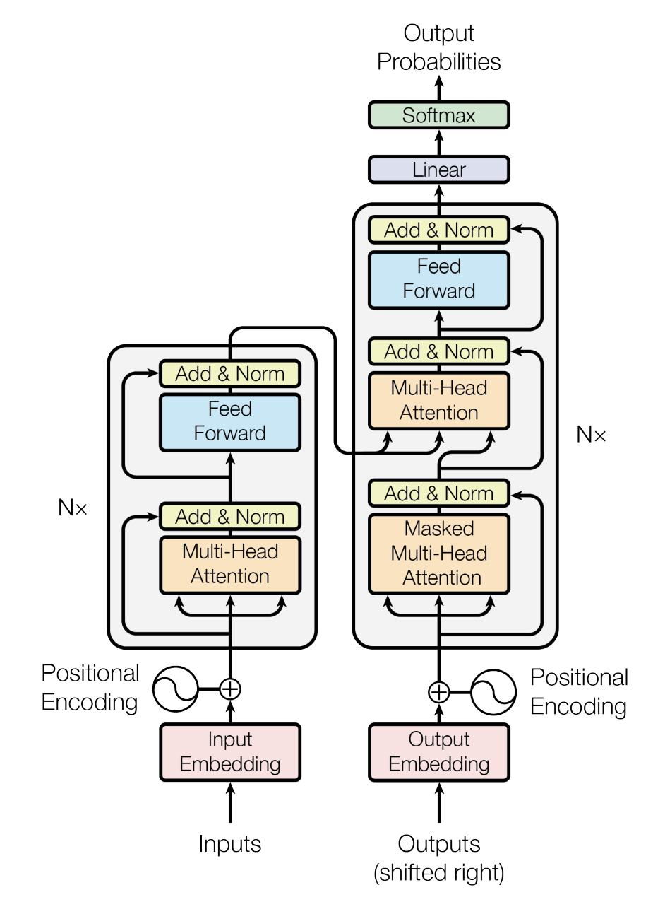
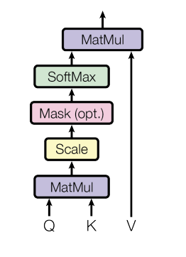
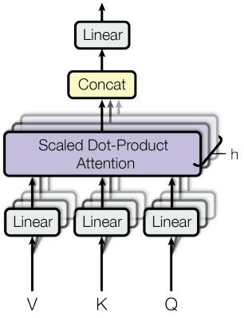

# Attention Is All You Need

## Abstract

In "Attention Is All You Need," the authors point out that most sequence transduction models—like those for machine translation—have relied on complex recurrent or convolutional neural networks, typically with both an encoder and a decoder. The best-performing models before this work used an attention mechanism to connect these two components.

The key contribution of the paper is the **Transformer** architecture, which relies entirely on attention mechanisms, removing the need for recurrence or convolutions. According to the authors, this design leads to models that are not only higher in quality, but also more parallelizable and significantly faster to train.

Their experiments on two machine translation tasks show that the Transformer achieves strong results:

- 28.4 BLEU on WMT 2014 English-to-German, surpassing previous state-of-the-art (even ensembles) by more than 2 BLEU.
- 41.8 BLEU on WMT 2014 English-to-French, setting a new single-model record with just 3.5 days of training on eight GPUs—much less compute than earlier approaches.

The authors also report that the Transformer generalizes well to other tasks, such as English constituency parsing, with both large and small datasets.

## 1. Introduction

The authors start by noting that recurrent neural networks (RNNs), particularly LSTMs and GRUs, have been the dominant approach for sequence modeling and transduction problems like language modeling and machine translation. Many advances have been made by improving these recurrent models and encoder-decoder frameworks.

However, RNNs process sequences one step at a time, which makes parallelization difficult—especially for long sequences. While some recent work has improved efficiency through various tricks and optimizations, the sequential computation bottleneck remains.

Attention mechanisms have become an important part of modern sequence models, since they allow the model to directly relate different positions in the input and output, regardless of distance. However, most attention-based models still rely on a recurrent backbone.

In this paper, the authors introduce the **Transformer**: a model architecture that eliminates recurrence and relies entirely on attention mechanisms to model dependencies between inputs and outputs. This design enables much greater parallelization and, according to their experiments, can reach state-of-the-art translation quality after as little as twelve hours of training on eight P100 GPUs.

## 2. Background

The authors emphasize that reducing sequential computation has been a major goal in previous sequence modeling research. They highlight several earlier models—**Extended Neural GPU**, **ByteNet**, and **ConvS2S**—which all use convolutional neural networks to compute hidden representations in parallel across all input and output positions.

However, in these convolutional models, the number of operations needed to connect information between any two positions still grows with the distance between them (linearly in ConvS2S, logarithmically in ByteNet). This scaling makes it harder for the model to learn dependencies between distant positions. The Transformer addresses this by reducing the number of operations needed to connect any two positions to a constant, regardless of distance. This improvement comes with a potential trade-off: the effective resolution can be reduced due to the averaging effect of attention over many positions, but the authors address this limitation using Multi-Head Attention (explained in section 3.2 of the paper).

The authors also discuss **self-attention** (or intra-attention), which relates different positions within a single sequence to compute its representation. Self-attention has already been successfully applied to tasks like reading comprehension, abstractive summarization, textual entailment, and learning general-purpose sentence representations.

Another related architecture is the end-to-end memory network, which uses a recurrent attention mechanism (rather than standard sequence-aligned recurrence) and has performed well in question answering and language modeling.

According to the authors, the Transformer is the first transduction model to rely entirely on self-attention for computing input and output representations, without using any sequence-aligned RNNs or convolutions. In the following sections, they go on to describe the Transformer architecture in detail, explain the motivation behind self-attention, and discuss the advantages of this approach over previous models like ConvS2S and ByteNet.

## 3. Model Architecture

The authors explain that most competitive sequence transduction models use an encoder-decoder structure. In this setup, the encoder takes an input sequence of symbols $(x_1, ..., x_n)$ and maps it to a sequence of continuous representations $\mathbf{z} = (z_1, ..., z_n)$. The decoder then generates an output sequence $(y_1, ..., y_m)$, producing one symbol at a time. The process is auto-regressive: at each decoding step, the model conditions on all previously generated outputs.

The Transformer adopts this encoder-decoder framework, but replaces recurrence and convolutions with **stacked self-attention** and **point-wise, fully connected layers** for both the encoder and decoder. The figure below, reproduced from the paper, illustrates the overall architecture:

    
    
<em>Transformer Model Architecture</em>

The left half of the diagram shows the encoder, while the right half shows the decoder. Both are composed of multiple layers. The encoder uses self-attention and feed-forward layers, while the decoder includes masked self-attention, encoder-decoder attention, and feed-forward layers. Positional encoding is added to the input embeddings to inject order information. The final output is passed through a linear layer and a softmax to produce probabilities over the target vocabulary.

### 3.1 Encoder and Decoder Stacks

**Encoder:**
According to the authors, the encoder consists of a stack of $N = 6$ identical layers. Each layer has two main sub-layers:

1. A multi-head self-attention mechanism.
2. A position-wise fully connected feed-forward network.

They use residual connections around each of these sub-layers, followed by layer normalization. Specifically, the output of each sub-layer is computed as `LayerNorm(x + Sublayer(x))`, where `Sublayer(x)` refers to the function implemented by the sub-layer. All sub-layers and the embedding layers output vectors of size $d_{model} = 512$, which makes it easier to use residual connections throughout the model.

**Decoder:**
The decoder is also a stack of $N = 6$ identical layers, but each decoder layer contains three sub-layers:

1. A masked multi-head self-attention mechanism (to prevent a position from attending to subsequent positions).
2. A multi-head attention layer over the encoder’s output.
3. A position-wise fully connected feed-forward network.

Just like the encoder, residual connections and layer normalization are applied around each sub-layer. The masking in the first sub-layer, combined with offset output embeddings, ensures that predictions for position $i$ depend only on the known outputs at positions less than $i$.

### 3.2. Attention

An attention function can be described as mapping a query and a set of key-value pairs to an output, where the query, keys, values, and output are all vectors. The output is computed as a weighted sum of the values, where the weight assigned to each value is computed by a compatibility function of the query with the corresponding key.

#### 3.2.1 Scaled Dot-Product Attention

    
    
<em>Scaled Dot-Product Attention</em>

- **Inputs:**

  - Queries ($Q$) and keys ($K$) are vectors of dimension $d_k$.
  - Values ($V$) are vectors of dimension $d_v$.

- **Computation:**

  $\text{Attention}(Q, K, V) = \text{softmax}\left(\frac{QK^T}{\sqrt{d_k}}\right)V$

  1. Compute the dot products between the query and all keys.
  2. Divide each by $\sqrt{d_k}$ (scaling).
  3. Optionally apply a mask (for tasks like decoding).
  4. Apply a softmax function to get the weights for the values.
  5. Output is the weighted sum of the values.

- **Comparison to Other Attention Mechanisms:**

  - _Additive attention_ uses a feed-forward network to compute the compatibility function.
  - _Dot-product attention_ is computationally faster and more space-efficient, especially when optimized with matrix multiplication libraries.
  - For small $d_k$, both mechanisms perform similarly, but additive attention may be better. For large $d_k$, unscaled dot products push softmax into regions with small gradients, so scaling by $\frac{1}{\sqrt{d_k}}$ is crucial for stable training.

#### 3.2.2 Multi-Head Attention

    
    
<em>Multi-Head Attention</em>

Instead of using a single attention function with $d_{model}$-dimensional queries, keys, and values, the authors propose **multi-head attention**. This approach involves projecting the queries, keys, and values $h$ times with different learned linear projections to dimensions $d_k$ and $d_v$. Each set of projected vectors is then fed into the attention mechanism in parallel (i.e., as separate "heads"). Each head produces output values, which are concatenated and projected again to get the final result.

**Multi-head attention allows the model to attend to information from different representation subspaces at different positions, which is something a single attention head cannot do as effectively.**

$MultiHead(Q, K, V) = Concat(head_1, ..., head_h) W^O$

where $head_i = Attention(Q W^Q_i, K W^K_i, V W^V_i)$

- $W^Q_i$, $W^K_i$, and $W^V_i$ are the learned projection matrices for the $i$-th head.
- $W^O$ is the output projection matrix.

**Typical settings:**

- The authors use $h = 8$ parallel attention heads.
- For each head:

  - $d_k = d_v = d_{model} / h = 64$

- This means the total computation is similar to that of single-head attention with full dimensionality, but with the benefit of richer feature representation.

#### 3.2.3 Applications of Attention in Model

- **Encoder-Decoder Attention:**
  In these layers, the queries come from the previous decoder layer, while the keys and values come from the encoder’s output. This allows every position in the decoder to attend over all positions in the input sequence, similar to standard encoder-decoder attention mechanisms in classic sequence-to-sequence models.

- **Encoder Self-Attention:**
  The encoder contains self-attention layers, where the queries, keys, and values all come from the same place—the output of the previous encoder layer. This means each position in the encoder can attend to all positions in the previous encoder layer.

- **Decoder Self-Attention:**
  The decoder also has self-attention layers, but with a crucial difference: each position in the decoder can only attend to positions up to and including itself (not future positions). This is enforced by masking out (setting to $-\infty$) illegal connections in the softmax, preserving the auto-regressive property needed for sequence generation.

### 3.3 Position-wise Feed-Forward Networks

Each layer in both the encoder and decoder contains a **fully connected feed-forward network** applied **independently to each position**. This sub-layer consists of two linear transformations with a ReLU activation in between:

$FFN(x) = max(0, xW_1 + b_1)W_2 + b_2$

- The weights and biases ($W_1, b_1, W_2, b_2$) are different for each layer but **shared across all positions** in the same layer.
- The dimensionality of the input and output is $d_{model} = 512$; the inner layer has dimensionality $d_{ff} = 2048$.
- You can think of this as two 1x1 convolutions.

### 3.4 Embeddings and Softmax

- As in other sequence transduction models, the Transformer uses **learned embeddings** to map input and output tokens to vectors of size $d_{model}$.
- The output of the decoder is converted to token probabilities using a **linear transformation** followed by a **softmax**.
- The weight matrix is **shared** between the two embedding layers (input and output) and the pre-softmax linear transformation.
- In the embedding layers, weights are multiplied by $\sqrt{d_{model}}$.

The authors provide a table comparing self-attention, recurrent, and convolutional layers in terms of computational complexity, degree of parallelism, and path length for signal propagation:

| Layer Type                  | Complexity per Layer     | Sequential Operations | Max Path Length |
| --------------------------- | ------------------------ | --------------------- | --------------- |
| Self-Attention              | $O(n^2 \cdot d)$         | $O(1)$                | $O(1)$          |
| Recurrent                   | $O(n \cdot d^2)$         | $O(n)$                | $O(n)$          |
| Convolutional               | $O(k \cdot n \cdot d^2)$ | $O(1)$                | $O(\log_k(n))$  |
| Self-Attention (restricted) | $O(r \cdot n \cdot d)$   | $O(1)$                | $O(n/r)$        |

- $n$: sequence length
- $d$: representation dimension
- $k$: kernel size (for convolutions)
- $r$: neighborhood size (for restricted self-attention)

**Key point:**

- **Self-attention** is highly parallelizable ($O(1)$ sequential operations), allows any position to attend to any other in a single step ($O(1)$ max path length), at the cost of higher per-layer computational complexity.
