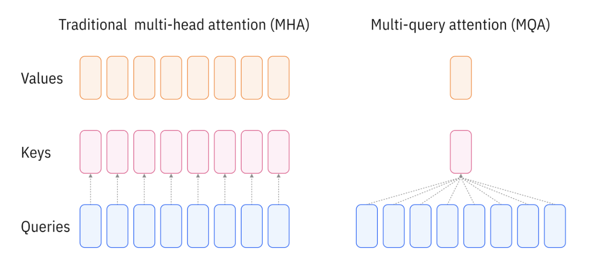
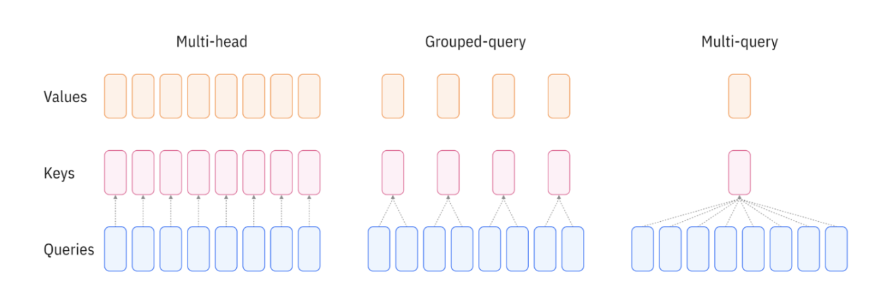

# Grouped Query Attention

- https://www.ibm.com/think/topics/grouped-query-attention

## Disadvantages of standard multi-head attention

The downside of standard multi-head attention is not so much the presence of some crucial flaw, but rather the lack of any optimization. MHA was the first algorithm of its kind and represents the most complex execution of its general mechanism for attention computation.

Most of MHA’s inefficiency stems from the abundance of calculations and model parameters. In standard MHA, each query head, key head and value head in each attention block has its own matrix of weights. So, for instance, a model with 8 attention heads in each attention layer—far fewer than most modern LLMs—would require 24 unique weight matrices for the layer's Q, K and V heads alone. This entails a huge number of intermediate calculations at each layer.

One consequence of this configuration is that it’s computationally expensive. Compute requirements for MHA scale quadratically with respect to sequence length: doubling the number of tokens in an input sequence requires quadruple the complexity. This puts hard practical limits on the size of context windows.

> Context window refers to the maximum amount of text (measured in tokens) that a large language model (LLM) can “see” or process at one time. It acts as the model’s short-term memory: everything you want the model to consider—such as the conversation history, instructions, or documents—must fit within this window. If the input is too long, some information will be cut off or summarized. The larger the context window, the more information the model can use at once, enabling it to handle longer conversations, documents, or code samples without losing track of earlier details.

MHA also puts a major strain on system memory. GPUs don’t have much on-board memory to store the outputs of the massive quantity of intermediate calculations that must be recalled at each subsequent processing step. These intermediate results are instead stored in high-bandwidth memory (HBM), which isn’t located on the GPU chip itself. This entails a small amount of latency each time keys and values must be read from memory. As transformer models began to scale to many billions of parameters, the time and compute required to train and run inference became a bottleneck on model performance.

Further progress required methods to reduce the number of computational steps without reducing the capacity of transformers to learn and reproduce intricately complex linguistic patterns. It was in this context that MQA, and subsequently GQA, were introduced.

## How multi-query attention (MQA) works

Multi-query attention (MQA) is a more computationally efficient attention mechanism that simplifies multi-head attention to reduce memory usage and intermediate calculations. Instead of training a unique key head and value head for each attention head, MQA uses a single key head and single value head at each layer. Therefore, key vectors and value vectors are calculated only once; this single set of key and value vectors is then shared across all h attention heads.

This simplification greatly reduces the number of linear projections that the model must calculate and store in high-bandwidth memory. According to the 2019 paper that introduced MQA, MQA allows a 10–100 times smaller key-value pair storage (or KV cache) and 12 times faster decoder inference. MQA’s reduced memory usage also significantly speeds up training by enabling a larger batch size.

    
    
<em>Multi-Query Attention</em>

## Disadvantages of multi-query attention (MQA)

Despite its benefits, MQA comes with several unavoidable downsides.

- Performance degradation: Unsurprisingly, reducing the number of unique, trainable model parameters reduces the model’s capacity for knowledge and nuance. MQA entails a meaningful drop in accuracy compared to standard MHA, making it unsuitable for certain situations and use cases.

- Must be trained from scratch: A model trained with standard MHA cannot be simply adapted to MQA, but must instead be trained with MQA from scratch. This means MQA cannot be used to optimize existing models and entails a considerable opportunity cost when experimenting with MQA for new models.

- Redundancies in tensor parallelism: One of the main benefits of training transformer models on GPUs is the ability to perform multiple complex tensor operations in parallel. K and V values must be present on each node of the GPU cluster performing these operations, which means that in practice they must be replicated for each node. This is not an optimal use of compute resources despite still being more efficient than standard MHA.

## How grouped query attention (GQA) works

Grouped query attention is a more general, flexible formulation of multi-query attention that partitions query heads into multiple groups that each share a set of keys and values, rather than sharing one set of keys and values across all query heads.

Following the publication of “GQA: Training Generalized Multi-Query Transformer Models from Multi-Head Checkpoints” in May 2023, many LLMs quickly adopted GQA. For instance, Meta first adopted GQA for its Llama 2 models in July 2023 and retained GQA in the Llama 3 models released in 2024. Mistral AI used GQA in the Mistral 7B model that it released in September 2023.

## Grouped query attention versus multi-query attention versus multi-head attention

In theory, GQA can be thought of as a generalization of the spectrum between standard MHA and full MQA. GQA with the same number of key-value head groups as attention heads is the equivalent of standard MHA; GQA with 1 head group is the equivalent of MQA.

In practice, GQA almost always implies some intermediate approach, in which the number of groups is itself an important hyperparameter.

    
    
<em>Grouped Query Attention</em>

## Benefits of grouped query attention

Grouped query attention offers several advantages that have led to its relatively widespread adoption for leading LLMs.

- Efficient GPU usage: GQA’s distribution of key-value pairs takes advantage of tensor parallelism, reducing the amount of compute that’s “wasted” by replicating redundant values.

- Effective compromise: GQA offers an ideal tradeoff between decoder inference speed and performance accuracy, in that it's nearly as accurate as MHA while being nearly as fast as MQA.

- Reduced memory bandwidth overhead: Like MQA, GQA significantly reduces the number of intermediate calculations that must be computed, stored and retrieved at inference time.

- Flexible training: Unlike MQA, group query attention doesn’t require models to be trained from scratch using the approach. Models pretrained using standard MHA can be adapted to use GQA through a fine-tuning process called “uptraining.”
