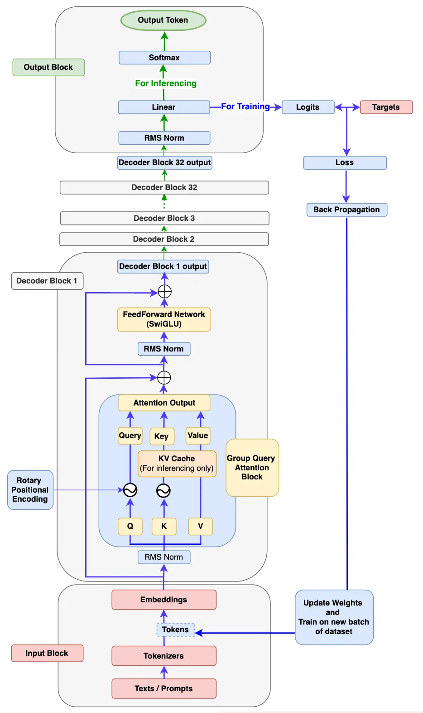
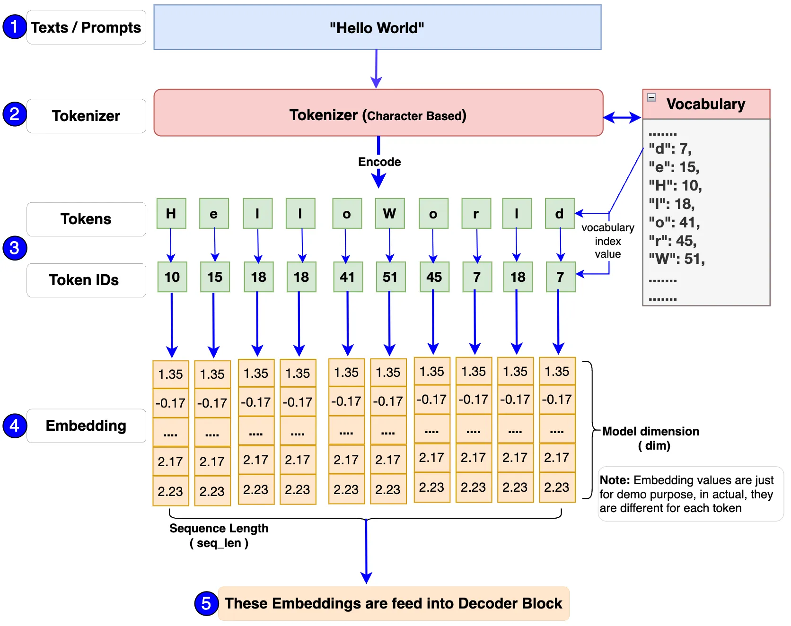
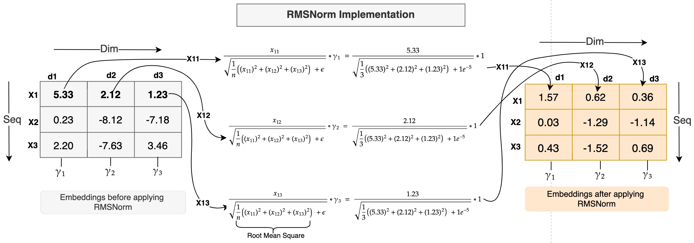
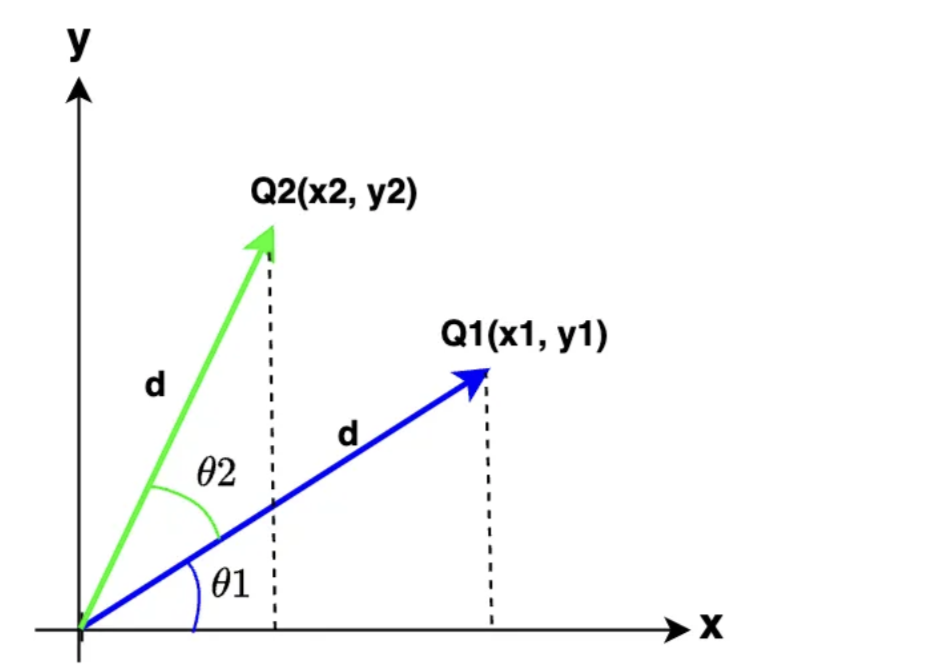
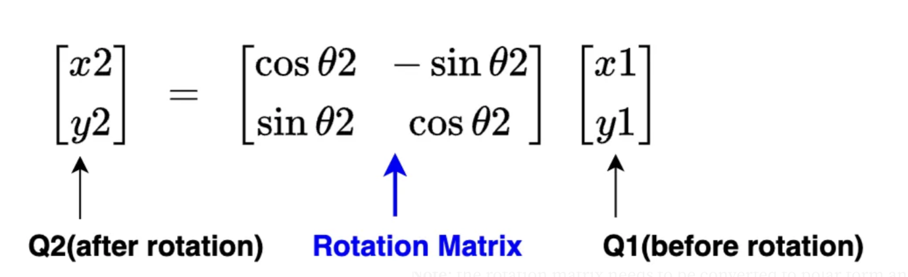
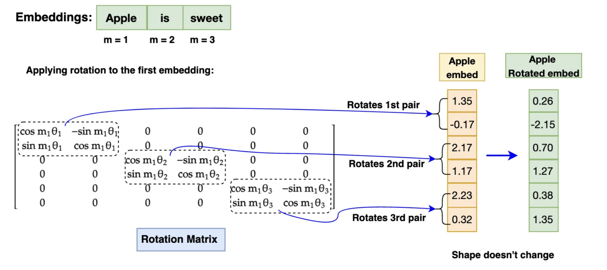
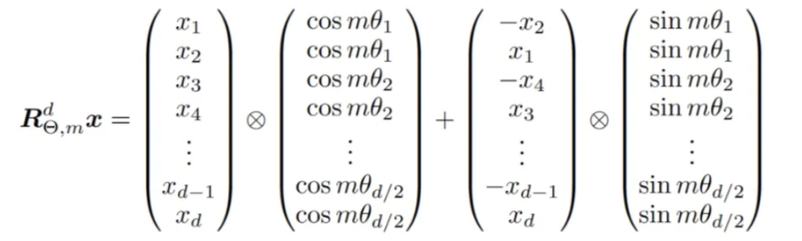
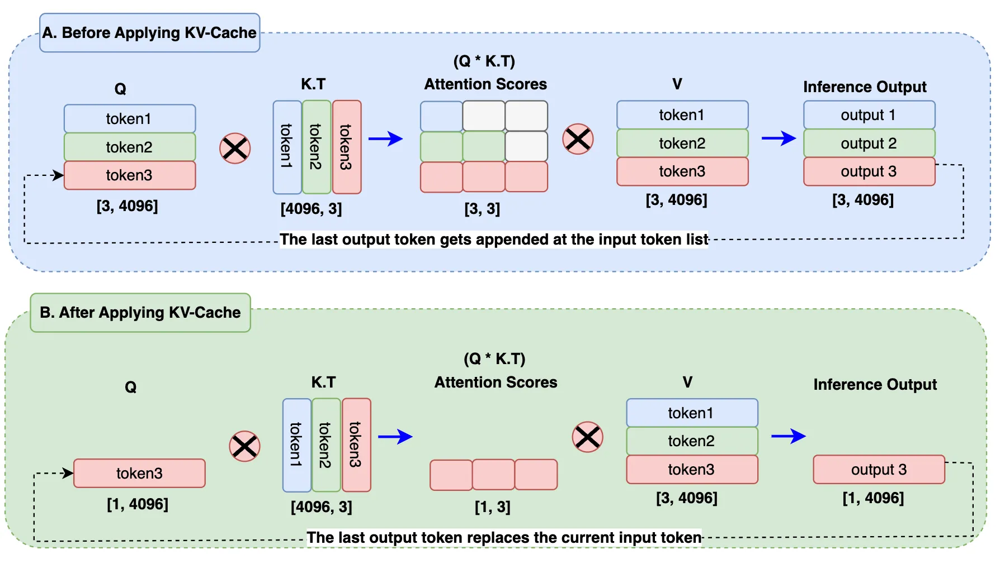

# Llama 3 Architecture

- https://pub.towardsai.net/build-your-own-llama-3-architecture-from-scratch-using-pytorch-2ce1ecaa901c

    
    
<em>Llama 3</em>

## 1. The Input Block

The input block has 3 components: Texts/ Prompts, Tokenizer and Embeddings.

    
    
<em>Input Block</em>

First, a single text or a batch of prompts (e.g., “Hello World”) is passed to the model. Since the model processes numerical inputs, a tokenizer converts the text into token IDs, representing each token’s index in the vocabulary. We will build this vocabulary and tokenizer ourselves using the Tiny Shakespeare dataset to understand encoding, decoding, and implementation details fully.

While Llama 3 uses TikToken, a subword tokenizer, we will implement a character-level tokenizer to gain complete insight and control. Each token ID is then mapped to an embedding vector of dimension 128 (4096 in Llama 3 8B) before being fed into the Decoder Block.

Implementation: [input_block.py](input_block.py)

## 2. The Decoder Block

### 2.1 RMSNorm (Root Mean Square Normalization)

#### Why RMSNorm?

As shown in the diagram, the embedding vector output from the input block passes through an RMSNorm block. Embedding vectors have high dimensionality (e.g. 4096 in Llama 3-8B), resulting in values with varying scales. Without normalization, this can lead to gradient explosion or vanishing, causing slow convergence or divergence during training. RMSNorm scales these values to a consistent range, stabilizing gradients and improving training speed.

#### How does RMSNorm work?

RMSNorm operates similarly to LayerNorm but with simplified computation:

- It normalizes along the embedding dimension.
- For each token embedding (e.g. $X_1$ with dimensions $x_{11}, x_{12}, x_{13}$), each value is divided by the root mean square (RMS) of all dimensions plus a small epsilon $\epsilon$ for numerical stability:

$$RMS(x) = \sqrt{\frac{1}{n} \sum_{i=1}^{n} x_i^2 + \epsilon}$$

- The normalized value is then scaled by a learnable parameter $\gamma$, initialized to 1:

$$RMSNorm(x_i) = \frac{x_i}{RMS(x)} \times \gamma_i$$

where each dimension has its own $\gamma_i$.

    
    
<em>RMSNorm</em>

The diagram illustrates embeddings before and after applying RMSNorm, showing reduced value ranges post-normalization.

#### Why choose RMSNorm over LayerNorm?

Unlike LayerNorm, RMSNorm does not compute the mean, reducing computational overhead. According to its authors, RMSNorm achieves similar accuracy while being more efficient.

Implementation: [RMSNorm.py](RMSNorm.py)

Here is your **professional, concise, and LaTeX-enhanced Markdown rewrite**:

### 2.2 Rotary Positional Encoding (RoPE)

#### Why do we need RoPE?

So far, we have converted input texts into embeddings and applied RMSNorm. However, without positional encoding, sentences like “I love apple” and “apple love I” would appear identical to the model, as embeddings alone lack order information. For language models, understanding token order is crucial.

In Llama 3, **Rotary Positional Encoding (RoPE)** is used to embed positional information, ensuring the model captures both **absolute** and **relative** token positions within a sequence.

#### What is RoPE and how does it work?

RoPE encodes token positions by **rotating embedding vectors** using a rotation matrix. This approach:

- Adds absolute positional information.
- Encodes relative position relationships between tokens.

Mathematically, RoPE applies a rotation transformation to each embedding dimension pair:

$$x' = R(\theta) x$$

where:

- $x$ is the embedding vector.
- $R(\theta)$ is the rotation matrix parameterized by $\theta$, derived based on token position.

    
    
<em>RoPE</em>

- Q1 $(x_1, y_1)$: A 2D Query vector with magnitude $d$ and angle $\theta_1$ relative to the x-axis.
- Q2 $(x_2, y_2)$: Formed by rotating Q1 clockwise by $\theta_2$, resulting in a new coordinate $(x_2, y_2)$ with the same magnitude $d$.

By expressing both Q1 and Q2 in polar form and applying standard derivations, we obtain the final result as shown below.

    
    
<em>Rotation Matrix</em>

In practice:

1. **Embeddings are converted to complex form** for rotation.
2. **Rotation is applied**, encoding position information.
3. **Rotated embeddings are converted back to real form** before attention operations.

    
    
<em>Rotation</em>

- θ = Rotation angle, this is different for each pair of embedding dimension. Total number is equal to dim/2
- m = Token's position number in sentence. For "apple", it is 1, for "is" it is 2. it will be remain same for each embedding.
- Dim = 6, this means each embedding rotate 3 times (6 is 3 pair)

**Note:** Even though the working principle is same, for better computation efficiency, the author has advised to perform calculation using the expression below.

    
    
<em>RoPE Calculation</em>

**Note:**

- RoPE is applied only to **Query** and **Key** embeddings, not to **Value** embeddings.
- While the diagram shows a 2D example, in Llama 3 RoPE operates over high-dimensional embeddings (e.g. 4096 dimensions).

This efficient positional encoding enables the model to understand token order and relationships without the overhead of traditional positional encodings.

Implementation: [RoPE.py](RoPE.py)

### 2.3 KV Cache (Inference Only)

In Llama 3, **KV Cache** stores previously generated tokens as **Key** and **Value** caches during inference. Only keys and values are cached; **queries are not cached**, hence the name KV Cache.

    
    
<em>KV Cache</em>

#### (A) Without KV Cache

- When generating output token 3, the model recomputes outputs for tokens 1 and 2 unnecessarily.
- This requires computing attention for all tokens, resulting in expensive matrix multiplications (e.g. $3 \times 3$ attention scores).

#### (B) With KV Cache

- Previously generated tokens are stored in the cache.
- For each new token, only its **query embedding** is processed, using cached keys and values to compute attention efficiently.
- This reduces computation from a **full sequence attention** ($3 \times 3$) to **single-step attention** ($1 \times 3$) – approximately **66% reduction** in matrix multiplications.

#### Key Benefits

- Significant computation savings, especially for long sequences and large batch sizes.
- Faster generation, as only the **latest output token** is computed at each step.

### 2.4 Grouped Query Attention

Grouped Query Attention is similar to **Multi-Head Attention (MHA)** used in models like Llama 1, with a key difference:

- MHA uses the **same number of heads** for Queries (Q), Keys (K), and Values (V).
- Grouped Query Attention uses **more heads for Queries** compared to Keys and Values.

    
    
<em>Grouped Query Attention</em>

For example, in the diagram:

- **Multi-Head Attention:**

  $$n_{heads}^{Q} = n_{heads}^{K} = n_{heads}^{V} = 8$$

- **Grouped Query Attention:**

  $$n_{heads}^{Q} = 8, \quad n_{heads}^{K} = n_{heads}^{V} = 4$$

This means Query has twice as many heads as Key/Value.

While Multi-Head Attention is effective, it scales up memory usage significantly when combined with **KV Cache** (which stores all previous Key and Value tokens). As sequence length grows, so does the memory footprint.

**Grouped Query Attention addresses this by:**

- **Reducing the number of K/V heads**, thus lowering the total cached parameters and memory requirements.
- Maintaining similar accuracy, as validated by empirical results.
