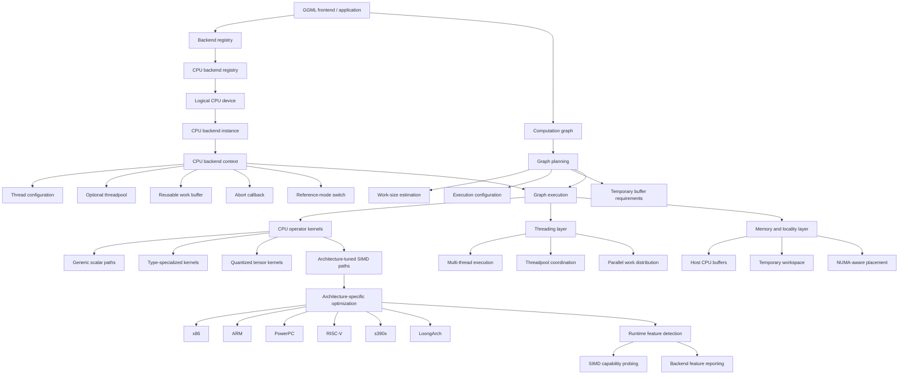
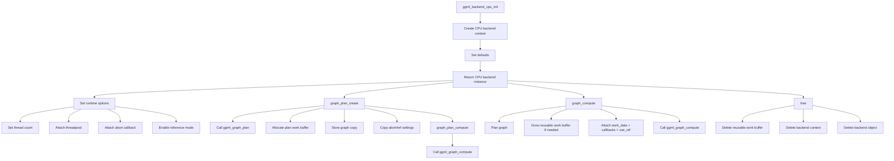
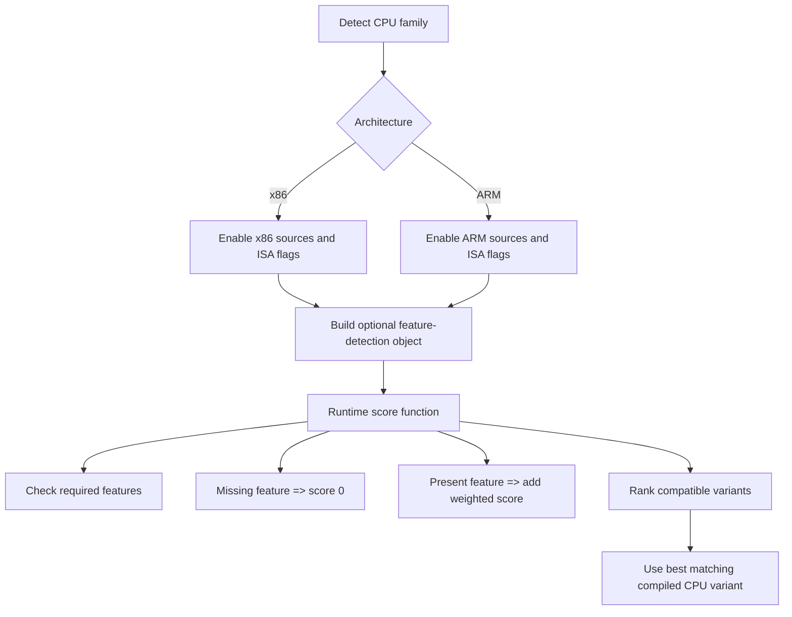
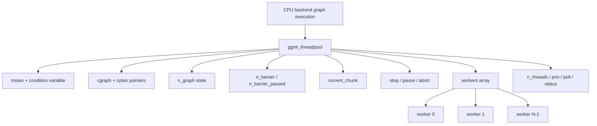
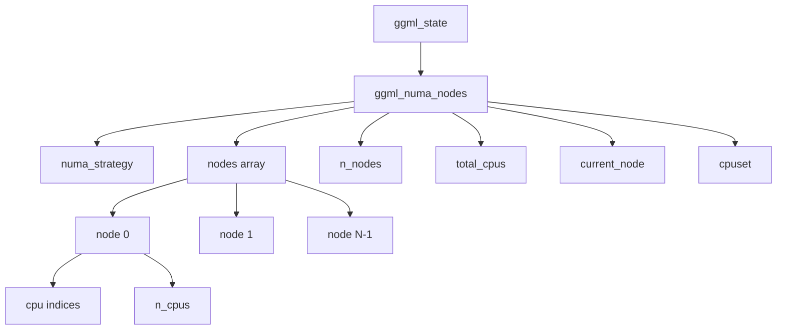
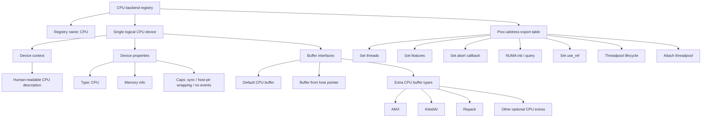

# CPU Backend

The CPU backend is GGML’s foundational execution backend and the reference implementation for tensor computation on general-purpose processors. It is the backend that guarantees GGML graphs can execute on standard host hardware without requiring a GPU or other accelerator, while still incorporating substantial performance engineering for modern CPUs.

Unlike a minimal fallback path, the CPU backend is organized as a full backend subsystem within GGML’s generic backend framework. It exposes a CPU device, creates backend instances for execution, plans computation graphs before running them, manages temporary work buffers, supports configurable thread-level parallelism, and integrates CPU-specific capabilities such as feature probing and NUMA-aware execution.

This backend is designed to scale across the major CPU families that GGML targets. The build system contains architecture-specific paths for x86, ARM, PowerPC, LoongArch, RISC-V, and s390x, allowing the same backend model to remain portable while enabling architecture-tuned kernels and instruction-set-specific optimizations where available.

At a high level, the CPU backend combines six responsibilities into one coherent execution path:

1. **Backend integration** with GGML’s registry, device, and buffer abstractions
2. **Execution context management** for thread count, threadpool selection, abort handling, and reference-mode execution
3. **Graph planning** to determine temporary workspace requirements before compute begins
4. **Operator execution** using CPU kernels and type-specialized logic
5. **System-level optimization** through multi-threading and NUMA awareness
6. **Architecture-aware acceleration** through feature detection and architecture-specific compilation paths

Because of this structure, the CPU backend plays two roles simultaneously: it is both the correctness-oriented baseline for GGML tensor operations and the production CPU path used when running optimized inference directly on host processors.

## Architecture Overview

The CPU backend follows the same abstract backend model used throughout GGML, but specializes that model for host execution. In practice, this means a computation graph does not interact directly with low-level CPU kernels. Instead, execution flows through a sequence of backend-managed stages:

- a registered CPU backend is discovered
- a logical CPU device is exposed
- a backend instance is created with its own execution context
- a graph plan is produced to determine scheduling and temporary workspace needs
- the graph is executed using CPU kernels, threadpool resources, and the selected runtime configuration

This separation is important because the CPU backend is not just a collection of operator implementations. It is also the control plane that decides how CPU execution should happen on the current machine. The same high-level graph interface can therefore adapt to different CPU configurations, different thread settings, different memory topologies, and different instruction-set capabilities without changing the graph itself.

From a systems perspective, the CPU backend architecture can be viewed as four stacked layers:

- **Backend-facing layer**
  Connects the CPU implementation to GGML’s generic registry, device, backend, and buffer interfaces.

- **Execution-control layer**
  Holds runtime state such as thread count, threadpool pointer, reusable work memory, abort callback, and reference-mode selection.

- **Compute layer**
  Plans and executes computation graphs, dispatching operator implementations onto CPU kernels.

- **Platform-optimization layer**
  Adapts execution to the actual machine through SIMD feature detection, architecture-specific build paths, thread-level parallelism, and NUMA support.

This layered design is what allows the CPU backend to remain both portable and performant. The public API exposed in the CPU header stays relatively stable, while the implementation underneath can select different optimized code paths depending on the target architecture and enabled build options.

### CPU Backend System Architecture



The diagram above shows that the CPU backend is not a single monolithic compute function. It is a coordinated subsystem where graph planning, execution control, kernel dispatch, memory handling, and platform optimization all participate in the final execution path.

A useful way to read this architecture is from left to right:

- The **frontend** builds a GGML graph.
- The **backend framework** routes execution to the registered CPU backend.
- The **CPU backend instance** carries runtime settings for that execution environment.
- The **planner** computes workspace and scheduling requirements.
- The **execution path** runs the graph through CPU kernels.
- The **system layer** improves performance through threading, memory locality, and architecture-specific optimizations.

In the current implementation, the CPU backend is exposed through a single logical CPU device. That device can initialize a backend instance, provide the default CPU buffer type, wrap host pointers as backend buffers, and report device properties through the same backend interface style used elsewhere in GGML.

The execution context attached to a CPU backend instance is intentionally compact. It stores the pieces of state that most directly affect runtime behavior: the number of threads, an optional threadpool, a reusable scratch/work buffer and its size, an abort callback with user data, and a flag that can force reference-mode execution. This makes the backend easy to configure while still allowing repeated graph execution without rebuilding all runtime state from scratch.

Graph execution itself is structured around a planning step followed by compute. Before running a graph, the backend determines the size of the required temporary workspace. During execution, that workspace can be reused across runs, which reduces allocation overhead and helps the CPU backend behave more like a long-lived execution engine than a one-shot compute helper.

From an optimization standpoint, the CPU backend sits at the intersection of two adaptation mechanisms:

- **build-time adaptation**, where architecture-specific sources and compiler flags are selected for the target CPU family
- **runtime adaptation**, where the backend probes CPU capabilities and exposes supported features such as x86 SIMD extensions, ARM vector features, RISC-V vector support, PowerPC VSX, or s390x vector capabilities

This combination is what makes the backend portable across many processor families without collapsing into a lowest-common-denominator implementation.

Finally, the CPU backend architecture is intentionally broad enough to support both simple and advanced deployment modes. On a laptop or desktop, it can act as a straightforward host backend with default buffers and basic multithreading. On larger servers, the same architecture can take advantage of configured threadpools, NUMA-aware execution strategies, and architecture-tuned kernels, all while presenting the same GGML backend interface to the rest of the system.

## Backend Interface Implementation

The CPU backend is implemented as a standard GGML backend instance rather than as a special-case execution path. This means CPU execution is plugged into the same backend abstraction used elsewhere in GGML: a backend has an interface table, a device association, a backend-specific context, graph planning hooks, and graph execution hooks.

At the backend layer, the CPU implementation behaves like a synchronous host backend:

- it has a backend name
- it owns a backend context
- it supports graph planning and graph execution
- it does not expose asynchronous tensor copy or event primitives at this layer
- it can be configured after initialization through CPU-specific setter functions

This design keeps the CPU backend consistent with the rest of the GGML backend system while still allowing CPU-specific control over threads, scratch memory, and reference-mode execution.

### Backend Context Structure

The backend-specific runtime state is stored in a compact `ggml_backend_cpu_context` structure. It contains exactly the pieces of information needed to control graph execution on CPU:

```c
struct ggml_backend_cpu_context {
    int n_threads;
    ggml_threadpool_t threadpool;
    uint8_t * work_data;
    size_t work_size;
    ggml_abort_callback abort_callback;
    void * abort_callback_data;
    bool use_ref;
};
```

#### Field-by-field role

**`n_threads`**
Controls how many CPU threads should be used when a graph is planned and executed. This is the default execution-width setting for the backend instance.

**`threadpool`**
Stores an optional externally managed threadpool. When present, graph planning and graph execution can use this pool instead of relying only on the numeric thread count.

**`work_data`**
Points to a reusable scratch buffer owned by the backend instance. This buffer is used for temporary workspace required by planned graph execution.

**`work_size`**
Records the currently allocated size of `work_data`. Before execution, the backend compares the planned work requirement against this value and grows the buffer only when necessary.

**`abort_callback` and `abort_callback_data`**
Allow execution to be interrupted cooperatively. These values are copied into the compute plan before execution so that long-running graph evaluation can be stopped by the caller.

**`use_ref`**
Forces reference-mode execution. This is a correctness-oriented control that allows the backend to prefer reference implementations rather than optimized paths when needed for debugging, validation, or comparison.

#### Architectural significance of the context design

This structure is intentionally small and execution-oriented. It does not try to store graph state, tensor ownership, or device metadata. Instead, it stores only the mutable runtime knobs that affect how a graph should be run:

- parallelism
- scheduling resource selection
- temporary memory reuse
- cancellation behavior
- implementation-mode selection

That makes the CPU backend cheap to initialize, easy to reconfigure, and efficient for repeated graph execution.

### Core Backend Operations

The CPU backend publishes a backend interface table that defines how GGML interacts with it. At the core level, the CPU backend implements the following operations:

#### 1. Backend naming and lifetime management

**`get_name`** returns `"CPU"` and gives the backend its stable user-facing identity.

**`free`** releases backend-owned resources. In the CPU implementation, that means:

- freeing the reusable scratch buffer
- deleting the CPU backend context
- deleting the backend object itself

This makes the backend instance self-contained with respect to execution state.

#### 2. Graph plan creation

**`graph_plan_create`** prepares a reusable execution plan from a computation graph.

The CPU implementation does the following:

1. reads `n_threads` and `threadpool` from the backend context
2. calls `ggml_graph_plan(...)` to create a `ggml_cplan`
3. stores a copy of the input graph in a CPU plan object
4. allocates per-plan work memory if the plan requires temporary space
5. copies abort and reference-mode settings from the backend context into the plan

This operation separates planning from execution, which is useful when the same graph shape will be executed multiple times.

#### 3. Graph plan destruction

**`graph_plan_free`** destroys a reusable CPU execution plan.
It releases the plan’s private work buffer and deletes the plan object.

This keeps reusable planning explicit and avoids hidden lifetime coupling between graphs and backend instances.

#### 4. Planned graph execution

**`graph_plan_compute`** executes a previously created CPU plan by calling the generic graph compute function with the plan’s stored graph and compute plan.

This is the “prepared execution” path.

#### 5. Immediate graph execution

**`graph_compute`** provides the one-shot execution path.

The CPU implementation performs the following sequence:

1. build a fresh `ggml_cplan` from the input graph using current backend settings
2. compare required `work_size` against the backend’s reusable scratch buffer
3. reallocate `work_data` only if the current buffer is too small
4. attach `work_data`, abort callback, abort callback data, and `use_ref` to the plan
5. invoke `ggml_graph_compute(...)`

This path is important because it makes the CPU backend efficient in the common case of repeated inference. The backend instance can retain its scratch buffer across runs instead of reallocating it every time.

#### 6. Backend initialization

**`ggml_backend_cpu_init()`** creates a new CPU backend instance.

Initialization performs these steps:

1. calls `ggml_cpu_init()` up front
2. allocates a new `ggml_backend_cpu_context`
3. sets default values:

   - default thread count
   - no threadpool
   - no scratch buffer
   - no abort callback
   - `use_ref = false`

4. allocates and returns a backend object bound to:

   - the CPU backend GUID
   - the CPU backend interface table
   - the single logical CPU device
   - the newly created CPU context

This eager initialization is significant because CPU capability setup is performed before the first graph run, avoiding extra latency on the first computation.

#### 7. CPU-specific runtime setters

The CPU backend also exposes a small set of configuration functions that mutate the backend context after initialization:

- `ggml_backend_cpu_set_n_threads(...)`
- `ggml_backend_cpu_set_threadpool(...)`
- `ggml_backend_cpu_set_abort_callback(...)`
- `ggml_backend_cpu_set_use_ref(...)`

Together, these functions turn the backend into a configurable execution engine rather than a fixed-function compute object.

#### Backend operation summary



---

## CPU Variants and SIMD Optimizations

GGML’s CPU backend is portable, but it is not compiled as a single lowest-common-denominator implementation. Instead, the build system selects architecture-specific source files and instruction-set flags so that the same backend model can be specialized for the target CPU family.

At a high level, the CPU optimization strategy has three layers:

1. **architecture selection**
   Choose the correct CPU family path such as x86 or ARM.

2. **variant compilation**
   Compile kernels with ISA-specific flags and preprocessor definitions.

3. **runtime suitability checks**
   Expose feature probes and, in dynamic-backend mode, score whether a compiled variant matches the host CPU.

The result is a backend that stays API-compatible while allowing aggressive SIMD specialization underneath.

### x86 Architecture Variants

For x86 builds, the CPU backend adds x86-specific source files, including quantization and repacking sources under `ggml-cpu/arch/x86/`.

The x86 build path supports a layered instruction-set model. Depending on configuration, compilation may enable:

- `SSE4.2`
- `F16C`
- `FMA`
- `BMI2`
- `AVX`
- `AVX2`
- `AVX_VNNI`
- `AVX512`
- `AVX512_VBMI`
- `AVX512_VNNI`
- `AVX512_BF16`
- `AMX_TILE`
- `AMX_INT8`
- `AMX_BF16`

#### x86 build modes

**Native mode**
When `GGML_NATIVE` is enabled, the compiler is allowed to target the local machine directly, typically through `-march=native` on non-MSVC toolchains.

**Explicit feature mode**
When native mode is not used, individual x86 ISA flags are appended explicitly. This produces a more controlled build where the enabled feature set is known and reproducible.

**MSVC-specific handling**
On MSVC, some x86 feature handling is more manual. The build logic compensates for compiler behavior by adding definitions for features that MSVC does not expose through the same macro model as GCC or Clang.

#### Why the x86 path is layered

The x86 ISA landscape is incremental. Features such as AVX2, AVX-VNNI, AVX-512 extensions, and AMX do not all appear together on all machines. GGML therefore treats them as composable capability layers rather than as one monolithic “x86 optimized” mode.

That layering is reflected in both:

- compile-time flags and definitions
- runtime feature reporting and variant scoring

### ARM Architecture Variants

For ARM builds, the CPU backend adds ARM-specific source files, including `ggml-cpu/arch/arm/quants.c` and `ggml-cpu/arch/arm/repack.cpp`.

ARM support is organized around architectural baselines plus progressively newer vector and matrix extensions.

#### ARM build modes

**Native mode**
The build system attempts to infer the effective native ARM target and derive a usable `-march=` or `-mcpu=` flag. It also probes key ARM features through compile checks.

**Explicit architecture mode**
If `GGML_CPU_ARM_ARCH` is specified, the build uses that explicit architecture string directly.

**All-variants mode**
When `GGML_CPU_ALL_VARIANTS` is used, the build begins with a conservative baseline and then raises the target architecture based on requested features.

#### ARM feature tiers in all-variants mode

The build logic starts from:

- `armv8-a`

Then it bumps the required architecture according to enabled features:

- `armv8.2-a` for:

  - dot-product
  - FP16 vector arithmetic
  - SVE

- `armv8.6-a` for:

  - integer matrix multiply (`i8mm`)
  - SVE2

- `armv9.2-a` for:

  - SME

It also appends architecture tags such as:

- `+dotprod`
- `+fp16`
- `+sve`
- `+i8mm`
- `+sve2`
- `+nosve`
- `+sme`

This creates a compact but expressive way to encode a specific ARM variant build.

#### ARM compile-time probing

The ARM path also includes explicit compile checks for features such as:

- `DOTPROD`
- `MATMUL_INT8`
- `SVE`
- `SME`

These checks help ensure that the final build flags actually correspond to compiler-supported features.

### Variant Selection Flow

The CPU backend’s variant model is a combination of build-time selection and runtime suitability testing.

#### Step 1: choose the architecture family

The build first determines the system architecture and routes CPU compilation into the corresponding family path, such as:

- ARM
- x86
- PowerPC
- LoongArch
- RISC-V
- s390x
- fallback generic CPU path

For the sections here, the important paths are x86 and ARM.

#### Step 2: assemble architecture-specific sources and flags

Once the architecture family is known, the build appends:

- architecture-specific source files
- ISA-specific compile flags
- corresponding preprocessor definitions

This is how the backend gains access to SIMD-specialized kernels and feature-specific code paths.

#### Step 3: build feature-detection support separately for dynamic loading

When dynamic backend loading is enabled, GGML compiles feature-detection code as a separate object target. The CMake comment explicitly states that this separation is needed so feature detection can be built without inheriting the architecture flags of a specific optimized variant.

This matters because multiple CPU backend variants may coexist in one build.

#### Step 4: compute a compatibility score at runtime

Each architecture-specific feature-detection unit exposes a score function.

For x86:

- the score begins at a base value
- each compiled-in required feature is checked against the host CPU
- if a required feature is missing, the score becomes `0`
- if a required feature is present, the score is increased by a weighted bit increment

For ARM:

- the same pattern is used
- required features such as DOTPROD, FP16 vector arithmetic, SVE, I8MM, SVE2, and SME are checked
- missing required features force score `0`
- present required features increase the score

This scoring approach gives each compiled backend variant a concise compatibility ranking.

#### Step 5: prefer the most specific compatible variant

Because incompatible variants return `0` and more capable variants accumulate higher scores, the runtime has a natural ordering it can use to distinguish between:

- unsupported variants
- minimally compatible variants
- more feature-rich compatible variants

Conceptually, the flow is:



### CPU Feature Detection

The CPU backend exposes feature detection in two complementary ways:

1. **public per-feature probe functions**
2. **backend-level exported feature list**

#### Public CPU probe API

The public CPU header defines a large set of `ggml_cpu_has_*` style functions that allow callers to query concrete hardware capabilities.

Examples include:

**x86**

- `ggml_cpu_has_sse3`
- `ggml_cpu_has_ssse3`
- `ggml_cpu_has_avx`
- `ggml_cpu_has_avx_vnni`
- `ggml_cpu_has_avx2`
- `ggml_cpu_has_bmi2`
- `ggml_cpu_has_f16c`
- `ggml_cpu_has_fma`
- `ggml_cpu_has_avx512`
- `ggml_cpu_has_avx512_vbmi`
- `ggml_cpu_has_avx512_vnni`
- `ggml_cpu_has_avx512_bf16`
- `ggml_cpu_has_amx_int8`

**ARM**

- `ggml_cpu_has_neon`
- `ggml_cpu_has_arm_fma`
- `ggml_cpu_has_fp16_va`
- `ggml_cpu_has_dotprod`
- `ggml_cpu_has_matmul_int8`
- `ggml_cpu_has_sve`
- `ggml_cpu_get_sve_cnt`
- `ggml_cpu_has_sme`

**Other architectures**

- `ggml_cpu_has_riscv_v`
- `ggml_cpu_get_rvv_vlen`
- `ggml_cpu_has_vsx`
- `ggml_cpu_has_vxe`
- `ggml_cpu_has_wasm_simd`

This API gives the rest of GGML, benchmarks, and applications a stable hardware-capability interface independent of the underlying detection implementation.

#### Backend-exported feature list

At the backend-registry level, the CPU backend also constructs a feature list dynamically. During this process it calls `ggml_cpu_init()` and then appends feature name/value pairs for capabilities detected on the current machine.

The exported feature list can include entries such as:

- `SSE3`
- `SSSE3`
- `AVX`
- `AVX_VNNI`
- `AVX2`
- `F16C`
- `FMA`
- `BMI2`
- `AVX512`
- `AVX512_VBMI`
- `AVX512_VNNI`
- `AVX512_BF16`
- `AMX_INT8`
- `NEON`
- `ARM_FMA`
- `FP16_VA`
- `MATMUL_INT8`
- `SVE`
- `DOTPROD`
- `SVE_CNT`
- `SME`
- `RISCV_V`

The list may also include backend-build capabilities such as:

- `ACCELERATE`
- `CPU_HBM`
- `OPENMP`
- `KLEIDIAI`
- `REPACK`

This exported feature table is useful because it unifies hardware features and important backend build capabilities under one query mechanism.

#### x86 detection model

The x86 feature detection code is based on CPUID queries.

Its detection logic:

- queries standard CPUID leaves
- queries extended CPUID leaves
- captures the vendor string
- distinguishes Intel and AMD vendors
- inspects bit fields for the requested ISA extensions

The x86 dynamic scoring path then maps those detected bits against the set of features that the compiled variant requires.

#### ARM detection model

The ARM feature detection path is platform-aware.

On Linux AArch64, it reads hardware capability flags using:

- `getauxval(AT_HWCAP)`
- `getauxval(AT_HWCAP2)`

These are used to detect capabilities such as:

- dot-product
- FP16 vector arithmetic
- SVE
- SVE2
- I8MM
- SME

On Apple platforms, the ARM path uses `sysctlbyname(...)` queries for feature detection, including DotProd, I8MM, and SME. The source also notes that Apple does not currently expose SVE in this path.

#### Why CPU feature detection matters in GGML

CPU feature detection is not just informational. It directly influences:

- which SIMD kernels are valid to use
- whether a compiled backend variant is compatible with the current machine
- what capabilities the backend can report to higher layers
- how portable CPU builds can remain while still taking advantage of modern ISA extensions

## Multi-Threading Support

The CPU backend includes a built-in multi-threading subsystem rather than delegating parallel execution entirely to external runtimes. This makes CPU execution self-contained: GGML can create and manage its own worker threads, coordinate graph execution, synchronize operator phases, and distribute work dynamically across threads.

At the public API level, the CPU backend exposes threadpool lifecycle and control functions, including:

- threadpool creation
- threadpool destruction
- thread count query
- pause
- resume

This is important because CPU execution can be configured in two ways:

1. by setting only a thread count for backend execution
2. by attaching an explicit threadpool object and letting the backend execute through that pool

In both cases, the multi-threading model remains part of the CPU backend itself.

### Threadpool Architecture

The central execution object for CPU parallelism is `ggml_threadpool`. It is a coordination structure that combines scheduling state, synchronization state, worker ownership, and execution metadata.

Its internal structure contains the following major components:

- **mutex and condition variable**
  Used for worker waiting and wakeup behavior.

- **active graph and plan pointers**
  The threadpool can be attached to the graph and compute plan currently being processed.

- **graph-generation / active-thread synchronization state**
  A packed atomic field tracks work availability and the currently active thread count.

- **barrier state**
  Two cache-line-aligned atomic counters coordinate barrier entry and barrier release.

- **chunk scheduler state**
  A cache-line-aligned atomic `current_chunk` counter is used for dynamically claiming chunks of work, especially during matrix multiplication paths.

- **lifecycle and control flags**
  The threadpool keeps atomic `stop`, `pause`, and `abort` flags for shutdown, temporary suspension, and graph abortion.

- **worker array**
  A pointer to per-thread worker state objects.

- **configuration fields**
  These include the number of threads, scheduling priority, polling level, and execution status.

Conceptually, the threadpool sits between graph execution and kernel execution. It does not replace the operator kernels. Instead, it determines how many workers are active, how work is divided, when threads synchronize, and how execution can be paused or aborted.

A simplified view looks like this:



This design makes the threadpool more than a passive worker container. It is the execution coordinator for parallel CPU graph evaluation.

### Thread State Structure

Each worker thread is represented by a `ggml_compute_state` structure. This is the per-thread execution record used by the threadpool.

Its fields are intentionally compact:

- **thread handle**
  Present on the non-OpenMP path.

- **last_graph**
  Tracks which graph generation the worker has most recently observed.

- **pending**
  Marks whether the worker has pending work on the current graph generation.

- **cpumask**
  Stores the CPU affinity mask for that worker.

- **threadpool pointer**
  Links the worker back to the owning threadpool.

- **thread index (`ith`)**
  Identifies the worker within the pool.

This structure highlights an important design choice: GGML treats each worker as a lightweight execution agent with just enough state to:

- know which graph generation it is serving
- determine whether it has pending work
- bind itself to the intended CPU set
- identify its role in per-op work partitioning

Because affinity state is stored per worker, the CPU backend can keep thread placement decisions close to the thread that actually executes the work.

### Barrier Synchronization

The CPU backend uses two different barrier strategies depending on build configuration.

#### OpenMP path

When `GGML_USE_OPENMP` is enabled, the barrier implementation is simply:

- an early return if only one thread is active
- otherwise an OpenMP barrier

This lets OpenMP provide the synchronization primitive directly.

#### Native threadpool path

When OpenMP is not used, GGML falls back to a custom barrier implemented with atomics.

The native barrier works as follows:

1. Read the current active thread count from the packed `n_graph` field.
2. Return immediately if only one thread is active.
3. Load the current barrier generation value from `n_barrier_passed`.
4. Atomically increment `n_barrier` using sequential consistency.
5. If the incrementing thread is the last thread to arrive:

   - reset `n_barrier` to zero
   - increment `n_barrier_passed`
   - release the barrier

6. Otherwise:

   - spin until `n_barrier_passed` changes
   - then perform an exit fence before continuing

This gives the CPU backend a reusable barrier that does not depend on OpenMP and can be used uniformly by internal worker threads.

Two implementation details are worth noting:

- the barrier counters are cache-line aligned to reduce contention and false sharing
- the implementation uses architecture-specific CPU relax instructions while spinning

For the polling loop, GGML uses:

- `yield` on AArch64
- `_mm_pause()` on x86-64
- `pause` (or its encoded fallback) on RISC-V
- a no-op fallback on other targets

This reduces waste during spin-waiting and makes the custom barrier friendlier to modern CPUs.

### Work Chunk Distribution

Parallel CPU execution is not limited to assigning one fixed slice of work to each thread. The threadpool also supports dynamic chunk claiming through the `current_chunk` atomic counter.

Two helper functions expose this mechanism:

- **set current chunk**
- **atomically add to current chunk and return the previous value**

This chunk counter is explicitly documented in the threadpool as the shared chunk-progress state used during matrix multiplication. The design is simple but effective:

1. initialize the chunk counter before a chunked parallel phase
2. let workers atomically claim the next available chunk
3. continue until all chunks have been assigned

This approach improves load balancing when work is not perfectly uniform across threads. Instead of statically binding one large region to each worker, the backend can hand out smaller pieces incrementally.

In practice, this chunk model is especially useful for:

- matrix multiplication
- tiled inner loops
- workloads where different chunks may complete at different speeds
- reducing straggler effects near the end of a parallel phase

So the CPU backend’s parallel model combines:

- **thread-level parallelism** for multiple workers
- **barrier synchronization** for phase boundaries
- **dynamic chunk claiming** for better work balancing

---

## NUMA Support

The CPU backend contains an explicit NUMA subsystem for multi-socket and multi-node systems. Rather than treating CPU memory as uniformly local, GGML records NUMA topology and selected policy state in a dedicated global structure.

At the API level, NUMA initialization is exposed explicitly through:

- `ggml_numa_init(...)`

The API comment states that this should be called once for better performance on NUMA systems.

### NUMA Initialization and Detection

The entry point for NUMA setup is `ggml_numa_init(enum ggml_numa_strategy numa_flag)`.

#### Initialization behavior

When called, the backend first checks whether NUMA has already been initialized. If it has, initialization is rejected with a message and the function returns early.

If NUMA is not yet initialized, the selected strategy is recorded into global NUMA state and topology discovery begins.

#### Linux topology discovery

The current implementation performs real NUMA discovery on GNU/Linux.

The detection flow is:

1. capture the current affinity mask using `pthread_getaffinity_np`
2. enumerate NUMA nodes by checking for:

   - `/sys/devices/system/node/node0`
   - `/sys/devices/system/node/node1`
   - and so on

3. enumerate CPUs by checking for:

   - `/sys/devices/system/cpu/cpu0`
   - `/sys/devices/system/cpu/cpu1`
   - and so on

4. determine the current CPU and current NUMA node using:

   - `getcpu(...)` when available
   - or a direct syscall fallback for older glibc environments

5. build each per-node CPU list by probing:

   - `/sys/devices/system/node/nodeN/cpuC`

If the discovered topology is invalid or the current node cannot be determined, the NUMA system is effectively disabled by resetting the detected node count.

#### NUMA-balancing warning

After successful topology detection, the backend checks `/proc/sys/kernel/numa_balancing`.

If NUMA balancing is enabled, GGML emits a warning because this kernel behavior has been observed to impair performance.

#### Non-Linux platforms

Outside GNU/Linux, the current implementation does not provide a full portable NUMA discovery path. The function accepts the requested strategy but the implementation is left as a TODO. The NUMA state still uses a portable fallback field for the affinity mask on non-Linux builds.

This means the NUMA subsystem is currently strongest on Linux, which is also the most common environment for server-class CPU inference.

### NUMA Strategy Options

The CPU API defines five NUMA strategy values:

- `GGML_NUMA_STRATEGY_DISABLED`
- `GGML_NUMA_STRATEGY_DISTRIBUTE`
- `GGML_NUMA_STRATEGY_ISOLATE`
- `GGML_NUMA_STRATEGY_NUMACTL`
- `GGML_NUMA_STRATEGY_MIRROR`

These options are stored in the global NUMA state during initialization.

At this architecture-overview level, the safest way to understand them is as policy categories that describe how the CPU backend should relate execution and memory placement to NUMA topology:

- **Disabled**
  Treat NUMA optimization as off.

- **Distribute**
  Prefer spreading placement across nodes.

- **Isolate**
  Prefer keeping execution and placement constrained.

- **Numactl**
  Respect the externally imposed CPU affinity context captured from the current process.

- **Mirror**
  Enable a mirrored placement policy category.

What matters architecturally is not just the names themselves, but that the CPU backend has a first-class NUMA policy enum rather than a single hard-coded behavior. This makes NUMA handling configurable and explicit.

### NUMA State Structure

NUMA state is stored in a dedicated `ggml_numa_nodes` structure inside a global `ggml_state`.

The structure contains:

- **selected NUMA strategy**
- **array of NUMA nodes**
- **number of detected nodes**
- **total CPU count**
- **current NUMA node**
- **captured process affinity set**

Each NUMA node is represented by a `ggml_numa_node`, which stores:

- an array of CPU indices belonging to that node
- the count of CPUs recorded for that node

The implementation also defines fixed limits:

- up to **8 NUMA nodes**
- up to **512 CPUs**

A simplified view looks like this:



This structure is important because it gives the CPU backend a stable internal representation of machine topology. Once initialized, the backend can reason about:

- whether the machine is actually NUMA
- which CPUs belong to which node
- where the current process is running
- what affinity constraints were already applied externally
- which NUMA strategy the runtime requested

The helper `ggml_is_numa()` then reduces that state to a simple runtime test: the system is considered NUMA when the detected node count is greater than one.

## Buffer Types and Memory Management

The CPU backend uses GGML’s generic backend-buffer abstraction rather than treating host memory as a special case. In practice, that means CPU tensors are still allocated through backend buffer types, attached to backend buffers, and checked against device support rules the same way as other backends.

From the CPU backend’s point of view, memory management is organized around four related concepts:

1. **the default CPU buffer type**
2. **wrapping existing host pointers as CPU buffers**
3. **optional specialized CPU-side buffer types**
4. **device-side selection and support checks**

This model keeps CPU memory handling simple at the surface while still allowing optimized storage formats and optional alternate allocators underneath.

### Buffer Type Hierarchy

The CPU backend’s buffer hierarchy is best understood as a layered set of host-accessible buffer classes.

#### 1. Standard CPU buffer type

This is the baseline host-memory buffer type for the CPU backend. It is the default buffer type returned by the CPU device and is also exposed as an always-available public CPU buffer type.

It is the canonical choice for ordinary CPU tensor allocation.

#### 2. Wrapped host-pointer buffers

The CPU backend can also build a backend buffer directly from an existing host pointer. This is useful when memory is already allocated externally and GGML should treat it as a CPU backend buffer without copying it.

This path gives the CPU backend a zero-copy-friendly integration point.

#### 3. Optional specialized CPU buffer types

Beyond the default buffer type, the CPU backend can expose additional specialized buffer types. In the current implementation, the extra-buffer list may include optional CPU-side optimized formats such as:

- AMX buffer types
- RISC-V Spacemit buffer types
- KleidiAI buffer types
- repack buffer types

These are not generic replacement buffers for all tensors. They are specialized storage types intended to support specific optimized kernel paths.

#### 4. CPU HBM buffer type

Separately, the CPU backend also contains a dedicated `CPU_HBM` buffer type implementation when HBM support is compiled in.

This buffer type is distinct from the extra-buffer list and should be thought of as an alternate host allocation strategy rather than just another kernel-specialized storage format.

#### Practical hierarchy

A useful mental model is:

```text
CPU backend memory
├── Standard CPU buffer type
├── Host-pointer-wrapped CPU buffer
├── Optional extra optimized CPU buffer types
│   ├── AMX
│   ├── KleidiAI
│   ├── Spacemit
│   └── Repack
└── Optional CPU_HBM buffer type
```

This hierarchy is intentionally flexible: the default path remains plain host memory, while specialized cases can opt into alternate buffer types without changing the frontend graph model.

### Standard CPU Buffer

The standard CPU buffer is the backend’s default host-memory buffer type.

At the interface level, the CPU backend device returns this buffer type when asked for its default buffer type. This makes it the natural allocation target for ordinary CPU tensors.

The standard CPU buffer also underlies host-pointer wrapping. When the device is asked to create a buffer from an existing host pointer, it delegates to the CPU buffer-from-pointer path rather than inventing a separate wrapped-buffer family.

Architecturally, the standard CPU buffer serves three purposes:

- **default allocation target** for CPU backend tensors
- **host-accessible storage model** for normal CPU execution
- **base implementation reused by other CPU-side buffer variants**

That last point matters because specialized CPU buffer types can reuse pieces of standard CPU buffer behavior such as alignment handling and host-buffer semantics.

In other words, the standard CPU buffer is not just the simplest path. It is also the baseline contract that other CPU buffer types build upon.

### CPU HBM Buffer

The CPU backend includes an optional `CPU_HBM` buffer type guarded by `GGML_USE_CPU_HBM`.

This implementation is designed for systems where host-side high-bandwidth memory is available through `memkind`. When enabled, the HBM buffer allocator:

1. names the buffer type `CPU_HBM`
2. allocates memory using `hbw_posix_memalign`
3. wraps the resulting pointer as a CPU backend buffer
4. overrides the free operation so the allocation is released with `hbw_free`

This design is important because it means the HBM buffer is still structurally a CPU backend buffer. It is not a separate execution backend. It remains host-visible and compatible with CPU execution, but changes the allocator used for the underlying storage.

The `CPU_HBM` buffer type also reuses standard CPU buffer behavior for:

- alignment policy
- host-buffer classification

So conceptually, `CPU_HBM` is best seen as:

- **same CPU execution model**
- **different allocation source**

That makes it a memory-placement optimization rather than a different compute model.

One subtle point in the current implementation is that `CPU_HBM` is implemented as its own buffer type, but it is not part of the CPU device’s extra-buffer-type list returned by `ggml_backend_cpu_device_get_extra_buffers_type()`. The extra-buffer list is currently reserved for specialized optimized buffer formats such as AMX, KleidiAI, Spacemit, and repack buffers.

### Buffer Type Selection

The CPU backend selects and accepts buffer types through a few simple rules.

#### Default selection

If the runtime asks the CPU device for its default buffer type, the answer is the standard CPU buffer type.

This is the normal path for general tensor allocation on CPU.

#### External memory selection

If the runtime already owns a host allocation, the CPU device can build a CPU backend buffer directly from that host pointer.

This path is selected explicitly through the buffer-from-host-pointer interface.

#### Specialized buffer selection

For optimized CPU-specific storage formats, selection is driven by optional extra buffer types. The CPU device exposes a null-terminated list of these extra buffer types, and support checks accept them as valid CPU-device buffers.

This means the CPU backend explicitly recognizes two buffer-type classes as supported:

- host buffer types
- registered CPU extra buffer types

#### HBM selection

`CPU_HBM` is compile-time optional and allocator-specific. It is available only when CPU HBM support is built in. In the current implementation, it exists as a dedicated buffer type but is not automatically surfaced through the extra-buffer-type list.

So in practice:

- the **standard CPU buffer** is the default
- **wrapped host buffers** are the direct external-memory path
- **extra CPU buffer types** are the device-advertised optimized path
- **CPU_HBM** is an optional alternate CPU allocation type that exists alongside them

---

## Build System and Configuration

The CPU backend is built through a dedicated CMake path that specializes the backend for the target architecture while preserving a common backend interface.

The build logic is split into two levels:

1. **top-level options**, where the project defines CPU-related configuration knobs
2. **CPU backend compilation logic**, where those knobs are translated into sources, compile definitions, compile flags, and optional feature-detection objects

This separation keeps the user-facing configuration stable while allowing the CPU backend to generate different concrete variants underneath.

### CMake Build Options

At the top level, the GGML build defines several options that directly affect the CPU backend.

#### CPU backend enablement and general tuning

- `GGML_CPU` enables the CPU backend
- `GGML_NATIVE` optimizes the build for the current machine
- `GGML_OPENMP` enables OpenMP support
- `GGML_ACCELERATE` enables Apple Accelerate integration on Apple platforms
- `GGML_LLAMAFILE` enables the LLAMAFILE path when requested

#### CPU-memory and specialized CPU-kernel options

- `GGML_CPU_HBM` enables memkind-based CPU HBM allocation support
- `GGML_CPU_REPACK` enables runtime weight conversion / repack support
- `GGML_CPU_KLEIDIAI` enables KleidiAI-optimized kernels where applicable

#### Variant and architecture-selection options

- `GGML_CPU_ALL_VARIANTS` enables building all CPU backend variants and is intended for dynamic backend loading scenarios
- `GGML_CPU_ARM_ARCH` allows an explicit ARM architecture string
- `GGML_CPU_POWERPC_CPUTYPE` allows an explicit PowerPC CPU type string

#### ISA-specific build options

The top-level build also exposes many architecture-extension toggles, including examples such as:

- `GGML_SSE42`
- `GGML_AVX`
- `GGML_AVX_VNNI`
- `GGML_AVX2`
- `GGML_BMI2`
- `GGML_AVX512`
- `GGML_AVX512_VBMI`
- `GGML_AVX512_VNNI`
- `GGML_AVX512_BF16`
- `GGML_FMA`
- `GGML_F16C`
- `GGML_AMX_TILE`
- `GGML_AMX_INT8`
- `GGML_AMX_BF16`

as well as non-x86 toggles such as LoongArch, RISC-V, and s390x-related options.

The important architectural point is that the CPU backend is not configured through one single “optimization level” switch. Instead, the build system exposes a family of knobs covering:

- ISA selection
- runtime portability
- alternate allocators
- optional optimized kernel systems
- dynamic multi-variant builds

### Architecture-Specific Flags

Inside the CPU backend CMake logic, those options are translated into actual compile flags and compile definitions.

#### Common backend compilation

Every CPU backend variant is built from a shared core source set that includes:

- core CPU compute files
- quantization code
- traits and vector helpers
- repack infrastructure
- HBM support files
- AMX support files
- operator implementations

This shared source base is then specialized according to architecture.

#### x86 flags

On x86, the build logic appends instruction-set flags such as:

- `-msse4.2`
- `-mavx`
- `-mavx2`
- `-mavxvnni`
- `-mbmi2`
- `-mf16c`
- `-mfma`
- `-mavx512f`
- `-mavx512vbmi`
- `-mavx512vnni`
- `-mavx512bf16`
- `-mamx-tile`
- `-mamx-int8`
- `-mamx-bf16`

depending on enabled options and compiler mode.

The build also accumulates matching compile definitions so the backend implementation can know which features were compiled in.

#### ARM flags

On ARM, the backend can derive architecture flags from native detection or from explicit configuration. In all-variants mode it starts from a baseline and appends architecture extensions such as:

- `+dotprod`
- `+fp16`
- `+sve`
- `+i8mm`
- `+sve2`
- `+sme`

with corresponding `-march=` selection as needed.

#### Other architectures

The same general pattern exists for other CPU families:

- PowerPC uses `-mcpu=` selection and optional `-mvsx`
- LoongArch uses `-march=loongarch64` plus `-mlsx` / `-mlasx`
- RISC-V constructs a composed `-march=` string and adds `-mabi=lp64d`
- s390x selects an architecture level such as `-march=z15` and newer in all-variants mode

So the build system’s architecture-specific behavior is not just about adding one file. It is a full specialization process that combines:

- source selection
- compile flags
- preprocessor feature definitions
- optional feature-detection side targets

### Variant Compilation Function

The main compilation entry point for CPU backend variants is the CMake function:

`ggml_add_cpu_backend_variant_impl(tag_name)`

This function is the build-system template that creates one concrete CPU backend library variant.

Its behavior can be summarized as follows:

#### 1. Choose the backend library name

If a tag is provided, the variant is named:

- `ggml-cpu-${tag}`

Otherwise it uses the default name:

- `ggml-cpu`

This gives the build system a uniform way to produce multiple CPU backend variants in the same build.

#### 2. Create the backend library

The function calls the backend-library helper to define the target for that CPU variant.

#### 3. Attach the shared CPU source set

The function appends the common CPU backend sources, including:

- `ggml-cpu.c`
- `ggml-cpu.cpp`
- `repack.*`
- `hbm.*`
- `quants.*`
- `traits.*`
- AMX files
- core operator/vector files

This is the common implementation base every CPU variant starts from.

#### 4. Apply shared build features and include paths

The function sets the required C and C++ language standards and adds the CPU include directories.

#### 5. Apply optional subsystems

Depending on configuration, the function then conditionally enables:

- Apple Accelerate
- OpenMP
- LLAMAFILE
- CPU HBM via memkind

#### 6. Apply architecture-specific specialization

After the common setup, the function branches by detected architecture and appends:

- architecture-specific sources
- ISA compile flags
- architecture compile definitions
- optional feature-detection targets for dynamic loading

This is where one generic CPU backend target becomes a specific compiled CPU variant.

#### 7. Support multi-variant dynamic loading

When dynamic backend loading is used, the build creates a separate feature-detection object target so each backend variant can be scored safely at runtime without inheriting incompatible architecture flags into the score code itself.

This is an important part of the CPU backend’s design because it prevents illegal-instruction failures during dynamic loading on older CPUs.

### Backend Registration

Once compiled, the CPU backend is exposed through GGML’s backend registry system.

#### Registry identity

The CPU backend registry reports its name as:

- `CPU`

#### Device model

The registry reports exactly one device.

That single logical CPU device is the frontend-visible CPU execution target for the backend.

#### Device capabilities relevant to registration

The CPU device reports properties that characterize it as a host CPU backend:

- device type is `CPU`
- asynchronous execution capability is not exposed
- event support is not exposed
- buffer-from-host-pointer support is enabled

This matches the CPU backend’s synchronous host-execution model.

#### Default and supported buffer types

Through its device interface, the CPU backend:

- returns the standard CPU buffer type as its default buffer type
- supports host buffer types
- supports registered extra CPU buffer types

#### Exported registry procedures

The CPU backend also exports additional procedure addresses through the registry, including support for:

- setting thread count
- retrieving extra buffer types
- retrieving backend feature flags
- setting abort callback
- NUMA initialization and NUMA query
- setting reference-mode execution
- threadpool creation and destruction
- attaching a threadpool

This makes the registry more than a passive name/device table. It is also the discovery point for CPU-backend-specific control functions.

#### Registration entry object

The backend registry interface itself contains the standard callbacks for:

- registry name
- device count
- device retrieval
- exported procedure lookup

Finally, the CPU backend exposes its dynamic-load entry through the backend dynamic-loading macro, allowing the compiled CPU backend to participate in GGML’s loadable backend system.

## Specialized Optimizations

Beyond the generic CPU execution path, the GGML CPU backend includes several specialized optimization subsystems that target specific architectures, instruction sets, or packed data layouts. These optimizations do not replace the CPU backend itself. Instead, they plug into the same backend framework through specialized tensor traits, optional buffer types, and architecture-specific kernel selection.

In the current implementation, three optimization families are especially important:

- **KleidiAI integration for ARM**
- **AMX-based optimized execution on x86**
- **the CPU repack system for interleaved quantized layouts**

Each of these systems follows the same broad pattern:

1. define optimized kernel or packing logic
2. expose it through CPU-side tensor traits or buffer types
3. register it with the CPU device as an optional extra buffer type when applicable
4. allow the generic CPU backend to dispatch into it when the tensor layout and runtime conditions match

### KleidiAI Integration (ARM)

KleidiAI is an ARM-focused optimization path integrated into the GGML CPU backend behind the `GGML_CPU_KLEIDIAI` build option.

When enabled, the build system:

- prints a status message indicating KleidiAI kernels will be used when applicable
- disables KleidiAI’s own tests
- fetches KleidiAI sources via CMake `FetchContent`
- pins the downloaded version to `v1.22.0`
- adds `ggml-cpu/kleidiai/kleidiai.cpp`, `ggml-cpu/kleidiai/kernels.cpp`, and their headers to the CPU backend source set
- defines `GGML_USE_CPU_KLEIDIAI`
- adds KleidiAI include paths under the downloaded source tree

Architecturally, this means KleidiAI is not treated as a separate backend. It is compiled into the CPU backend and becomes one of the CPU backend’s optional optimized execution paths.

At runtime, KleidiAI maintains an internal global context with:

- a detected CPU feature mask
- a primary q4 kernel selection
- a primary q8 kernel selection
- an SME thread-cap value
- a thread hint

This context is initialized once, then used to choose the most appropriate ARM kernels for the current machine.

### KleidiAI Architecture

The KleidiAI integration is structured around two ideas:

1. **feature-driven kernel selection**
2. **packed-weight execution with fallback chaining**

The integration defines a compact CPU-feature model with these feature classes:

- `DOTPROD`
- `I8MM`
- `SVE`
- `SME`

During initialization, GGML maps the machine’s ARM feature probes into this internal feature mask. It then selects primary q4 and q8 kernel sets based on the detected capabilities.

A notable part of the design is that KleidiAI is not limited to one single kernel slot. The code defines:

- `GGML_KLEIDIAI_MAX_KERNEL_SLOTS = 2`

This allows a primary kernel path plus a compatible fallback path. That fallback mechanism is especially relevant when SME is present but cannot be used for every thread configuration. The runtime can keep an SME-oriented primary slot while also preparing a non-SME fallback slot for the same tensor/operator combination.

The integration also defines a packed-weight header format with:

- a magic value
- a version number
- a slot count
- per-slot offsets
- per-slot sizes

This packed header is used to describe one or more packed kernel-specific representations stored inside the same buffer. In other words, KleidiAI does not just accelerate compute. It also defines how optimized packed weights are laid out in memory.

### KleidiAI Kernel Structures

The core KleidiAI kernel description lives in `kernels.h`. The design is highly structured and breaks each kernel family into reusable metadata records.

#### CPU feature enum

The KleidiAI kernel layer uses a small internal feature enum:

- `CPU_FEATURE_NONE`
- `CPU_FEATURE_DOTPROD`
- `CPU_FEATURE_I8MM`
- `CPU_FEATURE_SVE`
- `CPU_FEATURE_SME`

This is the compatibility contract used by kernel selection.

#### `kernel_info`

`kernel_info` describes the execution-side behavior of one concrete kernel. It stores function pointers for:

- tile or stepping sizes such as `get_m_step` and `get_n_step`
- microkernel geometry such as `get_mr`, `get_nr`, `get_kr`, and `get_sr`
- destination offset and destination size calculations
- packed-LHS and packed-RHS offset helpers
- the final `run_kernel_ex(...)` entry point

This makes a kernel self-describing from the backend’s point of view.

#### `lhs_packing_info`

This structure describes how left-hand-side activations or inputs are packed for a kernel. It includes:

- source offset computation
- packed offset computation
- packed size computation
- packing function

#### `rhs_packing_info`

This structure describes how right-hand-side weights are packed and interpreted. It includes:

- packed stride helpers
- packed size helpers
- conversion to float for inspection or fallback paths
- the actual RHS pack function

#### `ggml_kleidiai_kernels`

This is the top-level kernel bundle used by the backend. It contains:

- one GEMM kernel description
- one GEMV kernel description
- GEMM LHS packing info
- GEMV LHS packing info
- RHS packing info
- the required CPU feature mask
- the left-hand-side tensor type
- the right-hand-side tensor type
- the output/operator tensor type

This structure is what lets GGML select kernels based on both hardware features and tensor-type compatibility.

In the current implementation, kernel tables exist for both q4 and q8 families, and the selection functions return the first compatible entry whose required feature mask is satisfied.

### KleidiAI Buffer Type

KleidiAI exposes a dedicated CPU buffer type through:

- `ggml_backend_cpu_kleidiai_buffer_type()`

At the CPU device level, this buffer type is included in the device’s extra-buffer-type list when KleidiAI support is compiled in and the buffer type object is available.

Functionally, the KleidiAI path is closely tied to CPU tensor traits. The KleidiAI tensor-traits implementation computes temporary workspace size and executes optimized forward paths for selected operators.

In the current code, the KleidiAI tensor-traits path specifically handles:

- `MUL_MAT`
- `GET_ROWS`

and includes specialized compute paths for:

- q4/q8 packed-weight execution
- FP16-based execution

Its workspace computation is layout-aware and alignment-aware. For packed q4 and q8 execution, it allocates slot-specific packed regions and aligns them using the KleidiAI pack alignment constant. For FP16-based paths, it also accounts for packed LHS storage, packed RHS storage, and temporary float/bias regions.

A practical way to think about the KleidiAI buffer type is:

- it is a CPU extra buffer type
- it stores KleidiAI-specific packed representations
- it works together with KleidiAI tensor traits
- it lets the ordinary CPU backend dispatch into ARM-optimized kernels without changing the frontend graph model

### AMX Support (x86)

The CPU backend also contains an AMX-specialized optimization path for x86.

At the interface level, AMX support is exposed through:

- `ggml_backend_amx_buffer_type()`

This declaration is only present when both:

- `__AMX_INT8__`
- `__AVX512VNNI__`

are enabled

At the CPU device level, the AMX buffer type is added to the CPU extra-buffer-type list only under the same compiled-feature conditions and only if the AMX buffer type object is available.

The AMX integration is implemented as an extra buffer type class inside `ggml::cpu::amx`. Its support policy is deliberately strict. In the current code, the AMX extra buffer type supports only `MUL_MAT`, and only when all of the following hold:

- both inputs are contiguous
- `src0` is stored in the AMX buffer type
- `src1` is either host-backed or not explicitly buffer-bound
- the output width is aligned to the AMX tile requirement
- the source quantization type matches one of the supported layouts
- the input activation tensor is `F32`

The alignment rules depend on the quantized source type:

- `Q4_0`, `Q4_1`, and `Q8_0` use `TILE_K`
- `Q4_K`, `Q5_K`, `Q6_K`, and `IQ4_XS` use `256`
- `F16` uses `16`

If the source shape does not satisfy the required alignment, the AMX path rejects the operation.

This makes the AMX subsystem a highly specialized fast path rather than a general-purpose fallback. The CPU backend will only use it when the tensor layout has already been prepared in the AMX-specific format and the matrix dimensions line up with the AMX tile geometry.

### CPU Repack System

The CPU repack system is GGML’s general-purpose infrastructure for CPU-friendly interleaved quantized layouts.

It is exposed through:

- `ggml_backend_cpu_repack_buffer_type()`

and is added to the CPU device’s extra-buffer-type list when `GGML_USE_CPU_REPACK` is enabled.

The repack subsystem serves two related purposes:

1. **create interleaved packed weight layouts**
2. **provide matching quantization and GEMV/GEMM helpers for those layouts**

#### Interleaved block layouts

The repack header defines a family of block templates and concrete aliases such as:

- `block_q4_0x4`
- `block_q4_0x8`
- `block_q4_0x16`
- `block_q8_0x4`
- `block_q8_0x8`
- `block_q8_0x16`

It also defines additional packed block families for K-quantized and MXFP4-style layouts.

These types are not just containers. They encode the exact memory layout the specialized CPU kernels expect.

#### Quantization helpers

The repack API includes explicit quantization-entry functions such as:

- `ggml_quantize_mat_q8_0_4x4`
- `ggml_quantize_mat_q8_0_4x8`
- `ggml_quantize_mat_q8_K_4x4`
- `ggml_quantize_mat_q8_K_4x8`

These functions take floating-point input rows and convert them into packed q8 layouts suitable for interleaved CPU kernels.

#### GEMV helpers

The repack header also exposes specialized GEMV helpers for packed quantized combinations, including examples such as:

- `ggml_gemv_q4_0_4x4_q8_0`
- `ggml_gemv_q4_0_4x8_q8_0`
- `ggml_gemv_q4_0_8x8_q8_0`
- `ggml_gemv_q4_K_8x4_q8_K`
- `ggml_gemv_q4_K_8x8_q8_K`
- `ggml_gemv_q5_K_8x4_q8_K`
- `ggml_gemv_q5_K_8x8_q8_K`
- `ggml_gemv_q6_K_8x4_q8_K`

The repack source file implements the data-movement and arithmetic logic behind these interleaved forms.

#### Architectural role of repack

The repack system is best understood as a layout optimization layer for the CPU backend.

Instead of storing weights only in their canonical serialized quantized format, GGML can transform them into interleaved CPU-oriented layouts that:

- improve SIMD friendliness
- improve cache behavior
- reduce shuffle/unpack overhead at execution time
- match the expectations of specialized GEMV/GEMM kernels

This makes repack a general CPU optimization mechanism rather than a one-architecture-only feature.

---

## Device Information and Capabilities

The CPU backend is represented to the rest of GGML through a single logical CPU device plus a backend registry entry. Together, these two pieces define how the CPU backend is named, described, queried, initialized, and extended.

### Device Context

The logical CPU device owns a small device context:

```c
struct ggml_backend_cpu_device_context {
    std::string description = "CPU";
};
```

Although the structure is simple, its constructor actively tries to replace the default `"CPU"` description with a machine-specific processor brand string.

In the current implementation:

- on **Apple platforms**, it queries `machdep.cpu.brand_string` via `sysctlbyname`
- on **Linux**, it parses `/proc/cpuinfo` and extracts the first `model name` entry
- on **Windows**, it reads `ProcessorNameString` from the registry under `HARDWARE\DESCRIPTION\System\CentralProcessor\0`

So the CPU device context is not just a placeholder. It carries the human-readable description returned by the device interface.

### Device Properties

The CPU device reports its properties through `ggml_backend_cpu_device_get_props(...)`.

These properties include:

- **name**: `"CPU"`
- **description**: the device-context description string
- **type**: `GGML_BACKEND_DEVICE_TYPE_CPU`
- **memory information**: free and total memory gathered by the device-memory helper
- **capabilities**

In the current code, the capability flags are:

- `async = false`
- `host_buffer = false`
- `buffer_from_host_ptr = true`
- `events = false`

These settings describe the CPU device as a synchronous host-execution device that can wrap host pointers as backend buffers, but does not provide asynchronous event semantics at the device interface level.

At the device-interface level, the CPU backend also wires in the expected callbacks for:

- getting name, description, memory, and type
- getting device properties
- initializing a backend from the device
- retrieving the default buffer type
- creating a buffer from a host pointer
- checking operation support
- checking buffer-type support

This makes the CPU device a first-class GGML backend device even though it represents host execution.

### Backend Registry Entry

The CPU backend registry is the discovery and control point for the CPU backend.

In the current implementation:

- the registry name is `"CPU"`
- the registry reports exactly **one** device
- `ggml_backend_cpu_reg_get_device(...)` returns the single logical CPU device backed by a static device context
- `ggml_backend_cpu_reg()` initializes CPU feature detection before returning the static registry object
- the backend is exported through the dynamic-loading helper macro

The registry also exposes CPU-specific functionality through `get_proc_address(...)`.

The proc-address export list includes hooks for:

- setting backend thread count
- retrieving extra CPU buffer types
- retrieving backend feature flags
- setting an abort callback
- NUMA initialization
- NUMA detection
- enabling reference-mode execution
- creating a threadpool
- freeing a threadpool
- attaching a threadpool to a CPU backend

This is an important architectural point: the CPU registry is not only a lookup table for “the CPU backend exists.” It is also the extension surface that lets higher layers configure CPU-specific execution behavior dynamically.

A simplified view is:



So, from GGML’s point of view, the CPU backend is presented as a cleanly registered backend with one CPU device, device metadata, optional specialized buffer types, and a registry-exported control plane for CPU-specific tuning.
