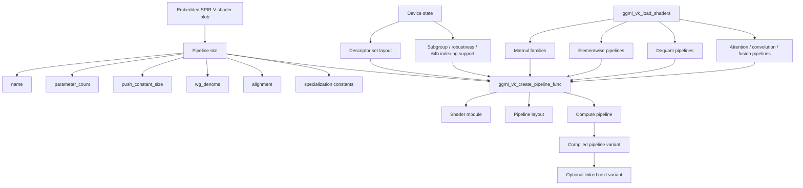

# Vulkan Backend

The Vulkan backend is GGML’s cross-platform GPU execution backend built on the Vulkan compute API. It provides a single backend model that can run on a wide range of GPUs, including NVIDIA, AMD, Intel, and other Vulkan-capable devices, while still adapting its execution strategy to vendor- and architecture-specific capabilities.

Unlike a backend that targets only one hardware ecosystem, the Vulkan backend is designed as a portability layer with performance specialization built in. The same backend interface can target different GPU vendors through a common Vulkan runtime path, then selectively enable optimized execution features such as subgroup operations, integer dot-product support, bfloat16 support, and cooperative-matrix-style acceleration when those features are available on the active device.

At the GGML backend level, Vulkan is exposed as a standard backend with:

- explicit backend initialization by device index
- device enumeration and description APIs
- a Vulkan device-specific buffer type
- a pinned host buffer type for faster CPU↔GPU transfers
- registry-based integration into GGML’s backend framework

This makes the Vulkan path a first-class execution backend rather than an external helper or one-off offload path.

From an architectural perspective, the Vulkan backend combines six major responsibilities into one system:

1. **backend integration** with GGML’s device, buffer, and registry abstractions
2. **device discovery and capability analysis** across multiple GPU vendors
3. **shader generation and embedding** from Vulkan compute shader sources
4. **compute pipeline construction** for tensor operators and specialized matrix multiplication paths
5. **GPU memory management** for device buffers, host-visible buffers, and pinned transfer memory
6. **command submission orchestration** through queues, command pools, and synchronization objects

Because of this structure, the Vulkan backend is both a generic GPU backend and a hardware-aware optimization layer. It does not merely “run compute shaders.” It also classifies devices, tracks queue topology, selects specialized pipelines, manages transfer behavior, and exposes host/GPU memory paths suitable for GGML tensor execution.

## Architecture Overview

### Component Architecture

The Vulkan backend is organized as a set of cooperating runtime components rather than one monolithic executor. Each component owns a specific part of GPU execution, and together they form the path from a GGML graph to Vulkan command submission.

At a high level, the backend is structured around these core components:

- **public backend API layer**
- **backend/device registration layer**
- **per-device runtime layer**
- **shader and pipeline layer**
- **buffer and memory layer**
- **queue and command-submission layer**
- **graph execution layer**

A useful way to understand the design is to start from the public API and move downward toward the GPU.

#### 1. Public backend API layer

The Vulkan backend exposes a compact public API centered on backend creation and device discovery. Through this layer, GGML or an application can:

- initialize a Vulkan backend for a selected device
- test whether a backend instance is Vulkan-backed
- query the number of Vulkan devices
- retrieve device descriptions and memory information
- obtain the Vulkan device buffer type
- obtain the Vulkan pinned host buffer type
- retrieve the Vulkan backend registry

This API keeps Vulkan-specific setup outside the generic graph-building logic. The frontend only needs to choose the device and obtain the corresponding backend/buffer types.

#### 2. Backend and device registration layer

Internally, the Vulkan backend plugs into GGML’s backend framework in the same style as other backends. The registry layer is responsible for exposing:

- available Vulkan devices
- the backend entry point for a selected device
- device-local buffer allocation behavior
- host-pinned transfer buffer support

This means the Vulkan backend is not just “some GPU code in the repo.” It is a registered GGML backend with explicit device identity and buffer semantics.

#### 3. Per-device runtime layer

Once a Vulkan device is selected, GGML creates a device-centric runtime object that holds the GPU-facing state and capabilities required for execution.

This per-device runtime tracks:

- the physical device and logical device
- vendor and driver identity
- the detected architecture class
- queue configuration
- subgroup capabilities
- memory placement preferences
- fp16/bf16 and integer-dot-product availability
- cooperative-matrix support flags
- descriptor-set layout and operator pipelines
- fence and staging resources
- pinned host-memory bookkeeping

In other words, the device object is the central “control tower” for Vulkan execution. It owns both low-level Vulkan handles and high-level GGML execution metadata.

#### 4. Shader and pipeline layer

The Vulkan backend does not interpret operator logic dynamically at runtime. Instead, it relies on pre-generated compute shader assets and explicit Vulkan compute pipelines.

The shader system is built from `.comp` shader sources under the Vulkan shader directory. During the build:

- `glslc` is required
- shader feature support is probed
- a helper tool called `vulkan-shaders-gen` is built
- that tool generates an embedded shader header
- per-shader generated C++ sources are also produced

This means GGML ships the Vulkan backend as compiled C++ plus generated shader artifacts, rather than compiling GLSL on demand during normal execution.

On top of those shader artifacts, the backend defines explicit pipeline objects. A pipeline record stores:

- pipeline name
- shader module
- pipeline layout
- Vulkan compute pipeline handle
- push-constant size
- parameter count
- workgroup-denominator metadata
- alignment requirement
- compile-state flags
- optional linked variants

This design is important because one logical operator may correspond to multiple pipeline variants depending on:

- tensor type
- alignment
- accumulator type
- indexing mode
- vendor capability
- specialization strategy

#### 5. Buffer and memory layer

Tensor storage in the Vulkan backend is handled through Vulkan-specific backend buffer types. The design separates device-local storage from transfer-friendly host storage.

The main memory-facing components are:

- **device buffer type** for GPU execution
- **pinned host buffer type** for faster CPU↔GPU transfer
- **buffer objects** that own Vulkan buffer/memory pairs
- **subbuffer views** that reference regions within larger buffers

A Vulkan buffer record tracks:

- Vulkan buffer handle
- bound device memory
- memory-property flags
- mapped pointer when available
- buffer size
- optional buffer-device-address value
- owning device

This layer gives the backend enough flexibility to support:

- pure device-local execution
- host-visible or UMA-oriented behavior
- pinned-memory transfer paths
- suballocation-oriented tensor placement

#### 6. Queue and command-submission layer

The Vulkan backend makes queue management explicit.

Each device runtime tracks queue objects for compute and transfer, including whether:

- the device effectively uses a single queue
- asynchronous execution is supported
- the transfer queue should be used for async work

Each queue record stores:

- queue-family index
- Vulkan queue handle
- command pool
- stage flags
- whether it is transfer-only

Command buffers are managed through a dedicated command-pool structure. The command-pool subsystem stores a deque of command buffers so existing command-buffer object addresses remain stable even as more buffers are added.

This is a practical but important design detail: the backend expects command-buffer reuse and incremental growth, rather than constant teardown/recreation.

The queue layer is therefore responsible for turning graph execution work into actual Vulkan submissions with appropriate synchronization and pool ownership.

#### 7. Graph execution and operator layer

Above the raw Vulkan objects sits the GGML execution layer that maps tensor operations onto pipelines and command sequences.

The device runtime stores a large family of operator pipelines, including dedicated families for matrix multiplication and dequantized matrix multiplication. It also tracks per-type availability arrays and shared descriptor-set layout state.

This makes the execution model highly pipeline-centric:

- select or build the operator pipeline
- bind descriptor sets and push constants
- record commands into a command buffer
- submit through the selected queue
- synchronize through fences or staged sequencing as needed

So even though Vulkan is the transport mechanism, the real architectural center is the combination of:

- device capability analysis
- shader/pipeline selection
- tensor-buffer placement
- command recording and submission

### Component relationship diagram

```mermaid
flowchart TD
    A["Application / GGML frontend"] --> B["Vulkan backend API"]
    B --> B1["Init backend by device index"]
    B --> B2["Query device count / description / memory"]
    B --> B3["Get Vulkan buffer type"]
    B --> B4["Get pinned host buffer type"]

    B --> C["GGML backend registry"]
    C --> D["Vulkan device runtime"]

    D --> D1["Physical device + logical device"]
    D --> D2["Vendor / driver / architecture classification"]
    D --> D3["Capability flags"]
    D --> D4["Queue topology"]
    D --> D5["Descriptor set layout"]
    D --> D6["Pipeline collections"]
    D --> D7["Fence + staging resources"]
    D --> D8["Pinned host memory tracking"]

    D3 --> E1["FP16 / BF16"]
    D3 --> E2["Integer dot product"]
    D3 --> E3["Subgroup operations"]
    D3 --> E4["Cooperative matrix support"]
    D3 --> E5["UMA / host-memory preference"]

    F["Shader sources (*.comp)"] --> G["glslc + vulkan-shaders-gen"]
    G --> H["Generated shader header"]
    G --> I["Generated per-shader C++ sources"]

    H --> J["Shader modules"]
    I --> J
    J --> K["Compute pipelines"]

    K --> K1["Generic operator pipelines"]
    K --> K2["Matmul pipelines"]
    K --> K3["Dequant + matmul pipelines"]
    K --> K4["Vendor / feature-specific variants"]

    D --> L["Buffer system"]
    L --> L1["Device-local Vulkan buffers"]
    L --> L2["Pinned host buffers"]
    L --> L3["Subbuffers / views"]

    D --> M["Queue + command subsystem"]
    M --> M1["Compute queue"]
    M --> M2["Transfer queue"]
    M --> M3["Command pools"]
    M --> M4["Command buffers"]
    M --> M5["Submission + synchronization"]

    A --> N["GGML computation graph"]
    N --> O["Vulkan graph execution"]
    O --> K
    O --> L
    O --> M
```



### Architectural interpretation

The most important architectural point is that GGML’s Vulkan backend is not just a shader bundle. It is a layered runtime where:

- the **API layer** chooses a target device
- the **device layer** discovers what that GPU can actually do
- the **shader/pipeline layer** materializes the executable compute kernels
- the **memory layer** decides how tensors live on or move across memory domains
- the **command layer** turns tensor operations into queue submissions

That layered structure is what allows one backend to remain portable across many vendors while still exploiting hardware-specific features when present.

### Vendor-aware but unified design

The current implementation explicitly classifies device architectures rather than treating every Vulkan GPU as identical. The code distinguishes vendor families such as:

- AMD GCN
- AMD RDNA1
- AMD RDNA2
- AMD RDNA3
- Intel Xe2
- NVIDIA pre-Turing
- NVIDIA Turing
- a generic fallback category

This architecture classification is not a separate optimization subsystem bolted on later. It is built directly into the Vulkan device model, which shows that vendor-aware adaptation is part of the backend’s core design from the start.

The result is a backend that stays unified at the API level but can still specialize its execution behavior using:

- extension presence
- subgroup-size properties
- integer-dot-product properties
- cooperative-matrix support
- vendor and architecture heuristics

### Why this architecture matters

This component architecture gives GGML’s Vulkan backend three useful properties at once:

- **portability**, because Vulkan provides a cross-vendor compute foundation
- **specialization**, because the backend tracks real device capabilities and architecture classes
- **backend consistency**, because it integrates with GGML’s standard backend, device, and buffer abstractions

That combination is what makes the Vulkan backend suitable as a general GPU backend for GGML rather than a narrow vendor-specific path.

## Device Initialization and Capability Detection

The Vulkan backend initializes devices through a two-stage process:

1. **global Vulkan instance initialization**
2. **lazy per-device runtime initialization**

This separation is important because the backend does not create full logical-device state for every GPU up front. Instead, it first discovers and filters the available Vulkan devices, then builds the heavy per-device runtime only when a specific backend instance or device handle is actually needed.

### Device Structure

The central runtime object for one Vulkan device is `vk_device_struct`. It is a large, stateful structure that combines:

- Vulkan handles
- hardware capability flags
- queue topology
- memory-placement preferences
- descriptor-set layout state
- operator pipeline collections
- synchronization resources
- backend buffer-type metadata

From a systems perspective, it is the “execution state container” for one GPU.

#### Structural categories inside `vk_device_struct`

A useful way to read the structure is by grouping its fields by purpose.

#### 1. Core Vulkan identity and limits

The device structure stores the core Vulkan objects and hardware limits needed for execution:

- `physical_device`
- `properties`
- `device`
- `name`
- `vendor_id`
- `driver_id`
- `architecture`
- `idx`

It also stores size and alignment-related limits such as:

- `max_memory_allocation_size`
- `max_buffer_size`
- `suballocation_block_size`
- `min_imported_host_pointer_alignment`

These fields establish the baseline execution contract for the device.

#### 2. Memory and placement capability state

The Vulkan backend tracks multiple memory-related behaviors directly in the device structure:

- `external_memory_host`
- `memory_priority`
- `uma`
- `prefer_host_memory`

These fields are important because the backend does not assume every Vulkan device behaves like a discrete GPU with identical memory behavior. The runtime explicitly tracks whether unified memory behavior is present, whether host-visible placement is attractive, and whether optional host-import or memory-priority extensions are available.

#### 3. Numeric-format and shader capability flags

The device structure includes many execution capability flags that determine which pipeline families and shader variants can be used:

- `fp16`
- `bf16`
- `shader_int64`
- `buffer_device_address`
- `vulkan_memory_model`
- `integer_dot_product`
- `shader_64b_indexing`

These are the low-level capability switches that shape what the backend can legally and efficiently compile or dispatch for that GPU.

#### 4. Subgroup and matrix-core capability state

A major part of Vulkan backend optimization depends on subgroup behavior and cooperative-matrix-style acceleration. The device therefore tracks:

- `subgroup_size`
- `subgroup_size_log2`
- `subgroup_size_control`
- `subgroup_min_size`
- `subgroup_max_size`
- `subgroup_require_full_support`

as well as subgroup feature flags such as:

- `subgroup_basic`
- `subgroup_arithmetic`
- `subgroup_shuffle`
- `subgroup_ballot`
- `subgroup_clustered`
- `subgroup_vote`

For matrix-core-style execution, it also stores:

- `coopmat_support`
- `coopmat_acc_f32_support`
- `coopmat_acc_f16_support`
- `coopmat_bf16_support`
- `coopmat_support_16x16x16_f16acc`
- `coopmat_support_16x16x16_f32acc`
- `coopmat_int_support`
- `coopmat2`

plus the detected tile dimensions:

- `coopmat_m`
- `coopmat_n`
- `coopmat_k`
- `coopmat_int_m`
- `coopmat_int_n`
- `coopmat_int_k`

This makes the device object the single source of truth for matrix-multiplication capability selection.

#### 5. Queue and execution topology

The device structure also stores its execution topology:

- `compute_queue`
- `transfer_queue`
- `single_queue`
- `support_async`
- `async_use_transfer_queue`

These fields determine whether the backend can use a dedicated transfer queue, whether async execution is meaningful, and how command submission should be organized.

#### 6. Pipeline inventory

A very large portion of `vk_device_struct` is dedicated to pipeline ownership. The device stores:

- descriptor-set layout state
- matrix multiplication pipeline families
- dequantization pipelines
- elementwise pipelines
- normalization pipelines
- copy/transposition pipelines
- convolution pipelines
- flash attention pipelines
- fused operator pipelines

This is one of the clearest architectural signals in the backend: **the Vulkan device object is pipeline-centric**. Once initialized, it becomes a catalog of prebuilt or lazily compiled execution paths for GGML operators.

#### 7. Runtime support fields

The device structure also stores supporting metadata such as:

- `shader_core_count`
- `partials_binding_alignment`
- `pipeline_executable_properties_support`
- `add_rms_fusion`
- per-type `mul_mat_*` enable arrays

These fields are used to tune execution strategy rather than merely record raw Vulkan capability.

### Device initialization flow

The Vulkan backend’s initialization flow is layered.

#### 1. Global instance initialization

The backend first initializes a global Vulkan instance singleton. During this step it:

- initializes the dynamic Vulkan dispatcher
- requires Vulkan API version 1.2 or newer
- enumerates instance extensions
- optionally enables validation-layer settings
- optionally enables `VK_EXT_debug_utils`
- on Apple, optionally enables `VK_KHR_portability_enumeration`

It then enumerates physical devices and builds the backend-visible device list.

#### 2. Device filtering and visibility

During device discovery, the backend:

- honors `GGML_VK_VISIBLE_DEVICES` when set
- otherwise prefers discrete and integrated GPUs
- filters unsupported devices out
- deduplicates devices that map to the same physical GPU under different drivers
- applies vendor-specific driver-priority rules when multiple drivers expose the same GPU

This is an important part of the design: device initialization is not just “enumerate and expose everything.” The backend actively curates a practical device list.

#### 3. Lazy runtime creation

When a concrete Vulkan device is actually requested, `ggml_vk_get_device(...)` builds the full runtime object. At that point it:

- selects the physical device
- records extension support
- detects architecture class
- reads backend environment toggles
- queries device properties and extended feature/property chains
- selects queue families
- creates the logical device
- creates the descriptor-set layout
- loads shader pipelines
- initializes compute and transfer queue state
- constructs the backend buffer type
- creates a fence

This division keeps discovery lightweight while still allowing the per-device runtime to become a fully configured execution engine when needed.

### Architecture Detection

The Vulkan backend includes an explicit architecture classifier instead of treating all GPUs from a given vendor as identical. This classifier is implemented in `get_device_architecture(...)` and feeds into later tuning decisions such as subgroup sizing, matmul warptile selection, and vendor-specific performance heuristics.

#### Architecture enum

The backend uses the following architecture classes:

- `OTHER`
- `AMD_GCN`
- `AMD_RDNA1`
- `AMD_RDNA2`
- `AMD_RDNA3`
- `INTEL_XE2`
- `NVIDIA_PRE_TURING`
- `NVIDIA_TURING`

This enum is intentionally compact. It is not trying to model every GPU family in the Vulkan ecosystem. Instead, it captures the architecture boundaries that materially change the backend’s execution strategy.

#### AMD detection path

For AMD devices, the backend checks extension presence for:

- `VK_AMD_shader_core_properties`
- `VK_KHR_shader_integer_dot_product`
- `VK_EXT_subgroup_size_control`

If those are present, it queries extended properties and uses:

- subgroup min/max size
- `wavefrontsPerSimd`
- packed integer dot-product acceleration

to distinguish:

- **GCN**, when subgroup min and max size are both 64
- **RDNA1**, when subgroup sizes span 32 to 64 and `wavefrontsPerSimd == 20`
- **RDNA3**, when the relevant integer-dot-product acceleration flag is present
- **RDNA2**, otherwise within the RDNA branch

This is a capability-driven architecture detector rather than a pure PCI-ID table.

#### Intel detection path

For Intel devices, the backend checks for:

- `VK_EXT_subgroup_size_control`

It then queries subgroup-size-control properties and classifies the device as **Intel Xe2** when the minimum subgroup size is 16.

The implementation comment explicitly ties this to SIMD width, using the subgroup minimum size as the practical discriminator between Xe2-class hardware and earlier Intel GPU generations.

#### NVIDIA detection path

For NVIDIA devices, the classifier checks for:

- `VK_KHR_cooperative_matrix`
- `VK_NV_shader_sm_builtins`

If cooperative matrix support is absent, the device is classified as **pre-Turing**.

If cooperative matrix support is present and SM builtins are available, the backend queries SM properties and classifies the GPU as **Turing** when `shaderWarpsPerSM == 32`. Later architectures fall through to the generic `OTHER` bucket in this classifier.

#### Why architecture detection matters

This classifier is not cosmetic. It directly influences later backend behavior such as:

- default subgroup sizing
- matrix multiplication warptile selection
- whether certain large/medium/small matmul variants are enabled
- whether cooperative-matrix-style paths should be preferred
- vendor-specific tuning overrides in shader loading

So the Vulkan backend’s architecture detection is part of the optimization system, not just part of device reporting.

## Shader Compilation Pipeline

The Vulkan backend does not rely on ad hoc runtime shader compilation from source. Instead, it uses a build-time shader-generation pipeline that converts `.comp` shader sources into generated C++ artifacts embedded into the backend build.

This gives the backend a reproducible shader inventory and avoids shipping raw GLSL compilation as part of ordinary runtime initialization.

### Compilation Process

The shader build pipeline is implemented in `src/ggml-vulkan/CMakeLists.txt` and has three major stages:

1. **tool discovery and extension probing**
2. **shader generator build**
3. **generated artifact emission for the backend target**

#### 1. Tool discovery and GLSL capability probing

The build first requires Vulkan with the `glslc` component:

- `find_package(Vulkan COMPONENTS glslc REQUIRED)`

That means `glslc` is not optional for building the Vulkan backend.

After that, the build probes shader-language extension support by actually invoking `glslc` on small feature-test compute shaders. The current feature tests include:

- cooperative matrix
- cooperative matrix 2
- integer dot product
- bfloat16

Each test:

- compiles a feature-test shader
- checks whether `glslc` reports the extension as unsupported
- defines a CMake result variable
- forwards that support flag into the shader-generator build when present

This is important because the backend does not assume the shader compiler supports every advanced Vulkan GLSL extension just because the Vulkan SDK is installed.

#### 2. Shader generator build

The backend builds an auxiliary host tool called:

- `vulkan-shaders-gen`

This tool is built as an `ExternalProject`, and the CMake logic includes special handling for:

- host compiler detection
- cross-compiling scenarios
- optional forwarding of a host toolchain file
- forwarding shader-support feature flags to the generator

This means the shader generator is treated as a first-class build artifact, not a prebuilt external dependency.

#### 3. Generated artifact emission

Once the generator exists, the backend build uses it in two ways.

First, it generates the shared embedded shader header:

- `ggml-vulkan-shaders.hpp`

Second, it iterates over every `.comp` file in the Vulkan shader directory and generates a corresponding C++ source file that embeds the compiled shader output and related metadata.

Those generated `.cpp` files are then added directly to the `ggml-vulkan` target.

So the final backend binary is built from:

- hand-written Vulkan backend code
- generated shader header content
- generated per-shader C++ translation units

#### Why the pipeline is structured this way

This build model gives the Vulkan backend several practical benefits:

- shader compilation happens at build time, not user runtime
- shader compiler support is checked early
- generated artifacts are deterministic
- backend C++ code can reference embedded SPIR-V blobs directly
- cross-platform packaging is simpler because runtime GLSL compilation is avoided

### Shader Variant Generation Example

A useful way to understand the shader pipeline is to follow what happens to one compute shader source file.

#### Build-time path for one `.comp` shader

For each shader file:

1. CMake discovers the `.comp` file through a `file(GLOB ...)` step.
2. A custom command invokes `vulkan-shaders-gen`.
3. The generator is given:
   - the `glslc` executable
   - the shader source file
   - the SPIR-V output directory
   - the target generated header path
   - the target generated C++ file path
4. The generated C++ file is added to the `ggml-vulkan` target.

So one logical shader source becomes:

- a compiled SPIR-V artifact in the shader output directory
- generated declarations in `ggml-vulkan-shaders.hpp`
- generated C++ source compiled into the backend

#### Runtime-side variant expansion

Build-time generation is only the first level of variation.

At runtime, pipeline creation can expand one shader blob into multiple actual Vulkan pipeline variants depending on device capabilities and backend needs. In the current implementation, one of the clearest examples is the optional **64-bit indexing variant**:

- if `VK_EXT_shader_64bit_indexing` is available and enabled
- and the device supports the backend’s 64-bit-indexing path
- pipeline loading creates an additional linked pipeline variant

The pipeline struct stores this through a linked `next` pointer, so one logical shader/pipeline slot can represent:

- the baseline variant
- an alternate 64-bit-indexing variant

This means shader variation happens at two levels:

- **build-time source-to-artifact generation**
- **runtime pipeline-variant materialization**

#### Matmul family example

The matrix multiplication path adds another layer of variation. During shader loading, the backend creates pipeline families for:

- large / medium / small tile classes
- aligned and unaligned variants
- fp16-accumulation and fp32-accumulation variants
- cooperative-matrix or non-cooperative-matrix execution modes
- optional 64-bit-indexing variants

So even when the source originates from one shader family, the final execution-side inventory can contain many pipeline objects tailored to different shapes and capabilities.

## Compute Pipeline System

The Vulkan backend’s operator execution model is pipeline-centric. It does not dynamically interpret tensor ops into generic dispatch at every call site. Instead, it predefines and materializes a large inventory of Vulkan compute pipelines, then selects among them at execution time.

This is one of the defining features of the backend architecture.

### Pipeline Structure

The core unit is `vk_pipeline_struct`. This structure represents one concrete compute-pipeline variant and stores both Vulkan objects and backend metadata needed for selection and compilation.

Its key fields are:

- `name`
- `shader_module`
- `layout`
- `pipeline`
- `push_constant_size`
- `parameter_count`
- `wg_denoms`
- `align`
- `initialized`
- `needed`
- `compiled`
- `register_count`
- optional `is_64b_indexing`
- `next`

#### Field roles

**`name`**
Human-readable pipeline identity used for logging and debugging.

**`shader_module`**
The Vulkan shader module created from the embedded SPIR-V blob.

**`layout`**
The Vulkan pipeline layout. This binds the descriptor-set layout plus the push-constant range.

**`pipeline`**
The actual Vulkan compute pipeline handle.

**`push_constant_size`**
The size of the push-constant block expected by the pipeline.

**`parameter_count`**
How many storage-buffer bindings the pipeline expects. The backend enforces a maximum parameter count.

**`wg_denoms`**
A three-element array used by the backend as workgroup-denominator metadata. This is part of how execution-side launch geometry is encoded for the pipeline.

**`align`**
Alignment requirement used by the backend when deciding whether a given tensor layout can use that pipeline directly.

**`initialized`**
Marks whether the pipeline metadata has already been filled in.

**`needed`**
A runtime flag indicating that this pipeline should actually be compiled.

**`compiled`**
Marks whether the Vulkan pipeline creation step has completed.

**`register_count`**
Stores register-usage information when pipeline executable statistics are available.

**`is_64b_indexing`**
Marks the 64-bit-indexing variant when that extension path is used.

**`next`**
Links to an alternate variant of the same logical pipeline slot. The current implementation uses this for multiple compilation variants, especially 64-bit indexing.

#### Higher-level pipeline groupings

The Vulkan backend also defines grouped pipeline containers such as:

- `vk_matmul_pipeline_struct`
- `vk_matmul_pipeline2`

`vk_matmul_pipeline_struct` groups related matmul variants:

- `l`
- `m`
- `s`
- `a_l`
- `a_m`
- `a_s`

These correspond to large, medium, and small variants plus aligned versions.

`vk_matmul_pipeline2` then groups two matmul families:

- `f32acc`
- `f16acc`

So the backend’s matmul pipeline model is hierarchical:

```text
matmul family
├── accumulation mode
│   ├── f32acc
│   └── f16acc
└── tile/alignment variant
    ├── l / m / s
    └── aligned l / m / s
```

This structure is one reason the Vulkan backend can adapt matrix multiplication aggressively without changing the frontend operator model.

### Pipeline Creation

The low-level pipeline build function is `ggml_vk_create_pipeline_func(...)`.

This function takes:

- the target device
- the pipeline object to populate
- SPIR-V size and data
- entrypoint name
- parameter count
- workgroup-denominator metadata
- specialization constants
- robustness/subgroup controls

and then performs the actual Vulkan compute-pipeline creation.

#### Pipeline creation steps

The current creation flow is:

1. validate pipeline metadata such as parameter count and denominator values
2. create a `vk::ShaderModule` from the SPIR-V data
3. define a compute-stage push-constant range
4. create a `vk::PipelineLayout` using:

   - the device descriptor-set layout
   - the push-constant range

5. build a Vulkan specialization-info block from the provided specialization constants
6. prepare the compute shader stage info
7. optionally require full subgroups
8. optionally attach a required subgroup size when subgroup-size control is supported
9. create the compute pipeline
10. mark the pipeline as compiled
11. optionally attach debug names when debug-utils support is available

This makes the creation routine explicit and capability-aware rather than a simple `createComputePipeline` wrapper.

#### Descriptor-set layout dependence

Pipeline creation depends on a device-wide descriptor-set layout stored in `device->dsl`.

That descriptor-set layout is created during device initialization and contains bindings for up to `MAX_PARAMETER_COUNT` storage buffers. So every compute pipeline in the backend shares a common descriptor-set layout model, while differing in:

- how many parameters it logically uses
- what push constants it expects
- which workgroup geometry it is tuned for
- what shader blob and specialization constants it uses

#### Specialization constants

The backend uses specialization constants heavily in pipeline creation. These constants are assembled into:

- specialization map entries
- specialization data payload
- shader-stage specialization info

This lets one shader family be tuned at pipeline-creation time for:

- tile geometry
- subgroup-related parameters
- reduction settings
- vendor-tuned warptile layouts

without requiring a totally separate shader source file for every small tuning difference.

#### Robustness and subgroup controls

Pipeline creation is also aware of optional execution controls:

- pipeline robustness can be disabled for storage/uniform buffers when the device supports `VK_EXT_pipeline_robustness`
- required subgroup size can be attached through subgroup-size-control extensions
- full-subgroup execution can be requested where appropriate
- 64-bit indexing can be enabled through an extra pipeline-create-info chain

So pipeline creation is not only about converting SPIR-V into a handle. It is also where device capabilities and backend policy get attached to the executable pipeline object.

#### Pipeline loading strategy

The higher-level loader `ggml_vk_load_shaders(...)` builds many pipelines lazily. It:

- locks the device during pipeline loading
- computes subgroup-derived tuning values
- computes vendor- and architecture-specific warptile parameters
- enables or disables some matmul tile classes based on shared-memory limits
- initializes pipeline groups on demand
- spawns asynchronous compilation tasks for pipelines marked as needed

This means pipeline creation in the Vulkan backend is both:

- **structured**, because every pipeline goes through the same creation logic
- **adaptive**, because the loader tailors what gets created to the device’s actual capabilities

### Pipeline-system relationship diagram



## Matrix Multiplication Implementation

Matrix multiplication in the Vulkan backend is not handled by a single generic compute shader. Instead, GGML organizes matrix multiplication as a family of pipeline groups, with selection driven by:

- source tensor data types
- requested precision
- cooperative-matrix support level
- subgroup behavior
- shader-core availability
- alignment constraints
- whether the operation is `MUL_MAT` or `MUL_MAT_ID`
- whether the operation uses split-K accumulation

This gives the backend a layered strategy:

1. choose the correct **pipeline family**
2. choose the correct **accumulator mode**
3. choose the correct **tile-size variant**
4. choose **aligned vs unaligned** specialization
5. dispatch either a direct matmul or a split-K matmul plus reduction

### Pipeline Selection

At the backend level, matrix multiplication begins with family selection.

The Vulkan backend maintains separate families for:

- dense floating-point matrix multiplication
- mixed floating-point matrix multiplication
- quantized matrix multiplication with runtime dequantization
- `MUL_MAT_ID` matrix multiplication
- `Q8_1`-based MMQ-style matrix multiplication
- split-K reduction

#### 1. Dense floating-point families

The backend uses dedicated pipeline families for the common dense cases:

- `F32 x F32`
- `F32 x F16`
- `BF16 x BF16`
- `F16 x F16`
- `F16 x F32`

For `F16`-based paths, the backend prefers **FP16 accumulation** when:

- the device supports FP16 execution
- the requested precision allows the default fast path
- cooperative-matrix execution does not force FP32 accumulation

If those conditions are not satisfied, it falls back to the matching **FP32 accumulation** family.

This means the Vulkan backend does not treat precision choice as purely a shader detail. It is part of pipeline-family selection.

#### 2. Quantized matrix multiplication families

For quantized inputs, the backend does not use one universal “dequantize then matmul” path. Instead, it exposes several pipeline groups:

- `pipeline_dequant_mul_mat_mat`
- `pipeline_dequant_mul_mat_mat_f16`
- `pipeline_dequant_mul_mat_mat_q8_1`
- corresponding `_id` versions for `MUL_MAT_ID`

These families cover different combinations of:

- quantized source formats on the left-hand side
- `F32`, `F16`, or `Q8_1` behavior on the right-hand side
- accumulator type
- cooperative-matrix path

#### 3. `Q8_1` special case

When the right-hand side is `Q8_1`, the backend uses a dedicated MMQ-style family instead of routing through the ordinary dequantized `F32`/`F16` path.

This is important because `Q8_1` is treated as a distinct execution mode, not just another storage type. It has its own pipeline family and its own workgroup/tile tuning.

#### 4. `MUL_MAT_ID` special case

`MUL_MAT_ID` has separate pipeline families because it adds extra bindings and extra row-routing behavior. It is not just a flag on top of ordinary matmul. The backend maintains:

- dedicated `pipeline_matmul_id_*` families
- dedicated dequantized `pipeline_dequant_mul_mat_mat_id*` families

That separation reflects the fact that `MUL_MAT_ID` changes both execution flow and shared-memory requirements.

### Runtime tile-variant selection

After the pipeline family is chosen, the backend still has to choose a concrete variant. Each matmul family contains up to six variants:

- `l`
- `m`
- `s`
- `a_l`
- `a_m`
- `a_s`

These correspond to:

- **large**, **medium**, and **small** tile configurations
- **aligned** and **unaligned** versions of each tile size

The selection logic differs depending on whether the device supports Cooperative Matrix 2.

#### CoopMat2 selection logic

On CoopMat2-capable devices, the backend uses a more GPU-aware selection strategy. It considers:

- the device’s shader-core count
- how many tiles the large and medium variants would generate
- whether the `N` dimension exceeds the medium or small crossover width
- whether the large variant is likely to fill or overfill the machine efficiently

This produces a heuristic preference for large, medium, or small tiles rather than relying on simple dimension thresholds alone.

#### Non-CoopMat2 selection logic

On older paths, selection is simpler:

- prefer the small shader when `M` or `N` is small
- prefer the medium shader for medium-sized problems
- otherwise use the large shader

This makes the older path easier to reason about, but less tightly coupled to actual GPU occupancy.

#### Alignment selection

Once tile size is chosen, the backend decides between aligned and unaligned variants. The aligned pipeline is used when the tensor layout satisfies the alignment requirements encoded in that pipeline object. Otherwise, the unaligned variant is selected.

This keeps fast aligned stores and loads separate from the more general fallback path.

### Split-K handling

The Vulkan backend supports split-K matrix multiplication rather than assuming the full reduction over `K` must happen in one pass.

The dispatch flow is:

1. choose the main matmul pipeline
2. if `split_k == 1`, dispatch directly to the output tensor
3. if `split_k > 1`:
   - compute a split-K tile size
   - round the split size up to a quantization-safe multiple
   - dispatch the main pipeline so partial sums land in a temporary split-K buffer
   - synchronize
   - launch `pipeline_matmul_split_k_reduce` to reduce the partials into the final output

This is a major part of the matmul design because it allows the backend to trade extra reduction work for better utilization when the `K` dimension is large or when tile occupancy would otherwise be poor.

### CoopMat Path (`mul_mm.comp`)

The original cooperative-matrix matmul shader is built around **subgroup-scope** cooperative matrices.

#### Core execution model

This shader declares a compute entry point with specialization-driven local size:

- `layout(local_size_x_id = 0, local_size_y = 1, local_size_z = 1)`

At the buffer level it binds:

- input matrix `A`
- input matrix `B`
- output matrix `D`

and, for `MUL_MAT_ID`, additional row/expert-routing buffers.

It also consumes a push-constant block containing:

- `M`, `N`, `K`
- source and destination strides
- batch strides
- `base_work_group_z`
- `num_batches`
- `k_split`
- broadcast flags
- padded output width metadata

So even the base CoopMat path already supports batching, split-K, and broadcast-aware execution.

#### Subgroup cooperative-matrix model

The shader uses subgroup-scope cooperative matrices such as:

- matrix A fragments
- matrix B fragments
- accumulator fragments

The key architectural property here is that the cooperative-matrix object lives at **subgroup scope**, not workgroup scope. This means the shader is closely tied to subgroup behavior and subgroup-level synchronization.

#### Shared staging path

The shader includes a shared staging buffer for accumulator spill/store fallback. This is important because the output-store path is not one-size-fits-all.

The shader distinguishes between:

- cases where the full cooperative-matrix tile is in bounds and suitably aligned
- cases where the tile is in bounds but the output stride/store alignment is not ideal
- cases where the tile is partially out of bounds

When the tile is fully safe and aligned, it can store directly with cooperative-matrix store instructions. Otherwise, it spills through shared memory and performs scalar or partially masked stores.

This is the main reason the shader has both aligned and unaligned variants.

#### `ALIGNED` behavior

The `ALIGNED` variant is not a cosmetic compile option. It changes the load/store assumptions of the kernel.

In the unaligned path, the shader may use more conservative batching and more conservative output-store logic. In the aligned path, it can make stronger assumptions and use the faster direct cooperative-matrix store path more often.

#### `MUL_MAT_ID` behavior

The same shader also supports `MUL_MAT_ID`, where the `K` loop and output-row selection are coupled to ID/expert data instead of using the ordinary contiguous row mapping.

That support is built directly into the shader rather than layered on later, which is why `MUL_MAT_ID` receives dedicated pipeline families.

### CoopMat2 Path (`mul_mm_cm2.comp`)

The CoopMat2 shader is structurally different from the original cooperative-matrix path. Its defining feature is that it uses **workgroup-scope** cooperative matrices and tensor-layout-based load/store operations.

#### Workgroup-scope execution model

Unlike the original CoopMat shader, CoopMat2 uses cooperative matrices at **workgroup scope** rather than subgroup scope.

That changes how the kernel is written:

- workgroup tiles are more explicit
- tensor-layout operations become central
- the implementation can express broader tile shapes directly through workgroup-scope matrix objects

This makes the CoopMat2 path more tensor-native and more flexible for larger or more structured tile shapes.

#### Tensor-layout load/store model

The CoopMat2 shader relies on operations such as:

- `coopMatLoadTensorNV`
- `coopMatStoreTensorNV`

rather than only the lower-level load/store style used in the original path.

That lets it operate directly with tensor layouts for:

- left-hand-side tiles
- right-hand-side tiles
- output tiles
- transposed or clamped tensor views

As a result, the kernel reads much more like a tiled tensor program than a manually staged subgroup microkernel.

#### Smaller-matrix fallback inside the same shader

The shader contains specialized handling for narrower output widths, with tile forms such as:

- `BN`
- `BN / 2`
- `BN / 4`

This allows the same kernel family to adapt to smaller matrix widths without switching entirely to a different conceptual implementation.

#### Quantized decode integration

One of the most important differences from the original CoopMat path is that CoopMat2 integrates dequantization more naturally into tensor loading.

The shader includes dequantization helpers and uses them during tensor loads. That is why this path is the backend’s primary mechanism for:

- quantized left-hand-side tensors
- `F16` right-hand-side execution
- more aggressive quantized cooperative-matrix kernels

#### `MUL_MAT_ID` integration

For `MUL_MAT_ID`, the shader includes additional row-ID and ballot/shared-memory support, allowing workgroup-scope tiled execution to coexist with row remapping and expert selection.

So CoopMat2 is not just “a faster CoopMat.” It is a broader matrix-programming model that supports:

- tensor-layout-aware loads/stores
- integrated quantized decode
- smaller-width tile variants
- explicit `MUL_MAT_ID` support
- workgroup-scope cooperative matrices

### Quantized Matrix Multiplication

Quantized matrix multiplication in the Vulkan backend is a first-class subsystem, not an afterthought.

#### Supported quantized families

The shader-loading path instantiates quantized pipelines for a wide range of GGML formats, including:

- `Q4_0`
- `Q4_1`
- `Q5_0`
- `Q5_1`
- `Q8_0`
- `Q2_K`
- `Q3_K`
- `Q4_K`
- `Q5_K`
- `Q6_K`
- `IQ1_S`
- `IQ1_M`
- `IQ2_XXS`
- `IQ2_XS`
- `IQ2_S`
- `IQ3_XXS`
- `IQ3_S`
- `IQ4_XS`
- `IQ4_NL`
- `MXFP4`

These are compiled into the backend as dedicated quantized matmul pipelines, not generic runtime combinations.

#### Distinct quantized paths

There are three important quantized matmul modes:

1. **ordinary dequantized matmul**
2. **CoopMat2 quantized + `F16` matmul**
3. **MMQ-style `Q8_1` right-hand-side matmul**

Each has separate pipeline families and separate tile tuning.

#### MMQ-style `Q8_1` path

The `Q8_1` path is special. Rather than simply treating `Q8_1` as a conventional dequantized right-hand side, the backend routes it to dedicated MMQ pipeline families. These use separate workgroup/tile settings from the ordinary dequantized path.

That is why `Q8_1` appears in selection logic as its own fast path.

#### Quantized `MUL_MAT_ID`

The backend also builds quantized `MUL_MAT_ID` families because row remapping and quantized decode interact with shared-memory and tile requirements differently from ordinary quantized matmul.

So the quantized design is multidimensional:

- data format
- `MUL_MAT` vs `MUL_MAT_ID`
- `F16` vs `F32` accumulation
- CoopMat vs CoopMat2 vs older scalar/subgroup paths
- MMQ-style `Q8_1` vs ordinary dequantized RHS

## Memory Management

The Vulkan backend’s memory model is centered on **backend-owned Vulkan buffers**, with optional pinned host memory for transfer-oriented workflows.

### Buffer Lifecycle

At the lowest level, memory ownership is represented by `vk_buffer_struct`.

A Vulkan buffer record stores:

- the Vulkan buffer handle
- the bound device memory object
- memory-property flags
- an optional mapped host pointer
- total buffer size
- an optional buffer-device-address value
- the owning Vulkan device

This means a single object owns both the logical buffer and the physical memory backing it.

#### Device-buffer creation

Device-buffer creation follows a structured sequence:

1. create a Vulkan storage/transfer buffer
2. optionally enable shader-device-address usage
3. query buffer memory requirements
4. choose a compatible memory type based on an ordered list of desired property flags
5. allocate memory
6. map memory if it is host visible
7. bind memory to the buffer
8. fetch buffer device address when supported

This creation path is shared across ordinary device-local buffers and more host-visible fallback cases.

#### Memory-policy selection

The backend does not choose one fixed memory policy for all GPUs.

Device-buffer creation policy depends on runtime characteristics such as:

- whether the device is UMA/integrated
- whether host-visible device-local memory is desirable
- whether system-memory fallback is allowed
- whether the backend prefers host memory on that device

So the same logical Vulkan buffer type can resolve to different physical memory placements depending on the machine.

#### Imported host pointers

The buffer-creation path also supports importing host allocations when external host memory is available. In that case, the backend creates a Vulkan buffer tied to host memory rather than allocating an independent block first.

This is one of the bridges between Vulkan execution and host-pinned transfer behavior.

#### Backend buffer ownership

At the GGML backend layer, the Vulkan buffer type allocates a device buffer, wraps it in a `ggml_backend_vk_buffer_context`, and uses that context as the backend-buffer owner. When the buffer context is destroyed, the Vulkan buffer is destroyed as well.

So the ownership stack is:

```text
GGML backend buffer
└── ggml_backend_vk_buffer_context
    └── vk_buffer_struct
        ├── vk::Buffer
        └── vk::DeviceMemory
```

#### Tensor operations inside a backend buffer

Tensor-level operations do not allocate one Vulkan buffer per tensor. Instead, tensor reads, writes, copies, and memsets operate on byte ranges within the owning backend buffer by combining:

- the tensor’s placement offset
- any view offset
- the underlying Vulkan buffer object

This is why the Vulkan backend can support tensor views and multi-tensor backend buffers without requiring one Vulkan allocation per tensor.

#### Host buffer path

The backend also exposes a Vulkan host buffer type for pinned host memory. This path allocates pinned memory first, then wraps it as a host buffer. If pinned allocation fails, it falls back to the ordinary CPU buffer type.

So Vulkan memory management is not limited to device-local storage. It also includes a dedicated transfer-friendly host path.

### Suballocation

The Vulkan backend uses a **block-oriented suballocation model** rather than unconstrained one-buffer-per-tensor allocation.

#### Device-side block size

Each Vulkan device stores a `suballocation_block_size`. This value is also reported as the maximum size for the Vulkan backend buffer type.

By default, that block size is limited to **1 GiB**, then clamped against the device’s maximum allocation size. It can also be overridden through the backend’s environment configuration.

This design intentionally batches allocations into large blocks instead of letting the backend emit an arbitrary number of unrelated Vulkan allocations.

#### Tensor allocation size

At the buffer-type level, the backend reports the required tensor allocation size simply as the tensor’s raw byte size. It does not add hidden tensor-level expansion in the `get_alloc_size()` callback.

That keeps tensor allocation semantics straightforward.

#### Offset-based suballocation

Actual tensor placement inside a backend buffer is handled through offsets. The helper representation is `vk_subbuffer`, which stores:

- a pointer to the owning `vk_buffer`
- a byte offset
- a byte range

and can be converted directly into a Vulkan descriptor buffer info structure.

This makes suballocation cheap and descriptor-friendly:

- one large Vulkan buffer can back many tensors
- each tensor is described by an offset and size
- shader dispatch binds subbuffer views rather than creating fresh Vulkan objects

#### Why this matters

This suballocation model gives the backend three benefits:

- fewer Vulkan allocations
- easier descriptor binding
- better reuse of large memory blocks across many tensors

It also fits well with GGML’s backend-buffer abstraction, where one backend buffer can own storage for multiple tensors.

#### Reusable internal scratch buffers

In addition to ordinary backend-buffer suballocation, the Vulkan backend keeps reusable temporary buffers such as:

- `prealloc_x`
- `prealloc_y`
- `prealloc_split_k`
- partial/fusion scratch buffers

These are resized upward when needed and then reused across graph execution. They are especially important for:

- temporary dequantization
- temporary quantization to `Q8_1`
- split-K partial accumulation
- fusion scratch storage

So memory reuse in the backend happens at two levels:

1. **backend-buffer suballocation for tensors**
2. **persistent scratch-buffer reuse for execution internals**

## Command Buffer Management

The Vulkan backend manages command buffers through explicit command-pool objects rather than creating and destroying command buffers ad hoc for every operation.

### Command Pool Structure

The core command-buffer manager is `vk_command_pool`.

A command pool stores:

- the Vulkan command-pool handle
- a deque of command-buffer records
- a pointer to the owning queue wrapper

Each command-buffer record is intentionally minimal:

- the Vulkan command-buffer handle
- an `in_use` flag

#### Why a deque is used

The command-pool structure uses a `deque` for command-buffer storage so that command-buffer object addresses remain stable even if the pool grows.

This is a practical implementation detail, but an important one: other runtime structures can safely keep pointers to command-buffer records even as new command buffers are added.

#### Pool ownership model

There is a command-pool instance for each:

- `(context, queue)` pair
- `(device, queue)` pair

This allows the backend to keep command-buffer state separate across compute and transfer usage, while still sharing queue-level behavior where needed.

#### Initialization

`vk_command_pool::init()` creates a Vulkan command pool using flags that make the pool suitable for transient and resettable compute work:

- `VK_COMMAND_POOL_CREATE_TRANSIENT_BIT`
- `VK_COMMAND_POOL_CREATE_RESET_COMMAND_BUFFER_BIT`

So the command pool is explicitly configured for short-lived reusable command buffers rather than long-lived immutable command streams.

#### Reuse-first allocation

When the backend needs a command buffer, it does not immediately allocate a new one.

Instead it:

1. scans the pool for a command buffer whose `in_use` flag is false
2. marks that buffer as in use and returns it
3. allocates a new command buffer only if no reusable one is available

This is a straightforward reuse policy that keeps command-buffer churn low.

#### Submission wrapper

The backend wraps command-buffer usage in `vk_submission`, which stores:

- a pointer to the active command buffer
- wait semaphores
- signal semaphores

This means command-buffer recording and queue synchronization are represented together at submission time, rather than being handled as unrelated pieces.

#### Begin/end model

A submission begins by acquiring a command buffer and beginning recording, usually with one-time-submit usage. After recording, the backend finalizes the submission object and hands it to the queue-submit path.

This creates a clear lifecycle:

```text
command pool
→ acquire or create command buffer
→ begin recording
→ bind pipelines / descriptors / push constants
→ dispatch
→ end recording
→ submit with wait/signal semaphores
→ mark reusable after cleanup/reset
```

#### Cleanup and reuse

The backend’s cleanup strategy is reuse-oriented rather than destruction-oriented. It resets command pools periodically, marks command buffers as no longer in use, and keeps them available for future submissions.

That makes command buffers a recyclable execution resource instead of a throwaway object.

#### Queue serialization

The backend also protects queue submission with a queue mutex because multiple logical queue wrappers may share the same underlying Vulkan queue handle.

So command-buffer management is not only about allocation and reuse. It also includes the submission-side rule that queue access must remain serialized when Vulkan queue ownership is effectively shared.

## Multi-Vendor GPU Support

The Vulkan backend is designed as a single GPU backend that can adapt to multiple vendors without fragmenting into separate implementations. Rather than assuming all Vulkan devices behave similarly, GGML explicitly classifies GPU architectures and records per-device capability flags that influence pipeline choice, subgroup policy, matrix multiplication strategy, memory placement, and asynchronous execution behavior.

### Vendor Optimizations

The backend uses a compact architecture classification model to distinguish the vendor and microarchitecture families that matter most for performance tuning:

- `AMD_GCN`
- `AMD_RDNA1`
- `AMD_RDNA2`
- `AMD_RDNA3`
- `INTEL_XE2`
- `NVIDIA_PRE_TURING`
- `NVIDIA_TURING`
- `OTHER`

This classification is not only descriptive. It exists because different vendors expose different subgroup behavior, matrix-core features, and integer-dot-product characteristics, and the Vulkan backend uses those differences to tune execution.

#### AMD path

For AMD GPUs, the backend checks for the presence of:

- AMD shader-core properties
- shader integer dot product support
- subgroup size control

It then reads extended properties and uses them to distinguish between:

- **GCN**, when subgroup size is fixed at 64
- **RDNA1**, when subgroup sizes span 32 to 64 and the hardware reports the earlier RDNA wavefront configuration
- **RDNA3**, when packed 4x8-bit mixed-signedness integer-dot-product acceleration is exposed
- **RDNA2**, otherwise inside the RDNA branch

This means AMD tuning is capability-driven rather than based only on PCI IDs or vendor strings.

#### Intel path

For Intel GPUs, the backend checks subgroup-size-control support and then identifies **Xe2** when the minimum subgroup size is 16. The code comment ties this directly to SIMD width, making subgroup size the practical discriminator between Xe2 and earlier Intel GPU families.

#### NVIDIA path

For NVIDIA GPUs, the classifier first checks for cooperative-matrix support. If it is missing, the device is treated as **pre-Turing**. If cooperative-matrix support is present, the backend optionally queries shader SM builtins and identifies **Turing** when the SM reports 32 warps per SM. Later NVIDIA architectures currently fall back into the generic `OTHER` category in this classifier.

#### Vendor-aware runtime state

The device runtime stores a broad set of vendor-relevant performance flags and topology hints, including:

- subgroup size and subgroup-size control limits
- shader-core count
- `fp16` and `bf16`
- integer-dot-product support
- cooperative-matrix support
- cooperative-matrix tile dimensions
- async queue support
- UMA and host-memory preference
- shader 64-bit indexing
- buffer device address
- pipeline executable properties support

So vendor optimization in the Vulkan backend is not one isolated tuning table. It is distributed across device classification, feature discovery, pipeline-family availability, and matrix-multiplication variant selection.

### Extension Requirements

The Vulkan backend has both **build-time** and **runtime** extension requirements.

#### Build-time shader-extension requirements

During the build, the backend requires `glslc` and actively probes whether the shader compiler supports these GLSL extensions:

- `GL_KHR_cooperative_matrix`
- `GL_NV_cooperative_matrix2`
- `GL_EXT_integer_dot_product`
- `GL_EXT_bfloat16`

These checks determine which shader variants can actually be generated and embedded into the backend.

#### Runtime device-side extension requirements

At runtime, the backend checks for and uses Vulkan device extensions and properties associated with advanced execution features. The current implementation directly relies on or tracks support for capabilities associated with:

- subgroup size control
- cooperative matrices
- integer dot product
- bfloat16
- shader SM builtins on NVIDIA
- external host memory import
- pipeline robustness
- memory priority
- buffer device address
- shader 64-bit indexing

Not every one of these is required for the backend to function. Instead, they form a ladder of optional capabilities:

- the baseline Vulkan path can run without the most advanced matrix features
- advanced paths such as cooperative-matrix matmul, integer-dot acceleration, bf16 paths, or 64-bit indexing are enabled only when the corresponding support is present

This is why the Vulkan backend remains portable while still exposing high-performance vendor-specific fast paths when the platform supports them.

---

## Quantization Support

Quantization is a first-class part of the Vulkan backend. The backend does not treat quantized tensors as an afterthought layered over floating-point execution. Instead, it generates dedicated shaders and pipeline families for quantized matrix multiplication, quantized matrix-vector multiplication, quantized dequantization paths, and runtime conversion into intermediate formats such as `Q8_1`.

### Quantization Pipeline

The shader generator defines a wide quantized type inventory and emits multiple specialized shader families from it.

The generator’s type list currently includes:

- legacy quantization types
- K-quant types
- IQ-family types
- `MXFP4`
- floating-point types used as companions in mixed paths

From that type inventory, the backend generates several important quantization-related shader families.

#### 1. Dequantization pipelines

The device runtime stores:

- one dequantization pipeline per GGML type
- dequantized matmul pipeline families
- dequantized matvec pipeline families
- ID-aware quantized variants

This means quantized execution can happen both in:

- full matrix multiplication
- matrix-vector multiplication
- `MUL_MAT_ID` variants

#### 2. `Q8_1` conversion path

The backend includes dedicated quantization shaders:

- `quantize_q8_1`
- `quantize_q8_1_subgroup`
- `quantize_q8_1_x4`
- `quantize_q8_1_x4_subgroup`

This is important because the Vulkan backend uses `Q8_1` not only as a stored tensor format but also as an execution-side intermediate in fast quantized paths.

#### 3. MMQ-style quantized matmul

When integer-dot-product GLSL support is available, the shader generator emits MMQ-style matmul shaders from `mul_mmq.comp`. These are generated for quantized types when:

- the accumulator is `f32`
- the path is not using CoopMat or CoopMat2
- the source type belongs to the legacy quant, K-quant, or `MXFP4` families

This gives the backend an additional integer-dot-product-oriented quantized fast path instead of relying only on generic dequantization.

#### 4. Quantized matvec paths

The shader generator also emits `mul_mat_vecq.comp` variants for quantized types with `Q8_1`-based execution. These include subgroup-enabled variants where supported.

So the quantization pipeline is multi-stage:

```text
quantized tensor type
→ generate type-specific shader variants
→ choose dequant, matvec, matmul, or MMQ family
→ optionally convert to Q8_1 intermediate
→ dispatch through the matched quantized pipeline
```

### IQ Format Support

The current shader generator explicitly includes multiple IQ formats in its type inventory:

- `iq1_s`
- `iq1_m`
- `iq2_xxs`
- `iq2_xs`
- `iq2_s`
- `iq3_xxs`
- `iq3_s`
- `iq4_xs`
- `iq4_nl`

These types are not treated uniformly. The generator assigns different vectorized quantized-load widths depending on the format:

- some IQ types are grouped with wider quantized loads
- others are grouped with narrower loads depending on their packing characteristics

The IQ family is also included in quantized matvec generation and, for selected formats, in integer-dot-product paths. In practice this means the Vulkan backend understands IQ formats as native quantized execution types, not merely formats that must always be expanded back to plain floating point first.

The presence of `MXFP4` in the same generation logic shows that the backend’s quantized support is broader than the original classic GGML quant families.

---

## Push Constants and Descriptor Sets

The Vulkan backend uses push constants and storage-buffer descriptor bindings as the primary control surface for compute dispatch.

### Matrix Multiplication Push Constants

The core matrix-multiplication push-constant structure in the backend is `vk_mat_mat_push_constants`. It contains:

- matrix dimensions: `M`, `N`, `K`
- per-tensor strides:

  - `stride_a`
  - `stride_b`
  - `stride_d`

- batch strides:

  - `batch_stride_a`
  - `batch_stride_b`
  - `batch_stride_d`

- batch dispatch control:

  - `base_work_group_z`
  - `num_batches`

- split-K control:

  - `k_split`

- broadcast metadata:

  - `ne02`
  - `ne12`
  - `broadcast2`
  - `broadcast3`

- padded output width:

  - `padded_N`

This structure matches the shader-side push-constant blocks used by both `mul_mm.comp` and `mul_mm_cm2.comp`. That is significant because it keeps the execution control model aligned across the original CoopMat path and the newer CoopMat2 path.

For `MUL_MAT_ID`, the shaders extend the push-constant payload with row-routing and expert-layout metadata such as:

- `nei0`
- `nei1`
- `nbi1`
- `ne11`

So matrix-multiplication push constants serve two purposes at once:

- describe the raw matrix geometry and memory layout
- describe the dispatch semantics for batching, broadcasting, split-K, and optional ID-based row remapping

### Descriptor Set Layout

At the backend level, each device stores one shared descriptor-set layout in `device->dsl`, and each pipeline records how many bound parameters it expects through `parameter_count`. The code also sets a global `MAX_PARAMETER_COUNT` of `12`, which defines the upper bound for storage-buffer parameters a pipeline can use.

The matmul shaders themselves show the binding pattern clearly:

#### Standard matmul bindings

For both `mul_mm.comp` and `mul_mm_cm2.comp`, the core bindings are:

- binding `0`: input buffer `A`
- binding `1`: input buffer `B`
- binding `2`: output buffer `D`

#### `MUL_MAT_ID` extra bindings

When `MUL_MAT_ID` is enabled, the shader adds:

- binding `3`: ID buffer
- binding `4`: expert-count buffer

From these pieces, the descriptor-set model can be understood as a shared storage-buffer layout wide enough to support:

- basic three-buffer operators
- fused operators with extra inputs
- ID-aware matrix multiplication
- additional internal scratch or auxiliary buffers for more complex kernels

So the Vulkan backend’s descriptor system is intentionally broad. Pipelines share the same descriptor-set-layout concept, but each pipeline advertises its own `parameter_count` and uses only the bindings it needs.

---

## Performance Characteristics

The Vulkan backend is designed to be performance-adaptive rather than performance-static. Its speed depends heavily on the active device’s capabilities and on which pipeline family the backend can legally select.

The current code shows that performance is shaped by several main factors:

- **vendor architecture class**
  AMD GCN/RDNA, Intel Xe2, and NVIDIA pre-Turing/Turing are classified separately.

- **numeric-format support**
  `fp16`, `bf16`, and integer-dot-product support determine which faster variants can be used.

- **cooperative-matrix support**
  the backend distinguishes ordinary paths, CoopMat paths, and CoopMat2 paths.

- **subgroup behavior**
  subgroup size, subgroup-size control, and subgroup feature flags affect launch configuration and some fast paths.

- **matrix-core tile support**
  cooperative-matrix tile dimensions and accumulator support affect whether advanced matrix kernels are enabled.

- **execution topology**
  async queue support, transfer-queue use, UMA detection, and host-memory preference influence memory and submission behavior.

- **quantization path**
  dequantized, MMQ-style integer-dot, `Q8_1` intermediate, and quantized matvec paths differ materially in performance behavior.

- **alignment and shape**
  aligned versus unaligned pipelines and large/medium/small tile variants change which kernel is actually used.

Because of this, the Vulkan backend does not have one single characteristic performance profile. Instead, it behaves like a matrix of execution modes that adapts to the device and tensor configuration.

The test harness also reflects this design. The backend test framework records per-test metrics such as:

- execution time in microseconds
- FLOPs
- bandwidth in GB/s
- memory footprint in KB
- number of runs
- device description
- backend registry name

So, in the repository’s current design, performance is treated as something to be measured per backend, per device, and per operator rather than summarized by a single backend-wide benchmark number.

---

## Testing and Validation

The Vulkan backend participates in GGML’s general backend testing framework rather than being validated only through ad hoc sample programs.

### Backend test coverage

The current test CMake configuration builds several backend-relevant tests, including:

- `test-backend-ops`
- `test-opt`
- `test-quantize-fns`
- `test-quantize-perf`

Of these, `test-backend-ops` is the most directly relevant to backend validation because it is structured around device enumeration, backend initialization, operator execution, support checks, and per-backend summaries.

The test harness reports:

- how many devices are being tested
- backend name and device description
- memory information when available
- pass/fail or not-supported status
- per-test execution and metric data
- per-backend summary counts

This makes it suitable for validating Vulkan alongside other GGML backends under a common framework.

### Vulkan-specific validation hooks

The Vulkan backend’s build system also exposes Vulkan-specific validation toggles:

- `GGML_VULKAN_CHECK_RESULTS`
- `GGML_VULKAN_RUN_TESTS`
- `GGML_VULKAN_VALIDATE`
- `GGML_VULKAN_DEBUG`
- `GGML_VULKAN_MEMORY_DEBUG`
- `GGML_VULKAN_SHADER_DEBUG_INFO`

In the backend source, enabling `GGML_VULKAN_RUN_TESTS` or `GGML_VULKAN_CHECK_RESULTS` pulls in CPU-side support headers. This indicates that the Vulkan backend can use CPU-side logic for internal checking or test-oriented validation workflows.

### Practical validation model

Taken together, the current repository suggests a layered validation strategy for Vulkan:

1. **build-time validation**

   - ensure shader variants can be generated
   - ensure required GLSL extensions are supported by `glslc`

2. **backend runtime validation**

   - initialize the Vulkan backend on detected devices
   - verify device properties and memory reporting
   - verify pipeline availability and operator support

3. **operator-level correctness testing**

   - use `test-backend-ops` and related backend tests to check supported operators and collect backend-specific results

4. **quantization-specific testing**

   - use the quantization test programs to validate quantization helpers and quantized execution behavior

So the Vulkan backend’s testing story is not purely manual. It is integrated into GGML’s backend-wide correctness and performance-testing infrastructure.
